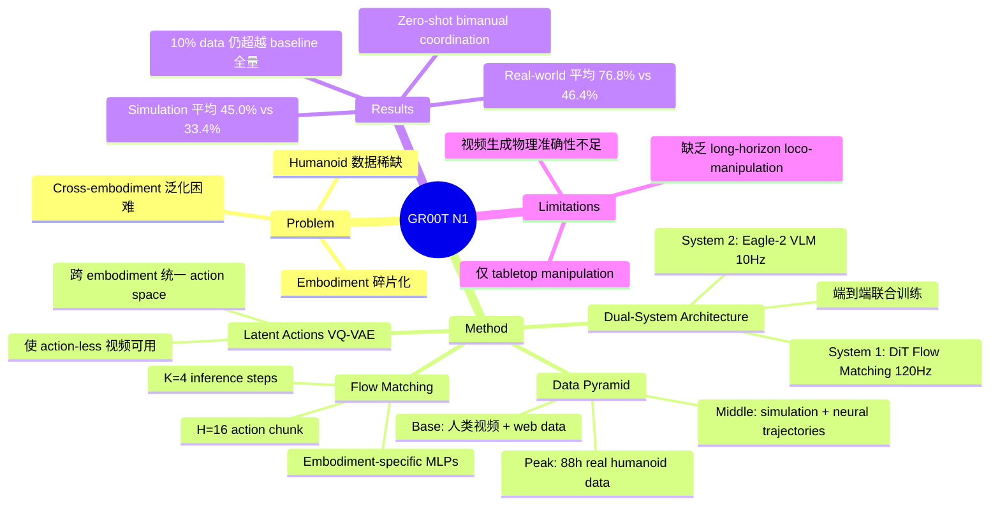

## Summary
GR00T N1 是 NVIDIA 提出的面向 humanoid robot 的开放式 foundation model，采用 dual-system 架构（VLM System 2 + Diffusion Transformer System 1），在 heterogeneous 数据（真实机器人轨迹、人类视频、合成数据）上端到端联合训练，在多个 simulation benchmark 上超越 Diffusion Policy 等 baseline，并在 Fourier GR-1 humanoid 上实现了 language-conditioned bimanual manipulation，平均成功率 76.8%。

## Problem & Motivation
构建通用 humanoid robot 面临三大核心挑战：（1）**数据稀缺**——真实 humanoid 数据采集成本高昂，不存在类似 web-scale 的"机器人互联网数据"；（2）**embodiment 碎片化**——不同机器人平台形成"数据孤岛"，难以统一利用；（3）**cross-embodiment 泛化**——现有方法难以处理不同 embodiment 间传感器、执行器和控制模式的差异。作者主张需要一个 full-stack solution，整合硬件（humanoid 平台）、模型（foundation model）和数据（多源异构数据），才能让机器人理解新场景、鲁棒应对现实世界变化并快速学习新任务。

## Method
核心架构：**Eagle-2 VLM (1.34B) + Diffusion Transformer (DiT) + Flow Matching**

**1. Dual-System 架构（受 Kahneman System 1/2 启发）**
- **System 2（Vision-Language Module）**：基于预训练 Eagle-2 VLM，处理 224x224 图像（每帧 64 token embeddings）和 language instructions，运行频率 10 Hz。使用第 12 层（中间层）LLM embeddings 而非最终层，兼顾速度和性能。
- **System 1（Diffusion Transformer Module）**：基于 DiT 的 flow matching action head，生成 closed-loop motor actions，运行频率 120 Hz。架构交替使用 cross-attention（条件化 VLM tokens）和 self-attention（处理 noised action embeddings），类似 Flamingo/VIMA 的设计。
- 两个模块通过 cross-attention 紧密耦合，端到端联合训练（VLM language 部分冻结，vision encoder 和 DiT 联合优化）。

**2. Flow Matching Action Generation**
- 使用 conditional flow matching 建模 action 的连续分布
- Noised action: $A^{\tau}_t = \tau A_t + (1-\tau)\epsilon$
- 推理时 K=4 步 forward Euler integration，action chunk H=16 步
- Embodiment-specific MLPs 处理不同机器人的 state/action 维度差异

**3. Data Pyramid（分层数据策略）**
- **Base（大规模）**：web data（VLM pretraining）+ 人类 egocentric 视频（Ego4D, EPIC-KITCHENS, HOI4D 等 7 个数据集）
- **Middle（合成数据）**：simulation trajectories（780K 轨迹 / 6,500 小时，via DexMimicGen）+ neural trajectories（~827 小时，fine-tuned image-to-video model 生成，10x 数据增强）
- **Peak（真实数据）**：GR00T N1 Humanoid Dataset（88 小时遥操作 GR-1 数据）+ Open X-Embodiment + AgiBot-Alpha（14 万轨迹）

**4. Latent Actions for Action-Less Data（关键创新）**
- 训练 VQ-VAE 从图像帧对 $(x_t, x_{t+H})$ 提取 latent action embeddings
- 使人类视频等无 action label 的数据可用于训练
- 创建跨所有 embodiment（包括人类）的统一 latent action space，作为独立的"LAPA" embodiment 处理

**5. Neural Trajectory Generation**
- 在 88 小时真实数据上 fine-tune image-to-video model，生成 827 小时合成视频（10x 增强）
- LLM-based object detection 创建物理可行的任务组合
- Commercial LLM judges 过滤不符合指令的生成视频

**6. 训练流程**
- **Pre-training**：在异构数据混合上端到端训练（~50,000 H100 GPU hours，最多 1024 H100 GPUs）
- **Post-training**：在单一 embodiment 任务特定数据上 fine-tune，可选 neural trajectory co-training（1:1 比例）

## Key Results
**Simulation Benchmarks（每任务 100 demonstrations）：**
- RoboCasa Kitchen（24 tasks, Franka Panda）：GR00T-N1-2B **32.1%** vs Diffusion Policy 25.6%
- DexMimicGen Cross-Embodiment（9 tasks, bimanual）：GR00T-N1-2B **66.5%** vs Diffusion Policy 56.1%
- GR-1 Tabletop（24 tasks, humanoid）：GR00T-N1-2B **50.0%** vs Diffusion Policy 32.7%（+17%）
- 三项平均：**45.0%** vs 33.4%

**Real-World（Fourier GR-1 humanoid）：**
- Pre-training zero-shot：bimanual coordination 76.6%，novel object placement 73.3%
- Post-training full data 平均：**76.8%** vs Diffusion Policy 46.4%（Pick-and-Place 82.0%，multi-agent coordination 82.5%）
- Post-training 10% data：GR00T-N1-2B **42.6%** vs Diffusion Policy 10.2%
- 关键发现：10% 数据下 GR00T N1 仅比 Diffusion Policy 全量数据低 3.8%，展现极强 data efficiency

**Neural Trajectory Augmentation：**
- RoboCasa 上 +4.2%~+8.8% 提升
- Real-world 10% data 下 +5.8% 平均提升

**推理速度**：16-action chunk 在 L40 GPU 上 63.9ms（bf16 precision）

## Strengths & Weaknesses
**Strengths:**
- Dual-system 架构设计优雅：System 2 做高层理解（10 Hz），System 1 做低层实时控制（120 Hz），frequency decoupling 合理且高效
- Data Pyramid 策略系统性地解决了 humanoid 数据稀缺问题，latent action 方法使海量人类视频数据可用，neural trajectory 提供低成本 10x 数据增强
- Cross-embodiment 支持通过 embodiment-specific encoder/decoder MLPs 实现，设计简洁有效
- 开源程度高：模型权重、代码、数据集均公开，对社区推动力大
- Real-world 结果说服力强：76.8% 平均成功率显著超越 baseline，且在低数据场景下优势更明显

**Weaknesses:**
- 目前仅限于 tabletop manipulation，缺乏 long-horizon loco-manipulation 能力（如移动+操作的组合任务）
- Neural trajectory 的视频生成模型在 physics-accurate counterfactual scenarios 上仍有困难
- VLM backbone（Eagle-2）的 spatial reasoning 和 language understanding 能力可能成为瓶颈
- Simulation-to-reality transfer 的 gap 未被充分讨论
- 与 [[2410-Pi0]] 的核心区别在于 humanoid 场景和 data pyramid 策略，架构层面（VLM + flow matching DiT）思路高度一致

## Mind Map

## Notes
- GR00T N1 与 [[2410-Pi0]] 在架构理念上高度相似（VLM + flow matching），核心差异在于：（1）GR00T N1 专注 humanoid embodiment；（2）提出 Data Pyramid 策略系统解决数据问题；（3）latent action 方法使人类视频可直接参与训练
- Frequency decoupling（System 2 @10Hz, System 1 @120Hz）是一个值得关注的设计模式——高层认知不需要高频更新，低层控制需要实时响应，这种分离可能成为 VLA 的标准范式
- Neural trajectory generation 的 10x 数据增强效果显著，但质量过滤依赖 LLM judge，这个 pipeline 的可靠性和可扩展性值得进一步验证
- 开源策略（模型+代码+数据）可能使 GR00T N1 成为 humanoid VLA 的重要 baseline，类似 OpenVLA 在 manipulation 领域的角色
