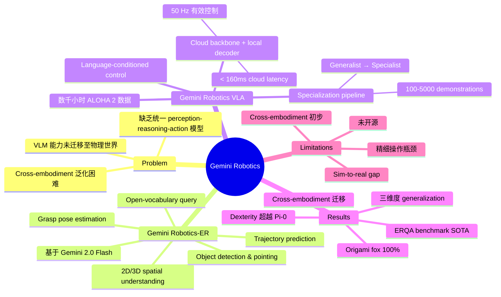

## Summary
Google DeepMind 提出 Gemini Robotics，一个基于 Gemini 2.0 的 Vision-Language-Action 模型，采用 cloud backbone + local action decoder 的双组件架构，在 ALOHA 2 平台上实现了灵巧双臂操作，并展示了在 visual/instruction/action 三个维度上的强泛化能力，同时引入 Gemini Robotics-ER 增强 embodied reasoning 能力，支持 zero/few-shot cross-embodiment 迁移。

## Problem & Motivation
当前大规模多模态模型在文本和图像理解上表现优异，但将这些能力迁移到物理世界的机器人控制仍面临重大挑战。机器人需要 robust 的 embodied reasoning（3D 空间理解、物体关系推理、直觉物理）以及精确的 action execution，现有方法难以在一个统一模型中同时具备 perception、reasoning 和 action 能力。作者希望利用 Gemini 2.0 的强大 VLM 基础，构建真正通用的机器人 foundation model，同时解决 generalization、dexterity 和 cross-embodiment adaptation 三大难题。

## Method
核心架构：**Gemini 2.0 (Cloud Backbone) + Local Action Decoder**，双层级系统设计。

**1. Gemini Robotics-ER (Embodied Reasoning)**
- 基于 Gemini 2.0 Flash 进行 targeted training，增强 embodied reasoning 能力
- 统一支持 2D/3D spatial understanding、object detection、pointing、trajectory prediction、grasp pose estimation
- 所有能力均支持 open-vocabulary query，无需针对特定物体训练
- 可通过 code generation（zero-shot）或 in-context learning（few-shot）直接控制机器人

**2. Gemini Robotics (VLA)**
- 在 Gemini 2.0 基础上用大规模 robot action 数据 fine-tune
- Cloud-based distilled Gemini backbone（<160ms latency）+ local action decoder（端到端 ~250ms，50 Hz 有效控制频率）
- 支持 language-conditioned 操作，对 paraphrasing、typos、多语言指令具有鲁棒性

**3. 训练数据**
- 数千小时 ALOHA 2 遥操作数据，12 个月持续收集，覆盖上千个 manipulation task
- 结合 web-scale 多模态数据（文档、代码、图像、视频）进行联合训练
- Specialization pipeline：generalist → task-specific fine-tune（2,000-5,000 demonstrations per task）

**4. ERQA Benchmark**
- 新提出的 embodied reasoning 评测基准，400 道 multiple-choice 题目
- 覆盖 7 个能力类别：spatial reasoning、trajectory reasoning、action reasoning、state estimation、pointing、multi-view reasoning、task reasoning

## Key Results
**Out-of-the-Box 任务表现：**
- 20 个灵巧操作任务中，超过半数达到 >80% 成功率
- 在 deformable object manipulation（折叠布料、缠绕线缆）上显著优于 Pi-0 re-implementation 和 multi-task diffusion baseline
- 在 baseline 完全失败的任务上仍能取得非零成绩

**Language Following（25 条指令 x 5 场景）：**
- 在 novel objects 和 fine-grained instructions 上优于 baseline
- 支持 typos、unseen languages、paraphrasing 等分布外指令

**Generalization（85 个任务）：**
- Visual generalization：新背景、新光照条件下保持性能
- Instruction generalization：多语言、拼写错误下仍能执行
- Action generalization：不同物体实例、不同初始条件下泛化

**Long-Horizon Dexterity（specialized models）：**
- Origami fox：100% 成功率（唯一成功的方法）
- Lunch-box packing：100% 成功率（2+ 分钟任务）
- Spelling board game：印刷字 100%，手绘字 66%
- Baselines 在多数任务上为 0%

**Fast Adaptation：**
- 仅 100 条 demonstration 即可在 8 个 short-horizon 任务中 7 个达到 >70% 成功率

**Cross-Embodiment：**
- 迁移至 bi-arm Franka：平均 63% 任务成功率
- 迁移至 Apollo humanoid：初步实验成功
- 显著优于 single-task diffusion baseline

**ERQA Benchmark：**
- Gemini 2.0 Flash：46.3%（CoT 50.3%），超过 GPT-4o（47.0%）和 Claude 3.5 Sonnet（35.5%）

## Strengths & Weaknesses
**Strengths:**
- 首次系统性地将 embodied reasoning（空间/3D 理解）与 action prediction 集成到单一 foundation model 中
- Cloud backbone + local decoder 的架构设计在模型能力和推理延迟之间取得了实用平衡（50 Hz 有效控制）
- Generalization 验证非常全面，覆盖 visual/instruction/action 三个维度，且在 unseen languages 等极端场景下仍有效
- Specialization pipeline（generalist → specialist）展示了 foundation model 高效适配复杂任务的路径
- ERQA benchmark 填补了 VLM embodied reasoning 评测的空白
- 数据规模（数千小时、数千任务）和 cross-embodiment 迁移（ALOHA 2 → Franka → Apollo）展示了强大的可扩展性

**Weaknesses:**
- 极精细操作仍有瓶颈（如 shoelace insertion 0% 成功率），dexterous manipulation 的上限尚未突破
- Sim-to-real gap 明显：banana handover 仿真 86% vs 真实 30%，实际部署仍有挑战
- Pi-0 baseline 使用作者自己收集的数据重新训练，难以判断优势来自架构还是训练 recipe
- Cross-embodiment 结果（Franka、Apollo）仍处于初步阶段，数据量和任务多样性有限
- Zero-shot code generation 平均仅 27%，复杂 multi-step planning 能力不足
- 模型未开源，可复现性低，社区无法验证和扩展

## Mind Map

## Notes
- Gemini Robotics 代表了 Google DeepMind 在 robot foundation model 赛道的最新力作，与 Physical Intelligence 的 Pi 系列形成直接竞争
- Cloud backbone + local decoder 的设计思路值得关注：利用云端大模型的强大能力，同时通过本地 decoder 保证实时控制，这可能是大模型部署到机器人的实用范式
- ERQA benchmark 的提出很有价值，当前缺乏针对 embodied reasoning 的标准化评测，这为后续研究提供了 common ground
- 与 Pi-0 的对比需谨慎解读：baseline 使用作者数据重训，可能不完全反映架构优劣
- Specialization pipeline（generalist pretrain → task-specific finetune）与 Pi-0 的 pre-training/post-training 范式高度一致，说明这可能是 robot foundation model 的通用 recipe
- Cross-embodiment 结果虽然初步，但从 ALOHA 2（平行夹爪）到 Apollo humanoid（五指灵巧手）的迁移展示了 foundation model 的潜力
