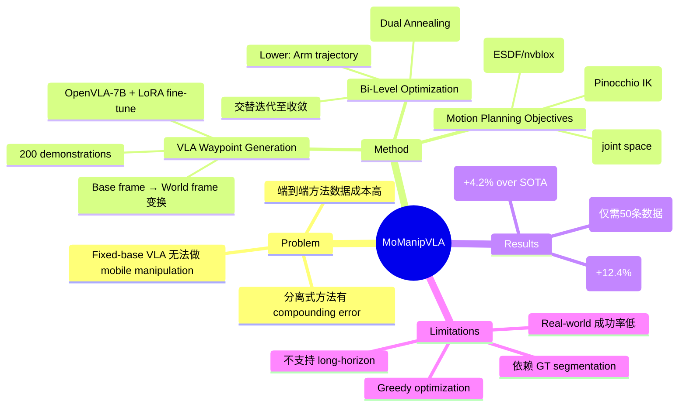

## Summary
提出 MoManipVLA，一个将预训练 fixed-base VLA 模型迁移到 mobile manipulation 的 policy adaptation 框架：利用 VLA 生成 end-effector waypoint，再通过 bi-level trajectory optimization（上层优化 base 位置，下层优化 arm 轨迹）生成物理可行的全身轨迹，在 OVMM benchmark 上比 SOTA 高 4.2% success rate，real-world 仅需 50 条 demonstration fine-tune。

## Problem & Motivation
Mobile manipulation 需要协调 mobile base 和 robot arm，传统方法面临两个瓶颈：(1) 分别训练 navigation 和 manipulation 模块导致 compounding error；(2) end-to-end 方法需要大量昂贵的 demonstration 数据，难以 scale。现有 VLA 模型（如 OpenVLA）展示了强大的 generalization 能力，但只支持 fixed-base manipulation，无法生成 base-arm 协调动作。核心问题：**如何在不重新收集大规模 mobile manipulation 数据的前提下，复用 VLA 的 generalization 能力？**

## Method

### 1. VLA Waypoint Generation
- 使用预训练 OpenVLA-7B 作为 waypoint generator，输入 RGB image + arm proprioception，输出 end-effector waypoint（base frame 下）
- 用 200 条 OVMM heuristic baseline 收集的 pick-and-place demonstration 做 LoRA fine-tune（10K epochs，4x RTX 3090）
- Waypoint 通过当前 base pose 变换到 world frame：$Q_i \rightarrow \hat{Q}_i$

### 2. Motion Planning Objectives
三个 cost component 组成复合优化目标 $O = \lambda_1 F_r + \lambda_2 F_s + \lambda_3 F_c$：

**Reachability Cost $F_r$**：用 Pinocchio IK solver 评估 end-effector 在给定 base pose 下的可达性。IK 迭代次数越多说明越接近 joint limit，无解则施加大惩罚 $C_0$。

**Smoothness Cost $F_s$**：约束相邻时间步 joint angle 和 base pose 的变化量，保证轨迹平滑。在 joint space 而非 task space 做 smoothness 约束。

**Collision Cost $F_c$**：基于 ESDF（nvblox 构建）计算机器人表面采样点到环境的距离，safety margin $\epsilon_0 = 0.1$m。

超参：$\lambda_1=10.0, \lambda_2=1.0, \lambda_3=0.6$，reachability 权重最大。

### 3. Bi-Level Trajectory Optimization
直接在 10-DoF 联合空间优化计算不可行，因此分解为两层：

**Upper-Level（Base Movement）**：用 Dual Annealing + SLSQP 搜索最优 base pose，目标是让 arm 有更好的操作空间。对每个 candidate base pose 采样 $N_s$ 个 arm pose，评估综合 cost。

**Lower-Level（Arm Trajectory）**：固定 base 轨迹，在已建立的搜索空间中选择 objective 最小的 arm pose。

交替迭代直到收敛：$||\Gamma(p_b^t, p_e^t) - \hat{Q}_i||_2 < \mu_s$。

### 4. Pipeline 总结
VLA waypoint prediction → world frame transformation → bi-level trajectory optimization → base + arm action execution。Base 动作是 zero-shot 推断的，不需要 mobile manipulation 训练数据。

## Key Results

**OVMM Benchmark：**
- Overall SR: 49.4%（SOTA KUZHUM 38.2%，**+4.2%**）
- Pick SR: 62.6%（SOTA 50.2%，**+12.4%**）
- FindRex SR: 15.8%（SOTA 11.6%，+4.2%）
- 注意：使用 ground-truth object segmentation 时 49.4%，换成 Detic 后骤降至 11.3%

**Ablation（cost components）：**
- 去掉 Reachability：SR 降 1.2%（贡献最大）
- 去掉 Smoothness：SR 降 0.7%
- 去掉 Collision：SR 降 0.5%
- 去掉 Bi-level（直接搜索）：SR 降 0.9%，latency 增 49.8ms

**Real-World（Hello Robot Stretch → RM65 迁移）：**
- Stack Block: 30%, Put in Bowl: 40%, Open Drawer: 10%
- 仅需 50 条 real-world demonstration fine-tune

**Failure Analysis：**
- 72% 失败来自 orient-to-place 阶段（navigation alignment）
- 15% 来自 find-receptacle（目标检测失败）

## Strengths & Weaknesses

**Strengths：**
1. **问题定义清晰**：将 VLA 从 fixed-base 迁移到 mobile manipulation 是一个实际且重要的问题，方法思路简洁——VLA 负责 what to do，optimization 负责 how to do
2. **Zero-shot base adaptation**：不需要 mobile manipulation 的训练数据来学习 base movement，具有工程实用价值
3. **模块化设计**：VLA 模型可替换，trajectory optimization 与具体 VLA 解耦

**Weaknesses：**
1. **依赖 GT perception 严重**：使用 ground-truth segmentation 时 49.4%，换 Detic 后仅 11.3%，说明方法的实际性能远低于报告的主要数字，这是一个值得注意的 presentation 问题
2. **Real-world 成功率偏低**：最好的 task 也只有 40%，Open Drawer 仅 10%，实用性存疑
3. **不支持 long-horizon task**：作者自己承认缺乏 task planning module，限制了适用范围
4. **Optimization latency**：每步 ~693ms，对实时性要求高的场景不适用
5. **Ablation 增益微弱**：各 cost component 和 bi-level optimization 的贡献都在 1% 以内，说明核心改进可能主要来自 VLA fine-tune 本身而非 trajectory optimization 的精巧设计
6. **Bi-level decomposition 的 greedy 性质**：作者承认可能收敛到 local optima，但没有深入分析什么条件下会失败

## Mind Map

## Notes
- 核心 insight 是 VLA 作为 high-level waypoint generator + classical optimization 作为 low-level motion planner 的分工，这个思路与 SayCan、Code-as-Policies 等 foundation model + classical planning 的范式一脉相承
- 与 Gemini Robotics 等直接端到端训练 mobile manipulation 的路线形成对比——MoManipVLA 是 "迁移复用" 路线，Gemini 是 "大力出奇迹" 路线
- Ablation 结果暗示 trajectory optimization 的精细设计（reachability/smoothness/collision）贡献有限，核心价值可能更多在于 "VLA + any reasonable motion planner" 这个框架本身
- GT segmentation vs Detic 的巨大 gap（49.4% vs 11.3%）是一个 red flag，说明 perception bottleneck 可能比 manipulation policy 本身更关键
- Rating 3/5：问题重要且实际，但方法的 novelty 有限（VLA + optimization 的组合比较 straightforward），实验中对 GT perception 的依赖削弱了结论的说服力，real-world 结果不够 convincing
