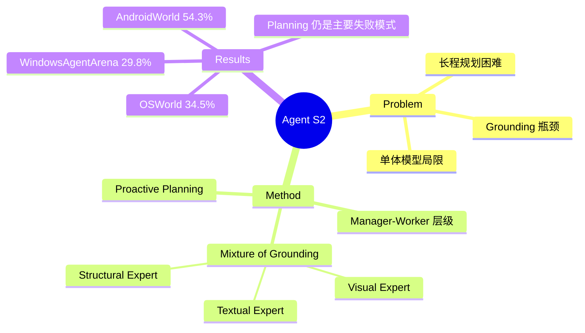

## Summary
提出 Agent S2，一个 compositional generalist-specialist 框架，通过 Manager-Worker 层级架构、Mixture of Grounding (MoG) 专家路由机制和 proactive hierarchical planning，在 OSWorld 上达到 34.5% 成功率（50-step），显著缩小与人类的性能差距。

## Problem & Motivation
当前 computer-use agent 面临三大核心挑战：(1) **Grounding 瓶颈**：难以将 GUI 元素的文本描述精确映射到像素级坐标；(2) **长程规划困难**：在多步任务中受背景干扰、中断和动态上下文影响；(3) **单体模型局限**：依赖单一通用模型导致性能瓶颈——通用模型在特定子任务上表现不如专用模型。现有 agent 在 OSWorld 上与人类有约 40% 的性能差距。

## Method
**整体架构**：Manager-Worker 层级 + Mixture of Grounding 专家路由。

**Manager (M)**：高层规划模块，将任务分解为 subgoal 序列。采用 proactive planning 策略——每次 subgoal 完成（成功或失败）后，Manager 基于原始指令、历史 subgoal 和最新观测重新生成剩余 subgoal，而非仅在失败时才修正（reactive planning）。

**Worker (W)**：低层执行模块，为当前 subgoal 生成原子动作，同时充当 gating 机制将 grounding 请求路由到合适的专家。

**Mixture of Grounding (MoG)**：三个专家：
- **Visual Grounding Expert**：基于 UI-TARS-72B-DPO，输入截图 + 语言描述，输出精确坐标
- **Textual Grounding Expert**：使用 Tesseract OCR 处理细粒度文本对齐，输出 span 坐标
- **Structural Grounding Expert**：处理 spreadsheet/表格内容，通过 UNO 接口程序化更新单元格

**输入**：仅使用截图 + action history，不需要 accessibility tree。

## Key Results
- **OSWorld**：50-step 达到 34.5%（Claude-3.7-Sonnet），相对最佳 baseline 提升 32.7%；15-step 为 27.0%，相对提升 18.9%
- **WindowsAgentArena**：29.8%（仅用截图，vs NAVI 19.5% 使用截图+accessibility tree），相对提升 52.8%
- **AndroidWorld**：54.3%，超越 UI-TARS-72B-SFT (46.6%)，相对提升 16.5%
- **领域分析**：Professional 57.14%、OS 50.0%、Daily 49.7%，但 Workflow 仅 18.21% 为最弱项

**Ablation**：
- MoG 在 50-step 上 +4.61%（33.85%→38.46%），长 horizon 收益更大
- Proactive planning vs reactive：+4.62%（15-step）、+6.15%（50-step）
- 7B 视觉专家模型在模块化框架中可超越 Claude-3.7-Sonnet 的内置 grounding

## Strengths & Weaknesses
**Strengths**：
- Generalist-specialist 分离设计很合理——让通用模型做规划、专用模型做 grounding，认知负载分配清晰
- MoG 路由机制优雅地处理了 GUI 中不同类型元素（视觉/文本/结构化）的 grounding 需求
- Proactive planning 比 reactive planning 持续优于，且长 horizon 收益更大，说明主动重规划在复杂任务中的重要性
- 跨三个平台（Linux/Windows/Android）验证，泛化性好
- Scaling 分析揭示四种 emergent behavior（adaptive navigation、backward correction 等），对理解 agent 能力边界有价值

**Weaknesses**：
- 对 Claude-3.7-Sonnet 的依赖很重——换成开源模型后性能如何？论文未充分讨论
- Workflow 类任务仅 18.21%，说明跨应用协同仍是根本性挑战
- 错误分析显示 planning failure 是最主要失败模式，但论文对如何改进 Manager 的规划鲁棒性着墨不多
- 多模型组合带来的推理延迟和成本未详细讨论
- 仅用截图不用 accessibility tree 是一个设计选择，但在某些场景（如表单填写）中可能牺牲精度

## Mind Map

## Notes
- MoG 的设计思路可以推广：不同类型的感知任务由不同专家处理，关键在于 routing 机制的设计
- Proactive vs reactive planning 的对比很有启发——agent 应该在每个 checkpoint 重新思考全局，而非只在失败时修补
- 与 SeeClick 形成互补视角：SeeClick 证明 grounding 是瓶颈，Agent S2 展示了如何用专家路由缓解这个瓶颈
- Workflow 任务的低成功率暗示 current agent 在需要跨应用状态追踪的任务上仍有根本限制
