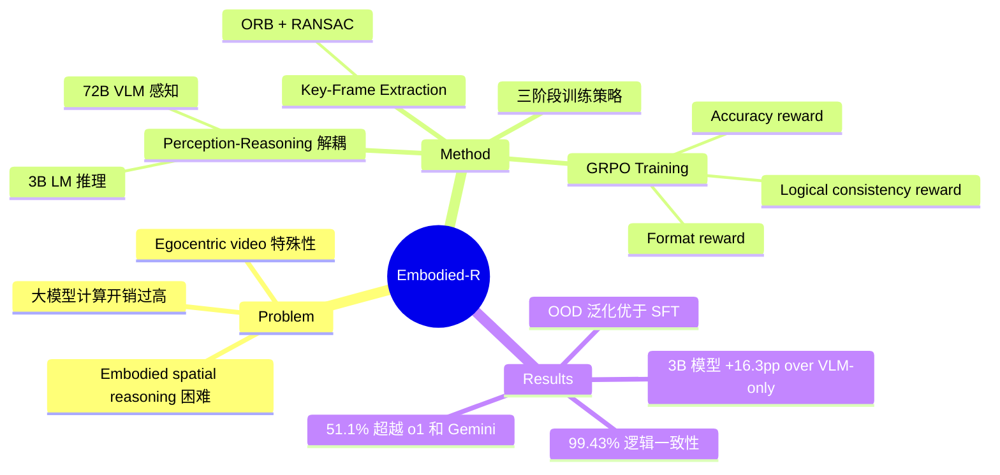

## Summary
Embodied-R 提出一种将 perception 和 reasoning 解耦的协作框架：用大规模 VLM（72B）做 egocentric video 的感知和语义提取，用小规模 LM（3B）通过 GRPO reinforcement learning 训练 spatial reasoning 能力。核心创新是 logical consistency reward——让 reference model 仅凭推理文本（不看视频）验证推理链的逻辑自洽性，有效缓解 reward hacking。仅用 5,000 个 embodied video 样本训练后，3B 模型在 spatial reasoning benchmark 上超越 OpenAI-o1 和 Gemini-2.5-Pro。

## Problem & Motivation
当前 foundation model 在 embodied spatial reasoning（从 egocentric video 理解空间关系）上表现不佳。核心矛盾：
1. **Perception 依赖大模型**：robust 的视觉感知需要大规模 VLM，但这带来巨大的计算开销
2. **Embodied video 的特殊性**：egocentric 视角、sequential processing、帧间冗余、空间连续性——与标准 video understanding 有本质区别
3. **Reasoning 和 perception 的耦合**：直接端到端训练大模型做 spatial reasoning 既昂贵又低效

关键 insight：可以将 perception（需要大模型）和 reasoning（可以用小模型学习）解耦，用 RL 而非 SFT 来激活小模型的 slow-thinking 能力。

## Method

### 1. 感知模块：Large-Scale VLM (72B Qwen2.5-VL)
- **Key-Frame Extraction**：使用 ORB feature matching + RANSAC homography estimation 计算相邻帧 overlap ratio，低于阈值时提取关键帧。将平均帧数从 32 降至 20.7，准确率仅降 1.6%
- **Embodied Semantic Representation**：VLM 逐帧处理关键帧，输出语义三元组：
  - `Action`：从帧变化推断 agent 运动
  - `△Information`：空间关系变化和新物体
  - `q-related content`：与任务相关的观测

### 2. 推理模块：Small-Scale LM (3B Qwen2.5)
通过 GRPO (Group Relative Policy Optimization) 训练，三种 reward 信号：
- **Format Reward** (binary)：验证 `<think>` / `<answer>` 标签格式
- **Accuracy Reward** (binary)：答案与 ground truth 匹配
- **Logical Consistency Reward** (novel)：将 question + reasoning 输入 reference model（不给视频），若 reference model 能仅凭推理链得出正确答案则给奖励。解决 reward hacking 问题

$$r_i = \omega_1 r'_i + \omega_2 r''_i + \omega_3 r'''_i$$

### 3. 三阶段训练策略
- **Stage 1** (epoch 1-2)：$\omega_1:\omega_2:\omega_3 = 7:3:0$（format 为主）
- **Stage 2** (epoch 3-4)：$3:7:0$（accuracy 为主）
- **Stage 3** (epoch 5-12)：$1:7:2$（引入 consistency reward）

## Key Results

### 主实验（8 个 embodied spatial reasoning 任务）
- **Embodied-R (3B)：51.1% 平均准确率**
- vs OpenAI-o1：37.2%（+13.9 pp）
- vs Gemini-2.5-Pro：40.8%（+10.3 pp）
- vs GPT-4o：35.7%（+15.4 pp）
- vs Qwen2.5-VL-72B（单独使用）：34.9%（+16.2 pp）

### 关键 Ablation
| 对比 | 结果 |
|------|------|
| Key-frame extraction | 帧数 32→20.7，训练时间 -12.6%，推理时间 -35.4%，精度仅降 1.6% |
| VLM-only vs 协作框架 | 34.8% → 51.1%（+16.3 pp） |
| RL 训练前后 | UrbanVideo-Bench +27.9 pp，VSI-Bench +20.6 pp |
| 直接 RL 训 VLM-3B | 43.8%（远低于协作框架 51.1%） |
| Logical consistency reward | 无：46.01% 逻辑一致；有：99.43% 逻辑一致 |

### OOD 泛化
- RL 训练的模型在 EgoSchema 上与 Gemini-2.5-Pro 相当
- SFT 训练的模型虽在 EgoSchema 上提升但在 MVBench 上退化
- 说明 RL 比 SFT 具有更好的泛化性

## Strengths & Weaknesses

### Strengths
1. **Perception-Reasoning 解耦**思路优雅：用 72B 做感知、3B 做推理，计算效率极高（约 90 GPU-hours 训练）
2. **Logical consistency reward** 设计巧妙：通过 reference model 验证推理链的自洽性，有效解决 reward hacking
3. **数据高效**：仅 5,000 样本即可超越 GPT-4o 和 o1 等强模型
4. **三阶段训练策略**合理：从 format → accuracy → consistency 逐步提升难度
5. 实验全面：主实验、ablation、OOD 泛化均有覆盖

### Weaknesses
1. **感知瓶颈未解决**：72B VLM 的推理开销仍在，只是将其从训练 loop 中移出；部署时两个模型的级联延迟仍需考虑
2. **Semantic representation 的信息损失**：将 video 压缩为文本三元组必然丢失细粒度空间信息（如精确距离、角度）
3. **数据集规模和多样性有限**：UrbanVideo-Bench + VSI-Bench 仅涵盖 aerial outdoor 和 indoor first-person，缺乏 manipulation 和 legged locomotion 场景
4. **Logical consistency reward 假设强**：要求"正确的推理链应让无视觉的模型也能推出正确答案"，但有些 spatial reasoning 本质上需要 grounding 到视觉信息
5. 缺乏与其他 RL for reasoning 方法（如 DeepSeek-R1）的直接对比

## Notes
- 训练硬件：8x NVIDIA A800-SXM4-40GB，RL 训练约 90 GPU-hours
- 项目主页：https://embodiedcity.github.io/Embodied-R/
- 这篇文章的核心贡献不在于某个具体 benchmark 的 SOTA，而在于证明了 **小模型通过 RL 可以在 embodied spatial reasoning 上超越远大于自己的模型**——这对资源受限的 embodied AI 研究有重要意义
- Logical consistency reward 的 insight 值得深入思考：它本质上是用"可解释性"作为训练信号，确保模型的推理链是 faithful 的而非 spurious correlation
