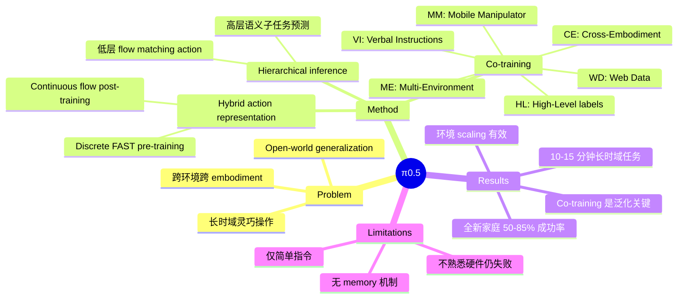

## Summary
Physical Intelligence 提出 π0.5，一个基于 π0 的 vision-language-action 模型，通过在异构数据（多机器人、高层语义预测、web 数据等）上进行 co-training，首次实现了端到端学习的机器人系统在**全新家庭环境**中执行 10-15 分钟的长时域灵巧操作任务（如清洁厨房、整理卧室）。

## Problem & Motivation
现有 robot policy 的泛化能力有限——通常只能在训练过的环境中工作。要让机器人真正进入千家万户，需要解决 **open-world generalization**：在从未见过的房间、面对从未见过的物体，依然能完成复杂的长时域操作任务。核心挑战在于：
1. 单一来源的 robot 数据不足以覆盖真实世界的多样性
2. 长时域任务需要高层语义规划与低层精细控制的协同
3. 跨 embodiment 的知识迁移

## Method

### 架构概览
π0.5 基于 multimodal transformer，接受 image patches、text tokens 和 continuous action representations 作为输入。核心设计是 **hierarchical inference**：

$$\pi_\theta(a_{t:t+H}, \hat{\ell} | o_t, \ell) = \pi_\theta(a_{t:t+H} | o_t, \hat{\ell}) \cdot \pi_\theta(\hat{\ell} | o_t, \ell)$$

即先预测高层语义子任务 $\hat{\ell}$（如 "pick up the plate"），再基于子任务生成低层 action。

### Hybrid Action Representation
- **Pre-training 阶段**：使用 discrete FAST tokens 表示 action，训练效率高
- **Post-training 阶段**：切换到 continuous flow matching，推理精度更高
- 联合 loss：$\mathcal{L} = H(\text{text outputs}) + \alpha \| \omega - a - f^a_\theta(\cdot) \|^2$，其中 $\alpha=10.0$

### Co-training 数据混合
关键创新是将五类异构数据统一训练：

| 类别 | 说明 |
|------|------|
| **MM** (Mobile Manipulator) | 真实家庭中的操作数据，~400 小时，100 个环境 |
| **ME** (Multi-Environment) | 固定臂在多样家庭中的数据 |
| **CE** (Cross-Embodiment) | 多种 robot 类型，含 OXE dataset |
| **HL** (High-Level) | 人工标注的语义子任务标签 |
| **WD** (Web Data) | 图文数据：CapsFusion, COCO, VQAv2 等 |

**关键发现**：97.6% 的训练数据并非来自 mobile manipulator 执行家务任务，但这些异构数据对泛化至关重要。

### 高层语义推理
模型在每个时间步先通过 autoregressive text decoding 生成子任务预测（含 bounding box），再以 50Hz 频率通过 10 步 denoising 生成低层 action。Post-training 阶段还引入 **Verbal Instructions (VI)** 数据——人类专家用语言指导 demonstration 过程。

### 硬件平台
- 双臂 mobile manipulator，每臂 6-DOF + parallel-jaw gripper
- 4 个 RGB 相机（2 个腕部 + 前后各 1 个）
- 全向轮底盘 + torso lift
- 50Hz 端到端控制，无显式 trajectory planning 或碰撞检测

## Key Results

### 真实家庭泛化
在 3 个训练中**从未出现过的真实家庭**中，π0.5 执行 10-15 分钟的长时域任务（洗碗、整理抽屉、叠被子等），成功率 50-85%。

### 环境数量的 scaling 效应
| 训练环境数 | 任务成功率 |
|-----------|-----------|
| 3 | ~25% |
| 104 | ~70% |
| 含测试家庭 | ~70%（与 104 相当） |

→ Co-training recipe 有效弥合了泛化鸿沟。

### 语言指令跟随
- In-distribution objects：70-85% 成功率
- Out-of-distribution objects：40-60% 成功率
- 性能在 ~82-104 个环境后趋于平台

### 消融实验
| 消融 | 影响 |
|------|------|
| 去掉 Web Data | 任务指标影响小，但 OOD 物体识别显著下降 |
| 去掉 Multi-Environment | 大幅下降 |
| 去掉 Cross-Embodiment | 大幅下降 |
| 去掉 High-Level 训练 | 成功率从 ~65% 降到 ~25% |

### 与 π0 对比
π0.5 在 dishes-in-sink 任务上 ~60% vs π0-FAST+Flow ~35%，提升主要归功于 co-training recipe。

## Strengths & Weaknesses

**Strengths:**
- 🏆 首次实现端到端 robot 系统在全新家庭中完成 10-15 分钟的复杂操作
- Hybrid training（discrete pre-train + continuous post-train）兼顾效率和精度
- Co-training 框架优雅地统一了多来源异构数据
- 消融实验充分，清晰展示了每类数据的贡献
- 真实世界 deployment，不是仅在 simulation 中验证

**Weaknesses:**
- 仍会犯错，某些环境持续失败（如不熟悉的硬件：抽屉把手、难开的柜门）
- 部分可观测性问题（手臂遮挡擦拭区域）
- 高层推理容易被干扰，产生重复行为
- Context window 有限，缺乏 memory 机制
- 无跨房间导航或空间记忆能力
- 仅限简单语言指令

## Mind Map

## Connections
- Related papers: [[Papers/2410-Pi0]] (前作 π0), π0-FAST
- Related ideas:
- Related topics: [[VLN-VLA-Unification]]
- Related projects:

## Notes
- 97.6% 训练数据不是目标任务数据，但对泛化至关重要——这是一个很强的 signal，说明 **data diversity >> data specificity**
- Hybrid action representation 的思路很有启发性：pre-training 用 discrete tokens 高效训练，post-training 切换到 continuous representation 保证精度
- High-level semantic prediction 作为 co-training 的一部分比作为 runtime inference 更重要（implicit HL ~62% vs full ~65% vs no HL ~25%），说明语义理解能力被"内化"了
- Physical Intelligence 的工程能力非常强——100+ 真实家庭环境的数据采集本身就是壁垒
- 与 GPT-4 zero-shot 高层规划（~20%）对比，说明纯 LLM 规划不足以驱动真实 robot
