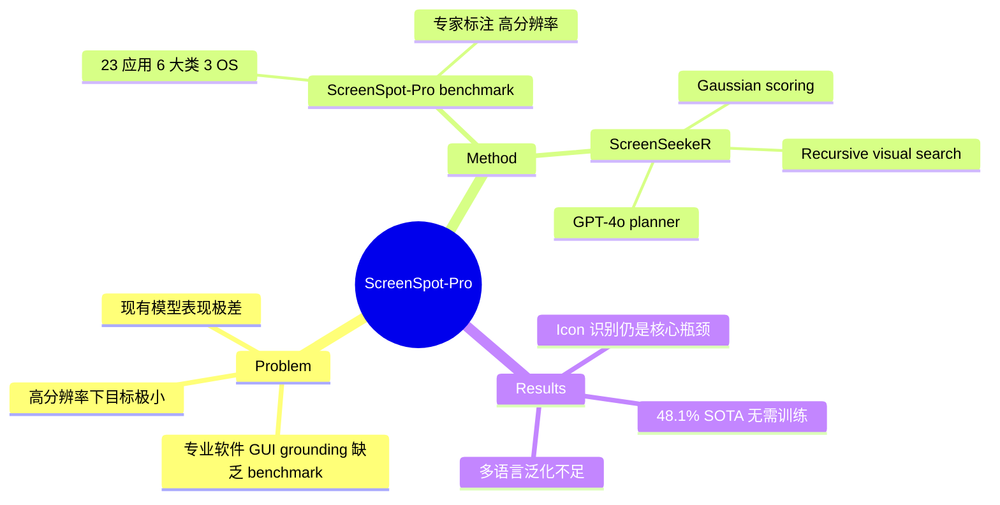

## Summary
针对专业高分辨率软件场景下 GUI grounding 能力不足的问题，提出了 ScreenSpot-Pro benchmark（1,581 样本，23 个专业应用，3 个操作系统）和 ScreenSeekeR 视觉搜索方法，无需额外训练即在该 benchmark 上达到 48.1% SOTA。

## Problem & Motivation
现有 GUI grounding benchmark（如 ScreenSpot）使用裁剪后的截图，无法反映真实专业软件的复杂性。专业应用存在三大挑战：(1) 高分辨率显示器超出当前 MLLM 处理能力；(2) 高分辨率下 UI 目标相对尺寸极小，模型定位困难；(3) 专业环境包含大量文档、工具栏等干扰元素。这些挑战使得当前模型在专业场景下的 grounding 能力严重不足（如 GPT-4o 仅 0.8%）。

## Method
### ScreenSpot-Pro Benchmark
- **数据范围**：6 大类 23 个应用，涵盖开发（VSCode, PyCharm）、创意工具（Photoshop, Blender）、CAD/工程（AutoCAD, SolidWorks）、科学分析（MATLAB, Stata）、办公（Word, Excel）和操作系统
- **采集方式**：邀请至少 5 年经验的专家标注员，在真实工作流中通过静默截屏工具实时标注，确保截图反映自然使用状态
- **标注标准**：分为 text 和 icon 两类（仅在无文字提示时标为 icon），每个样本至少两名标注员交叉验证
- **分辨率要求**：全部高于 1080p，禁用显示器缩放

### ScreenSeekeR 方法
一个无需训练的 agentic visual search 框架：
1. **Position Inference**：利用 GPT-4o 作为 planner，根据指令预测目标可能位置和候选区域，利用常识推理（如 "new" 按钮通常在 "delete" 附近）
2. **Candidate Area Scoring**：对候选区域进行 Gaussian scoring（σ=0.3），通过 NMS 去除重叠区域
3. **Recursive Search**：迭代裁剪子图像，当 patch 达到 1280px 最小尺寸时调用 grounder，递归缩小搜索范围直至找到目标

## Key Results
- **End-to-end baseline**：OS-Atlas-7B 18.9%，UGround-7B 16.5%，GPT-4o 仅 0.8%
- **ScreenSeekeR + OS-Atlas-7B**：48.1%（相对提升 254%，绝对提升 29.2pp）
- **Text vs Icon**：文本目标平均 28.1%，图标目标仅 4.0%，说明专业领域特有图标是核心难点
- **中文指令（ScreenSpot-Pro-CN）**：OS-Atlas-7B 降至 16.8%，多语言泛化仍是挑战
- Planner-free baseline 中 ReGround 达 40.2%，但仍低于 ScreenSeekeR

## Strengths & Weaknesses
**Strengths**:
- 填补了专业软件场景 GUI grounding benchmark 的空白，1,581 个真实高分辨率截图极具价值
- 专家驱动的标注流程和质量控制确保了数据可靠性
- ScreenSeekeR 无需训练，通过 cascaded search 大幅提升小目标检测能力，思路简洁有效
- 提供了中文变体，揭示多语言挑战

**Weaknesses**:
- ScreenSeekeR 依赖 GPT-4o 作为 planner，成本高且不可复现
- Icon 准确率仅 4%，核心难题并未真正解决，ScreenSeekeR 也只是缓解
- Benchmark 规模（1,581 样本）相对较小
- 因软件许可限制，排除了 planning 和 execution 任务，与真实 agent 使用场景仍有距离
- Recursive search 引入显著延迟，实际部署受限

## Mind Map

## Notes
- 与 GroundCUA/GroundNext 形成互补：ScreenSpot-Pro 提供 benchmark，GroundNext 提供在该 benchmark 上的 SOTA grounding 模型（52.9%）
- ScreenSeekeR 的 recursive search 思路值得关注——通过 zoom-in 策略绕过 MLLM 分辨率限制，是一种通用的 inference-time scaling 方法
- 专业软件 icon 识别的 4% 准确率揭示了 MLLM 在 domain-specific visual element 上的根本局限
