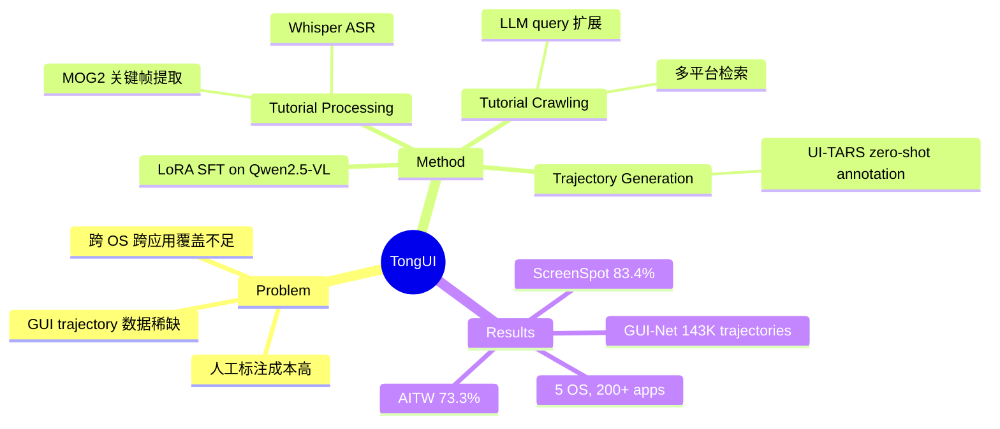

## Summary
利用互联网上大量多模态教程（视频+图文）自动构建跨 OS、跨应用的 GUI agent trajectory 数据集 GUI-Net（143K trajectories），微调 Qwen2.5-VL 后在 grounding 和 navigation benchmark 上超越同规模 baseline 约 10%。

## Problem & Motivation
构建通用 GUI agent 的核心瓶颈是高质量 trajectory 数据的稀缺——人工标注成本高且难以覆盖多 OS、多应用场景。已有数据合成方法（如 AgentTrek、OS-Genesis）依赖特定环境或逆向工程，难以达到 internet-scale。互联网上存在海量 how-to 教程（YouTube、WikiHow 等），天然包含 step-by-step GUI 操作指导，但从未被系统性地利用为 agent 训练数据。

## Method
四阶段 pipeline：

1. **Tutorial Crawling**：用 LLM 从 seed task 扩展出多样化 query（"app + task" 格式），从 YouTube、Bilibili、TikTok、WikiHow、百度经验等平台检索教程
2. **Tutorial Processing**：
   - 文本处理：Whisper ASR 转录视频音频 → LLM 清洗、分类设备类型（mobile/desktop）、提取 task query 和 step description
   - 视觉处理：图文教程直接取截图；视频用 MOG2 background subtraction 检测 GUI 状态变化，提取关键帧
3. **Trajectory Generation**：用 zero-shot pretrained agent（UI-TARS）为每个 step 生成 thought 和 action，失败步骤丢弃并切分 trajectory
4. **Agent Tuning**：在 Qwen2.5-VL-3B/7B 上做 LoRA SFT（rank=16, alpha=32），context window 8192 tokens，最多保留 2 个历史 observation

关键设计选择：依赖已有强 agent（UI-TARS）做 trajectory annotation 而非自己训练标注器，本质是一种知识蒸馏。

## Key Results
- **ScreenSpot (grounding)**：TongUI-7B 83.4%，超越 ShowUI-2B (75.1%)，但低于 UI-TARS-7B (89.5%，40× 训练数据)
- **AITW (offline navigation)**：TongUI-7B 73.3%，ShowUI-2B 70.0%
- **Mind2Web**：TongUI-7B element accuracy 48.0-50.0%，step SR 42.6-46.0%
- **MiniWob (online)**：TongUI-7B 71.9，与 ShowUI-2B (71.5) 差距极小
- **Data scaling ablation**：无 SFT → 8.0%；+ refined public data → 68.0%；+ WikiHow → 75.8%；+ 百度 → 78.7%；+ Video → 79.6%
- 数据质量人工评估：GUI-Net 4.12/5.0 vs ShowUI 4.26/5.0（质量可比）

## Strengths & Weaknesses
**Strengths**：
- 数据来源思路新颖且 scalable：互联网教程是几乎无限的免费数据源，理论上可以持续扩展
- 跨 5 个 OS + 200+ 应用的覆盖面远超已有数据集，泛化性有保障
- Pipeline 各组件均用现成工具（Whisper, UI-TARS, MOG2），工程可复现性强
- 开源代码、数据、模型

**Weaknesses**：
- 核心依赖 UI-TARS 做 trajectory annotation——性能天花板受限于 teacher agent 能力，本质是蒸馏而非真正的新能力获取
- MiniWob 上 TongUI-7B (71.9) vs ShowUI-2B (71.5) 提升微乎其微，说明数据量增加未必转化为 online 场景的能力提升
- MOG2 background subtraction 作为关键帧提取方法过于简单，对动画丰富的现代 UI 可能失效
- 缺乏 continual learning 能力——每次更新需要全量重新收集和训练
- 未在 OSWorld 等更具挑战性的长 horizon benchmark 上评估

## Mind Map

## Notes
- 与 AgentTrek 思路互补：AgentTrek 在真实环境中合成 trajectory（$0.55/traj），TongUI 从教程中提取。两者可结合使用
- 性能天花板问题值得关注：如果 teacher agent (UI-TARS) 本身在某些场景下失败，那么从教程中提取的 trajectory 质量也会受限。未来可能需要 RL self-improvement 来突破蒸馏上限
- GUI-Net 数据集本身可能比模型更有价值——可用于训练其他架构的 agent
- 视频教程处理 pipeline 可能对 embodied AI 的 demonstration 数据构建有启发
