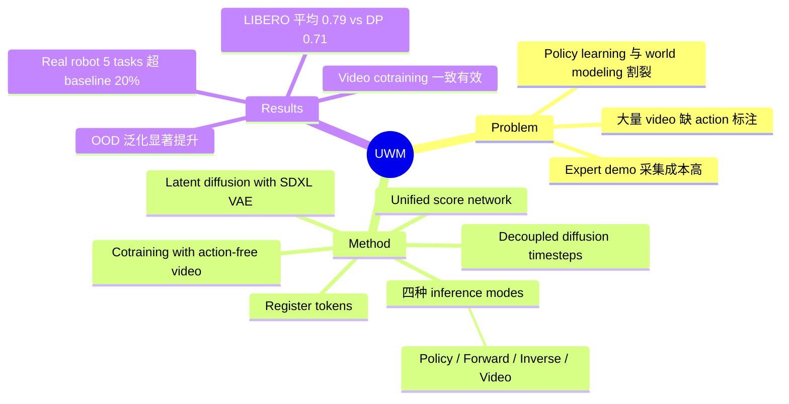

## Summary
UWM 提出在统一 transformer 架构中耦合 video diffusion 和 action diffusion（通过解耦的 diffusion timesteps），实现从异构数据（有/无 action 标注）中同时学习 policy 和 world model，显著提升机器人 imitation learning 的泛化能力。

## Problem & Motivation
Imitation learning 依赖高质量 expert demonstrations，但采集成本极高。与此同时，大量 video 数据虽然展现了丰富的行为和物理交互，却缺少 action annotations，无法直接用于 policy learning。现有方法要么只做 policy learning（忽略 temporal dynamics），要么只做 world modeling（不直接产出 policy），二者割裂。UWM 的核心 motivation 是：统一这两个范式，通过一个共享架构从 video 和 action 数据中提取最大化的学习信号，尤其是利用 action-free video 来提升 policy 的 out-of-distribution 泛化。

## Method
核心设计是 **decoupled diffusion timesteps**：在同一个 diffusion transformer 中，action 和 next observation 各自拥有独立的 noise schedule（timestep $t_a$ 和 $t_{o'}$），训练时联合预测两个模态的 noise。

关键组件：
- **Unified Score Network**：共享的 score function $s_\theta(o, a_{t_a}, o'_{t_{o'}}, t_a, t_{o'})$，同时对 action 和 observation 做 denoising
- **灵活的 inference modes**：通过控制各模态 timestep 实现四种推理模式：
  - **Policy**（$t_{o'}=T$）：边缘化 observation，直接出 action
  - **Forward dynamics**（$t_a=0$）：给定 action 预测下一帧
  - **Inverse dynamics**（$t_{o'}=0$）：给定 next observation 推断 action
  - **Video prediction**（$t_a=T$）：边缘化 action，纯视频预测
- **Architecture**：Diffusion transformer + adaptive LayerNorm，ResNet-18 image encoder，SDXL VAE 做 latent diffusion 提升效率
- **Register tokens**：增强多模态特征共享
- **Cotraining with action-free video**：通过 timestep masking（$t_a=T$）自然整合无 action 标注的视频数据

## Key Results
**Real Robot（5 个 manipulation 任务）**：
| Method | Stack-Bowls | Block-Cabinet | Paper-Towel | Hang-Towel | Rice-Cooker |
|--------|-------------|---------------|-------------|-----------|-----------|
| UWM (Pretrain) | 0.86 | 0.76 | 0.78 | 0.82 | 0.60 |
| UWM (Cotrain) | 0.92 | 0.84 | 0.86 | 0.86 | 0.65 |
| Diffusion Policy | 0.48 | 0.60 | 0.52 | 0.64 | 0.35 |
| GR1 | 0.66 | 0.66 | 0.60 | 0.66 | 0.40 |

- In-distribution 上 UWM 超过最佳 baseline 高达 **20%**
- Out-of-distribution 鲁棒性显著：cotraining with video 在 Stack-Bowls OOD 上 21/30 vs 15/30
- **LIBERO benchmark**：UWM 平均成功率 **0.79 ± 0.11**，Diffusion Policy 0.71，GR1 0.58，PAD 0.57
- Ablation：forward dynamics 预测质量接近 ground truth；inverse dynamics 轨迹跟踪精度（55%）远超 policy（26%）

## Strengths & Weaknesses
**优势**：
- 设计简洁优雅：通过 decoupled timesteps 在单一架构中统一 policy learning 和 world modeling，理论动机清晰
- 四种 inference mode 自然涌现，无需额外设计
- 实验全面，real robot + simulation，in-distribution + OOD 都有覆盖
- 能自然地利用 action-free video 数据，且实验证明 cotraining 一致性地提升性能
- 在 real robot 上相对 Diffusion Policy 有显著且一致的提升

**不足**：
- Simulation（LIBERO）上 OOD 改进不如 real-world 显著，作者归因于 simpler dynamics 但不够有说服力
- 从 scratch 训练时（Figure 10）相比 Diffusion Policy 优势不明显，说明主要收益来自 pretraining 而非架构本身
- 仅用 2000 条额外 video trajectories 做 cotraining，未验证大规模 video 数据的 scaling behavior
- 计算开销和 inference 速度讨论不充分（训练需要 100K steps）
- OOD 评估主要是 visual distractions，缺少更广泛的 domain shift 测试

## Mind Map

## Notes
- 项目主页含 code 和 videos：https://weirdlabuw.github.io/uwm/
- 核心 insight：decoupled timesteps 是统一多模态 diffusion 的关键设计选择，可能推广到其他 multi-modal generative 场景
- 值得关注后续是否会在更大规模 video 数据（如 internet video）上验证 scaling
