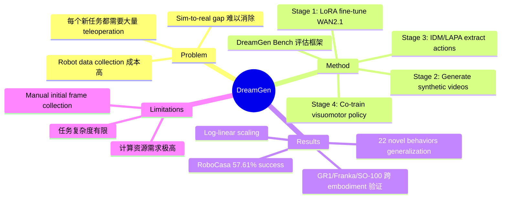

## Summary
DreamGen 提出一个 4 阶段 pipeline，利用 video world model 生成 synthetic robot trajectories（称为 neural trajectories），通过 inverse dynamics model 恢复 action labels，从而在少量真实数据基础上实现跨行为和跨环境的 robot policy generalization。

## Problem & Motivation
Robot learning 当前面临的核心瓶颈是数据获取成本高：每个新任务、新环境都需要大量 human teleoperation 数据。Simulation 虽然是替代方案，但存在 sim-to-real gap，且难以处理 deformable objects、液体等复杂交互。作者认为 internet-scale video generative models 蕴含了丰富的物理世界知识，可以作为 synthetic data generator，弥补真实数据的不足。关键 insight 是：video model 能够 generalize 到新行为和新环境，而这种 generalization 可以通过 neural trajectories 传递给 robot policy。

## Method
DreamGen 是一个简洁的 4 阶段 pipeline：

1. **Fine-tune Video World Model**: 在目标 robot embodiment 的 trajectory 数据上用 LoRA 微调预训练 video model（WAN2.1），保留 internet-scale 知识的同时适配具体 robot 形态。输入为 initial frame + language instruction，输出为未来 video frames。多视角数据通过拼接成 2x2 grid 处理。

2. **Generate Synthetic Videos**: 用微调后的 video model 批量生成 synthetic trajectories。通过在新环境中拍摄 initial frames、搭配新 language instructions，实现跨行为和跨环境的 generalization。

3. **Extract Pseudo-Actions**: 使用 Inverse Dynamics Model (IDM) 或 Latent Action Model (LAPA) 从 video frames 中恢复 action sequences。IDM 基于 diffusion transformer 架构，在真实 robot 数据上训练。

4. **Train Visuomotor Policy**: 将 video-action pairs（neural trajectories）与真实数据混合训练标准 visuomotor policy。

### 关键设计选择
- 基座 video model 选用 WAN2.1（diffusion transformer）
- LoRA fine-tuning 保持预训练知识
- DreamGen Bench：一个无需物理 robot 即可评估 video model 质量的 benchmark，与下游 policy 性能高度相关（correlation > 0.9）

## Key Results
**Simulation (RoboCasa)**:
- Co-training with 240k neural trajectories: 57.61% success（baseline 49.59%）
- 仅用 neural trajectories 训练: 20.55% success
- Scaling neural trajectories 呈现 log-linear performance improvement

**Real-world 跨 3 种 embodiment**:
- GR1 humanoid: 37% → 46.4% average success（4 个 dexterous tasks）
- Franka arm: 23% → 37% average success（3 个 tasks）
- SO-100 arm: 21% → 45.5% average success（2 个 tasks）
- 每个 task 仅需 10-13 条真实 trajectories + ~300 条 synthetic augmentation

**Generalization 能力**:
- Novel behaviors in seen environments: 43.2% success（baseline 11.2%）
- Novel behaviors in unseen environments: 28.5% success（baseline 0%）
- 从 single-task pick-and-place 数据学会 22 种新行为

## Strengths & Weaknesses
**优势**:
- Pipeline 设计简洁实用，4 步流程整合现有模型，无需复杂的 joint training
- 跨 3 种 robot embodiment 的全面实验验证，说服力强
- 真正实现了从单任务数据到 22 种新行为的 generalization，这是非常显著的飞跃
- DreamGen Bench 贡献了一个无需物理 robot 的 video model 评估方案
- Log-linear scaling 趋势表明有很大的 scaling potential

**不足**:
- 计算开销巨大：生成 RoboCasa 数据需要 1500 块 L40 GPU 跑 54 小时，普通实验室难以复现
- 需要手动采集新环境的 initial frames，引入额外人工成本
- 任务复杂度有限，主要是 pick-and-place 级别的操作，复杂 dexterous manipulation 尚未验证
- IDM 仍然需要 robot-specific ground truth 数据训练，并非完全 zero-shot
- 缺少与其他 video-based robot learning 方法的直接对比

## Mind Map

## Notes
