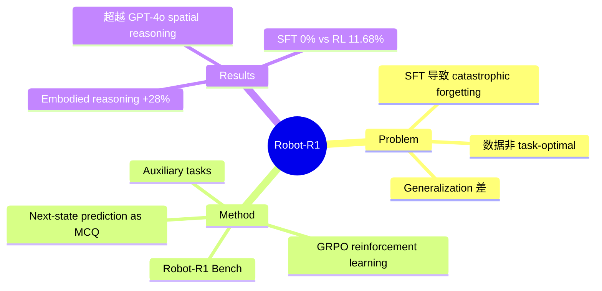

## Summary
提出 Robot-R1 框架，将 DeepSeek-R1 的 GRPO（Group Relative Policy Optimization）强化学习方法应用于 embodied reasoning，通过将 next-state prediction 重新建模为 multiple-choice QA 任务来降低 exploration 复杂度，配合 auxiliary tasks（current state prediction、movement prediction），在 7B 参数量下超越 GPT-4o 的 spatial reasoning 能力，并在 EmbodiedBench manipulation 和 SpatialRGPT-Bench 上显著优于 SFT baseline。

## Problem & Motivation
现有将 LVLM 应用于机器人控制的方法主要依赖 Supervised Fine-Tuning（SFT），存在两大问题：
1. **数据质量**：SFT 数据集通常是启发式构造的（heuristically constructed），并非针对提升 robot control 能力而显式优化
2. **训练缺陷**：SFT 容易导致 catastrophic forgetting 和 generalization 下降，模型在训练分布外的场景表现差

作者受 DeepSeek-R1 在 mathematical reasoning 上 RL 成功的启发，提出用 RL 替代 SFT 来优化 embodied reasoning，核心假设是 RL 可以让模型自主发现更好的推理策略而非简单模仿标注。

## Method
### 核心思路
将 continuous state prediction（预测 robot keypoint 的下一状态坐标）转化为 discrete multiple-choice QA，降低 RL 的 exploration space，使 GRPO 在有限采样下即可有效训练。

### 数据构建
- 基于 RLBench 的 expert demonstrations 提取 keypoint trajectories
- 从场景中抽取 reference points、coordinate systems、object dimensions 等 metadata
- 构造三种 QA 任务：
  1. **Next-state prediction**（核心）：给定当前观测和 robot state，预测 keypoint 的下一状态
  2. **Current state prediction**（auxiliary）：预测当前 keypoint 位置，增强 spatial grounding
  3. **Movement prediction**（auxiliary）：预测运动方向（如 "move up"），增强 action-level 理解

### Multiple-Choice 建模
- 将 continuous coordinate prediction 离散化为 4 选项的选择题
- 选项设计确保干扰项具有合理性（nearby coordinates），避免 trivial shortcuts
- 大幅降低 RL exploration 复杂度

### 训练算法：GRPO
- 每个 prompt 生成一组 responses，计算 group-relative advantage
- 模型需在 `<think>` 标签中进行显式推理，在 `<answer>` 标签中给出答案
- 无需额外 reward model，直接用答案正确性作为 reward signal
- 基座模型：Qwen2.5-7B-VL-Instruct

### Robot-R1 Bench
- 构建了新的 embodied reasoning benchmark，包含 spatial reasoning、planning 等维度
- 用于系统评估 embodied reasoning 能力与 robot control 的相关性

## Key Results
- **Robot-R1 Bench**: embodied reasoning 提升 28%，7B 模型超越 GPT-4o（average score 1.51 vs 1.40）
- **EmbodiedBench Manipulation**: 比 base model 提升 31%（Base tasks 6.3% → 12.5%），SFT baseline 在此 benchmark 上完全失败（0% success rate）
- **SpatialRGPT-Bench**: quantitative metrics 提升 ~40%，qualitative metrics 提升 ~60%
- **SFT 对比**: SFT 在 EmbodiedBench 上 0% 成功率，Robot-R1 达到 11.68% 平均成功率，验证了 RL 相比 SFT 在 generalization 上的显著优势
- **Ablation**: auxiliary tasks 和 multiple-choice 建模都对性能有显著贡献；结果在不同 random seeds 下稳定

## Strengths & Weaknesses
**Strengths**:
- 首次将 GRPO/RL 系统性地应用于 embodied reasoning for manipulation，与 VLN-R1 在 navigation 上的工作形成呼应
- Multiple-choice QA 建模是解决 continuous space RL exploration 难题的巧妙方案
- 7B 模型超越 GPT-4o 的 spatial reasoning，证明 RL fine-tuning 的 parameter efficiency
- SFT 完全失败 vs RL 有效的对比非常有说服力，清晰展示了 RL 在 generalization 上的优势
- 发表在 NeurIPS 2025，质量有保障

**Weaknesses**:
- 仅限 RLBench tabletop manipulation scenarios，未验证 real-world 迁移
- Planning task 性能略有下降（Robot-R1 Bench 上 planning correlation 仅 0.33 vs spatial 0.89），说明 next-keypoint prediction 优化目标与高层 planning 存在 misalignment
- 需要 expert demonstrations 来构建训练数据，非 fully autonomous learning
- 绝对成功率仍然较低（EmbodiedBench 11.68%），距离实用差距明显
- Multiple-choice 离散化可能丢失 fine-grained spatial precision

## Mind Map

## Notes
- 与 [[2506-VLNR1]] 构成同期平行工作：都是将 DeepSeek-R1 的 GRPO 应用于 embodied AI，但分别针对 manipulation 和 navigation。两者都发现 RL 在 generalization 上优于 SFT，但绝对性能与各自领域 SOTA 仍有差距。
- Multiple-choice 建模的 trade-off 值得注意：降低了 exploration 复杂度使 RL 可行，但也牺牲了 continuous precision。未来是否可以用 curriculum（先 MCQ 再逐步 refine to continuous）可能是有价值的方向。
- Planning correlation 低（0.33）是重要信号：next-keypoint prediction 优化的是 local spatial reasoning，对 long-horizon planning 的迁移有限，暗示 embodied reasoning 可能需要分层 RL 策略。
