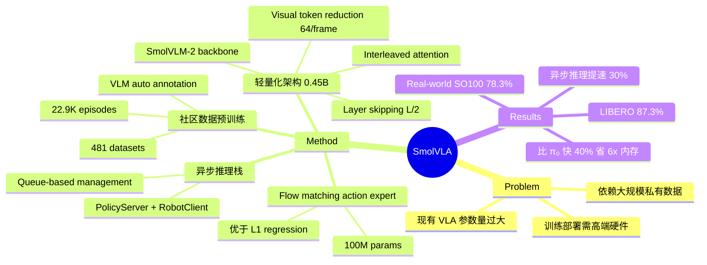

## Summary
SmolVLA 提出了一个仅约 450M 参数的紧凑型 Vision-Language-Action 模型，通过 layer skipping、visual token reduction、interleaved attention 等架构优化以及社区数据集预训练，在 LIBERO 等 benchmark 上达到了与 10 倍大模型相当的性能，并通过异步推理栈实现了约 30% 的任务完成速度提升。

## Problem & Motivation
现有 VLA 模型（如 OpenVLA 7B、π₀ 3.3B）虽然性能强大，但参数量巨大，训练和部署都需要高端硬件，限制了机器人学习研究的普及性。同时，大多数 VLA 依赖大规模私有数据集进行预训练。SmolVLA 希望证明：通过精心的架构设计和社区贡献的开源数据，紧凑模型同样可以达到可比的性能，从而让更多研究者能够在消费级硬件上参与机器人学习研究。

## Method
SmolVLA 的核心设计包含以下关键组件：

**1. 轻量化架构**
- **VLM Backbone**：基于 SmolVLM-2（256M 参数），而非更大的 VLM
- **Layer Skipping**：仅使用 VLM 前 N=L/2 层，将计算成本减半且不显著损失性能
- **Visual Token Reduction**：通过 pixel shuffle 将每帧视觉 token 压缩至 64 个，避免昂贵的 image tiling
- **Interleaved Attention**：在 action expert 中交替使用 cross-attention 和 causal self-attention，提升速度和动作平滑性

**2. 社区数据预训练**
- 使用 481 个社区贡献数据集（约 22,900 episodes、10.6M frames），数据量比竞争方法少一个数量级
- 用 VLM（Qwen2.5-VL-3B-Instruct）自动生成任务描述
- 手动标准化不同数据集的 camera viewpoint 命名

**3. Flow Matching Action Expert**
- Action expert 约 100M 参数，使用 flow matching 替代 diffusion 或 regression
- Flow matching 对 multimodal action distribution 建模具有更好的 inductive bias
- 与 L1 regression 对比：flow matching（80.25%）显著优于 regression（75.25%）

**4. 异步推理栈**
- 将 perception 与 action execution 解耦：PolicyServer 异步预测动作，RobotClient 并行消费
- 基于 queue 的管理机制，threshold 参数 *g* 平衡 reactivity 和计算开销
- 实现约 30% 的任务完成速度提升

**5. State Integration**
- 将 sensorimotor states 输入 VLM 而非 action expert，显著提升各种 attention 机制下的性能

## Key Results
**Simulation Benchmarks：**
- LIBERO benchmark：SmolVLA（0.45B）达到 87.3% 平均成功率，超越 OpenVLA（7B，76.5%），与 π₀（3.3B pretrained，86.0%）相当
- Meta-World benchmark：SmolVLA 达到 57.3%，超越 TinyVLA（sub-1B，31.6%）

**Real-World 评测：**
- SO100 机器人多任务：平均 78.3% 成功率（Pick-Place 75%、Stacking 90%、Sorting 70%），超越 π₀（61.7%）
- SO101 机器人 OOD 测试：in-distribution 90%、out-of-distribution 50%，超越 ACT baseline

**预训练的影响：**
- 无预训练：51.7% → 有预训练：78.3%，社区数据集预训练带来巨大提升

**训练效率：**
- 总预训练约 30,000 GPU hours
- 比 π₀ 快 40%，内存消耗降低 6 倍
- 使用 bfloat16 和 torch.compile() 优化

**Ablation 关键发现：**
- Interleaved attention（85.5%）优于单独 cross-attention（79.0%）或 self-attention（74.5%）
- Causal masking（74.5%）优于 bidirectional（67.5%），防止 future action leakage
- 使用 VLM 前半层在 speed-accuracy tradeoff 上最优

## Strengths & Weaknesses
**Strengths：**
- 模型规模仅 0.45B 就达到与 10 倍大模型相当的性能，证明了 VLA 领域存在显著的过参数化现象
- 完全基于社区开源数据训练，数据量仅为竞争方法的 1/10，降低了数据壁垒
- 异步推理栈设计实用且通用，30% 速度提升对实际部署有重要意义
- 全面开源（模型权重、训练代码、数据集、训练 recipe），reproducibility 极佳
- Ablation 充分，架构选择有数据支撑

**Weaknesses：**
- 预训练数据仅包含单一机器人类型（SO100），cross-embodiment 泛化能力未验证
- 约 23K trajectories 的预训练规模仍较小，可能限制泛化上限
- 主要评测集中在短 horizon 任务，long-horizon 场景下的表现未知
- VLM backbone（SmolVLM-2）原本面向文档阅读/OCR 设计，并非针对机器人场景优化
- 仅使用 imitation learning，缺少 RL fine-tuning 的探索

## Mind Map

## Notes

