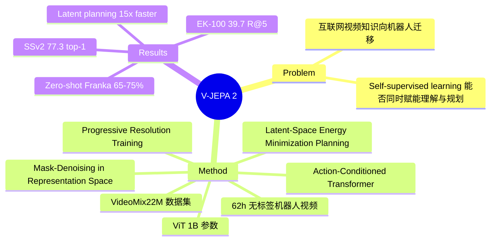

## Summary
Meta FAIR 提出 V-JEPA 2，基于 self-supervised mask-denoising 预训练的 video foundation model，在 22M 视频上训练 1B 参数 ViT，冻结 representation 后仅用 62 小时无标签机器人视频即可训练 action-conditioned world model，实现 zero-shot 机器人操控的 goal-conditioned planning。

## Problem & Motivation
AI 系统如何通过观察学习理解世界并采取行动，是 Yann LeCun 长期倡导的核心问题。当前方法面临两个关键挑战：（1）大规模 video understanding 模型通常依赖 supervised 或 language-supervised 训练，限制了从纯视觉数据学习物理规律的能力；（2）将互联网视频中学到的 visual representation 迁移到 robotic manipulation 需要大量 robot interaction data。V-JEPA 2 试图证明：纯 self-supervised video pretraining 可以同时赋能视觉理解、未来预测和物理世界规划，且仅需极少量机器人数据即可迁移。

## Method
### V-JEPA 2 Pretraining
- **架构**: Vision Transformer (ViT)，最大 1B 参数
- **训练范式**: Mask-denoising，在 **representation space**（非 pixel space）操作
- **数据**: VideoMix22M 数据集，融合 Something-Something v2、Kinetics、HowTo100M、YT-Temporal-1B、ImageNet 共 2200 万样本
- **Scaling 策略**:
  - 数据：2M → 22M 视频
  - 模型：300M → 1B 参数
  - 训练：90K → 252K iterations
  - **Progressive resolution training**：多阶段递增分辨率，提升训练效率

### V-JEPA 2-AC (Action-Conditioned Post-training)
- **300M 参数** action-conditioned transformer
- 仅用 **62 小时**无标签机器人视频训练
- 在冻结的 V-JEPA 2 representation 之上学习 action-conditioned next-state prediction
- **Goal-conditioned planning**: 通过 energy minimization 在 latent space 搜索达到目标状态的 action sequence

### Latent-Space Planning
- 在 latent space 进行 model-predictive planning（非 pixel space video generation）
- 计算效率显著提升：**16 秒 vs. 4 分钟**/action
- 无需 environment-specific training 或 reward signal 即可 zero-shot 部署

## Key Results
- **Motion Understanding**: Something-Something v2 top-1 accuracy **77.3**
- **Action Anticipation**: Epic-Kitchens-100 recall@5 **39.7**（相比此前方法提升 **44%**）
- **Video QA**: 8B 规模下 SOTA（PerceptionTest **84.0**、TempCompass **76.9**）
- **Robot Manipulation**: Franka 机械臂上 zero-shot 部署，grasping 和 pick-and-place 成功率 **65-75%**
- **Latent planning 效率**: 比 pixel-space video generation 快约 **15×**

## Strengths & Weaknesses
**Strengths**:
- 完整验证了 self-supervised video pretraining → understanding + prediction + planning 的统一路径，符合 LeCun 的 world model 哲学
- 仅 62 小时无标签机器人视频即可实现 zero-shot manipulation，数据效率极高
- 在 representation space 而非 pixel space 做 prediction 和 planning，计算效率提升显著
- Scaling 实验充分（数据量、模型规模、训练时长三个维度），为社区提供了清晰的 scaling recipe
- 同时在 video understanding benchmark 和 robot manipulation 上验证，跨域泛化令人印象深刻

**Weaknesses**:
- Robot manipulation 成功率 65-75%，距离实用部署仍有差距
- Zero-shot 仅在简单任务（grasping、pick-and-place）上验证，复杂长序列任务未涉及
- 22M 视频的训练数据规模和 1B 参数的计算需求对大多数实验室不可及
- Action-conditioned model 仅在 Franka 单一平台上验证，cross-embodiment 迁移能力有待更多实验支撑

## Mind Map

## Notes
- 该工作是 LeCun 提出的 JEPA (Joint Embedding Predictive Architecture) 在 video domain 的最新进展，代表了 self-supervised world model 路线的重大里程碑
- "冻结 representation + 轻量 action-conditioned head" 的范式与 VLA 中 frozen vision encoder 的思路一致，但 V-JEPA 2 完全不依赖语言监督
- Latent planning 的 15× 速度优势对 real-time robot control 有重要实践意义
- Cross-embodiment tag 基于其从互联网视频到机器人的迁移能力，但严格来说仅在单一 embodiment (Franka) 上验证
