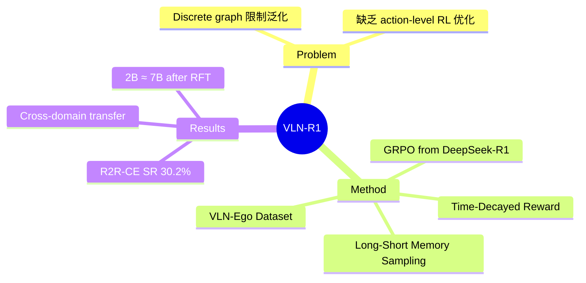

## Summary
首次将 GRPO（Group Relative Policy Optimization，DeepSeek-R1 启发）应用于 VLN 任务，提出端到端框架直接从 egocentric video 生成连续导航动作，通过 SFT + RL fine-tuning 两阶段训练和 Time-Decayed Reward 机制，在 VLN-CE 上验证了 RL 微调对 navigation 的有效性。

## Problem & Motivation
现有 VLN 方法主要依赖 discrete topological graph，将 agent 约束在预定义节点上，限制了对 continuous environments 的泛化。虽然 LLM 在 embodied AI 中展现潜力，但此前方法依赖额外 modality（depth maps, navigation maps）或专用模型（CLIP）做 vision-language alignment，缺乏 fine-grained action-level control。作者受 DeepSeek-R1 的 GRPO 成功启发，探索 RL fine-tuning 能否替代纯 SFT 来提升 VLN agent 的 action prediction 能力。

## Method
### 整体架构
基于 Qwen2-VL（2B/7B）处理 egocentric video，生成四种基本动作：FORWARD, TURN-LEFT, TURN-RIGHT, STOP。

### VLN-Ego Dataset
- 使用 Habitat simulator + 90 Matterport3D scenes 构建
- 训练集：630K samples from R2R + 1.2M from RxR（61 training scenes）
- 标注包含 instruction、vision（historical frames + current observation）、action

### Long-Short Memory Sampling
- 双速率帧采样平衡历史和当前观测
- Short-term memory：最近 M 步内每 δ₁ 帧采样（δ₁ 较小，保留细节）
- Long-term memory：剩余历史每 δ₂ 帧采样（δ₂ > δ₁，保留全局上下文）

### 两阶段训练
**Stage 1 - SFT**: 生成 n-step future action sequences（action-description pairs），用 cross-entropy loss 对齐 expert demonstrations

**Stage 2 - RFT (GRPO)**:
- 每个 prompt 生成 G 个 responses，计算 group-wise 归一化 reward 作为 relative advantage
- 无需显式 reward model，直接用 action correctness 计算 reward
- **Time-Decayed Reward (TDR)**: 对多步预测施加指数衰减 γ，近端动作权重远高于远端，建模 temporal dependency

### Multi-step Action Prediction
- 预测 6 步 future actions（而非单步），显著提升 SR（从 15.1% 到 24.9%）

## Key Results
- **R2R-CE Val-Unseen (7B + RFT)**: SR 30.2%, OS 41.2%, SPL 21.8%, NE 7.0m
- **R2R-CE Val-Unseen (2B + RFT)**: SR 25.6%, OS 37.5%, SPL 20.5%, NE 10.2m
- **RxR-CE Val-Unseen (7B)**: SR 22.3%, OS 33.4%, SPL 17.5%
- **Cross-domain transfer**: R2R SFT + 10K RxR RFT → 22.7% SR（少量 RL 数据即可迁移）
- **Ablation**: TDR（30.2% SR）>> hard reward（23.8%）>> uniform（25.0%）；GRPO k=8 为收敛点
- **2B vs 7B**: 经 RFT 后 2B 模型接近 7B 性能，说明 RL 对小模型提升更显著

## Strengths & Weaknesses
**Strengths**:
- 首次验证 GRPO/RL fine-tuning 在 VLN 中的有效性，开辟了新的训练范式
- Time-Decayed Reward 设计合理，符合导航中近端动作比远端更重要的直觉
- 端到端纯 RGB 输入，无需 depth/map/navigation graph 等额外模态
- Cross-domain transfer 实验（R2R→RxR）展示了 RL 微调的数据效率

**Weaknesses**:
- 绝对性能与 SOTA 差距明显（SR 30.2% vs StreamVLN 56.9%），说明 RL-only 路线目前不如 SFT+DAgger
- 仅在 simulated indoor environments 验证，无 real-world 实验
- Discrete action space（4 actions）过于粗粒度，限制了 fine-grained control
- SFT 阶段 1.8M samples 训练量大，但 RFT 仅用 20K samples，RL 的 scaling behavior 未充分探索

**Impact**: 作为 VLN + RL fine-tuning 的先驱工作，方法论价值大于当前数值，为后续 RL-based VLN 奠定基础。

## Mind Map

## Notes
- 与 [[2507-StreamVLN]] 代表 VLN 训练的两种范式：SFT+DAgger vs SFT+RL，目前前者性能大幅领先，但 RL 路线的潜力值得关注
- GRPO 的 group size k=8 即收敛，暗示 VLN 的 action space 相对简单时 RL exploration 需求有限
- 2B ≈ 7B after RFT 是有趣发现，可能因为 VLN action space 本身较小，大模型的额外容量未被充分利用
