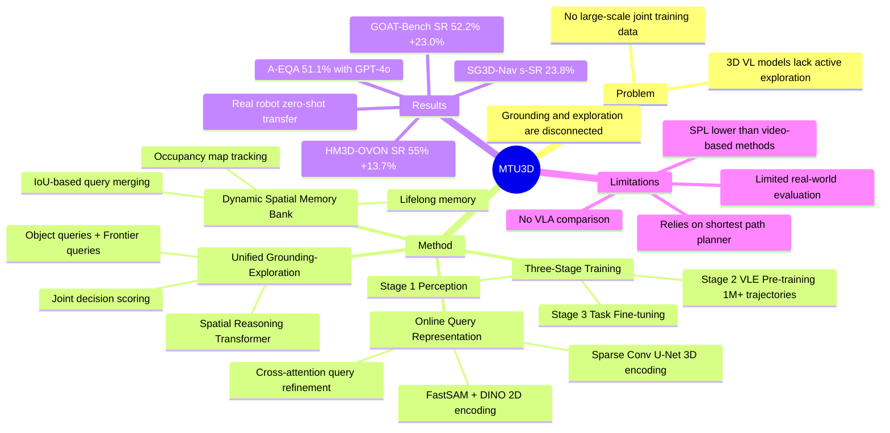

## Summary
MTU3D 提出了一个统一的 embodied navigation 框架，通过 **online query representation** 和 **joint grounding-exploration objective** 将 3D visual grounding 和 active exploration 桥接在一起，无需显式 3D 重建，在 open-vocabulary navigation、multi-modal lifelong navigation、sequential task navigation 和 active EQA 四个 benchmark 上取得 SOTA。

## Problem & Motivation
现有 3D vision-language models 依赖预计算的 3D 重建进行静态场景理解，缺乏 **主动探索（active exploration）** 能力。核心矛盾：
1. **Grounding vs. Exploration 割裂**：现有方法要么专注于已观测区域的 object grounding，要么只做 frontier-based exploration，两者没有 joint optimization
2. **离线重建依赖**：大多数 3D VL models 需要预先构建的 point cloud / mesh，无法在线处理 RGB-D 流
3. **大规模训练数据匮乏**：缺少同时包含 grounding 和 exploration 决策的 trajectory 数据

这个问题与 VLN-VLA unification 高度相关——MTU3D 本质上在解决 "如何在导航过程中建立和利用空间理解" 的问题。

## Method
### 1. Online Query Representation Learning
不做显式 3D 重建，直接从 RGB-D 帧生成 **object queries**：
- **2D Encoding**: FastSAM 分割 + DINO 特征提取 → segment-level features
- **3D Encoding**: Depth → point cloud → sparse convolutional U-Net → 3D features
- **Local Query Proposal**: MLP 融合 2D+3D features → cross-attention + spatial self-attention 精炼
- 每个 query 包含：3D bounding box、segmentation mask、open-vocabulary embedding、confidence score

### 2. Dynamic Spatial Memory Bank
- 通过 **bounding box IoU matching** 将当前帧的 local queries 与历史 global queries 合并
- 维护 **occupancy map** 标记 explored/unexplored 区域
- 支持 lifelong memory（跨 sub-episode 保持记忆）

### 3. Unified Grounding-Exploration Objective
核心创新——将 object grounding 和 frontier exploration 统一到同一个决策空间：
- **Frontier Queries** $Q_t^F$：表示 explored/unexplored 边界的候选探索点
- **Spatial Reasoning Transformer**：融合 language instructions、object queries $Q_t^G$、frontier queries $Q_t^F$
- 统一决策：$q^* = \arg\max S_t^u(q_i), \quad q_i \in Q_t^G \cup Q_t^F$
  - 如果最优 query 是 object → 执行 grounding
  - 如果最优 query 是 frontier → 导航到该位置继续探索

### 4. 三阶段训练
| Stage | 目标 | 数据 | Epochs |
|-------|------|------|--------|
| Stage 1: Low-level Perception | Query representation | ScanNet + HM3D RGB-D | 50 |
| Stage 2: VLE Pre-training | Joint grounding + exploration | >1M trajectories (sim+real) | 10 |
| Stage 3: Task Fine-tuning | 任务适配 | Task-specific data | 10 |

训练细节：AdamW (lr=1e-4)，4× A100，总计 ~164 GPU hours。

### 5. 关键设计
- **Hybrid frontier selection**：混合 random + optimal frontiers 防止 exploration overfitting
- **Type embeddings** 区分 object vs. frontier queries
- 支持多模态目标：language goal (CLIP text encoder) + image goal (CLIP image encoder)

## Key Results

### HM3D-OVON (Open-Vocabulary Navigation)
| Setting | SR | SPL | vs. Best Baseline |
|---------|----|----|-------------------|
| Val Seen | **55.0%** | **23.6%** | +13.7% SR (vs. Uni-NaVid) |
| Val Unseen | **45.0%** | 18.5% | +1.1% SR |

### GOAT-Bench (Multi-modal Lifelong Navigation)
| Setting | SR | SPL | vs. Best Baseline |
|---------|----|----|-------------------|
| Val Seen | **52.2%** | **30.5%** | +23.0% SR (vs. SenseAct-NN) |
| Val Unseen | **47.2%** | **27.7%** | +15.1% SR (vs. TANGO) |

### SG3D-Nav (Sequential Task Navigation)
- s-SR: **23.8%**（+9.1% vs. Embodied Video Agent）
- t-SR: **8.0%**, SPL: **16.5%**

### A-EQA (Embodied QA)
- GPT-4o + MTU3D: **51.1% LLM-SR**, **42.6% LLM-SPL**（baseline GPT-4V: 41.8% / 7.5%）

### Real-World Deployment
在 NVIDIA Jetson Orin 上部署，Kinect RGB-D + Lidar 移动机器人，三种室内环境（home/corridor/meeting room）**zero-shot transfer**，无需额外 fine-tuning。

### Ablation Highlights
- VLE pre-training: OVON SR +5.5%, GOAT SR +13.9%
- Lifelong memory: GOAT object SR 10.5% → 52.6%（+42.1%）
- 运行效率：266M 参数，3.4 FPS (RTX 3090 Ti)

## Strengths & Weaknesses
### Strengths
- **统一框架**：首次将 grounding 和 exploration joint optimization，而非 pipeline
- **无需 3D 重建**：online query representation 直接处理 RGB-D 流，更实用
- **Spatial memory 设计精巧**：occupancy map + dynamic query merging，支持 lifelong navigation
- **多任务泛化**：4 个不同 benchmark 都取得 SOTA
- **Real-world transfer**：成功 zero-shot 部署到物理机器人
- **训练效率高**：164 GPU hours，相对可复现

### Weaknesses
- SPL 在部分 setting 不如 video-based models（如 Uni-NaVid），说明 exploration 路径可能不够高效
- Real-world 验证仅 3 个室内场景，规模有限
- 依赖 Habitat-Sim shortest path planner 做低层导航，非真正端到端
- 未与 VLA models（如 π0.5、NaVILA）做对比，缺少 manipulation 评测
- Query merging 基于 IoU 的简单启发式，可能在 cluttered scenes 中失败

## Mind Map

## Notes
### 对 VLN-VLA Unification 的启示
1. **MTU3D 的 spatial memory bank 是我们 survey 中提出的 "shared spatial representation" 的一个实例**。它用 online query merging 替代了显式 3D 重建，这对 VLA 端也很有启发——manipulation policy 同样可以从这种 query-based representation 中获取 object affordance
2. **Unified decision space（grounding vs. exploration）的思路可以推广到 grounding vs. manipulation**。类似地，可以把 manipulation action 也作为一种 query type 加入统一决策
3. **Stage 2 的 VLE pre-training 思路值得借鉴**：用大规模 simulation trajectories 做 pre-training，再 fine-tune 到具体任务。VLA 也可以采用类似的 "先在 simulation 中学 spatial reasoning，再 real-world fine-tune" 的路径
4. **局限性方面**：MTU3D 仍然使用 shortest path planner 做低层导航（非学习式），且完全没有涉及 manipulation。这恰好是 VLN-VLA unification 需要填补的 gap

### 技术细节备注
- 266M 参数，比 VLA models (π0 3B+) 小很多，但功能更专注
- 3.4 FPS 对于 navigation 足够，但如果要加入 manipulation 的实时控制可能不够
- Hybrid frontier selection 是一个巧妙的 training trick，防止 agent 只学会 "走最优路径"
