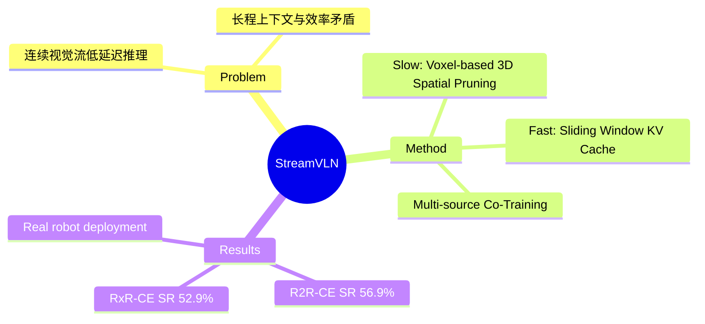

## Summary
首个 streaming VLN 框架，通过 SlowFast 双速上下文建模策略（fast-streaming dialogue context + slow-updating 3D-aware memory context），在 VLN-CE benchmarks 上实现 SOTA 性能的同时保持稳定低延迟，并成功部署于真实机器人。

## Problem & Motivation
Real-world VLN 需要 agent 处理连续视觉流并以低延迟生成动作，同时保持长程上下文。现有 Video-LLM 方法面临三角矛盾：fine-grained visual understanding、long-term context modeling 和 computational efficiency 难以兼得。基于帧采样的方法牺牲时间分辨率，基于 token compression 的方法丢失视觉细节，而每步刷新 dialogue context 导致大量冗余计算。StreamVLN 提出 hybrid slow-fast 策略同时解决这三个问题。

## Method
### 整体架构
基于 LLaVA-Video 构建，扩展为支持 interleaved vision-language-action 的 multi-turn dialogue 模型。

### Fast-Streaming Dialogue Context
- Sliding window KV cache，保留最近 N 轮对话的 KV 状态
- 通过 KV cache reuse 消除 >99% 的 prefilling 时间
- 窗口外的历史状态 offload，非 observation tokens 直接丢弃

### Slow-Updating Memory Context
- **Voxel-based spatial pruning**: 利用 depth 信息将 2D image patches back-project 到共享 3D 空间，基于 3D spatial proximity 丢弃冗余 tokens
- 约减少 20% input tokens，同时性能反而提升（去除时空冗余）
- 保持高分辨率图像输入，不需要降低 visual resolution

### Co-Training with Multi-Source Data
- VLA 数据：450K R2R/R2R-EnvDrop/RxR + 300K ScaleVLN + 240K DAgger
- VL 数据：248K VQA（LLaVA-Video-178K, ScanQA）+ 230K interleaved image-text（MMC4）

## Key Results
- **R2R-CE Val-Unseen**: SR 56.9%, SPL 51.9%, NE 4.98m（超越 ETPNav 等不使用全景/waypoint 监督的方法）
- **RxR-CE Val-Unseen**: SR 52.9%, SPL 46.0%, NE 6.22m
- **ScanQA**: BLEU-4 15.7, CIDEr 100.2（保持通用 VQA 能力）
- **Ablation**: Voxel pruning 带来 +1.2% SR/+1.0% SPL（R2R）；DAgger 数据 +5.5% SR
- **Real-world**: 部署于 Unitree Go2 机器人，inference 0.27s/4 actions，在办公室/商场/户外均成功导航

## Strengths & Weaknesses
**Strengths**:
- SlowFast 设计优雅：fast path 解决计算效率，slow path 解决长程记忆，两者解耦且互补
- Voxel-based spatial pruning 是 principled 的 token 压缩方案，利用 3D 几何信息而非简单的 temporal sampling
- 真实机器人部署验证了方法的实用性，inference latency 稳定且低
- 多源数据 co-training 有效保持了通用 VL 能力

**Weaknesses**:
- 依赖 depth sensor（虽然只在 pruning 时使用），限制了纯 RGB 场景的适用性
- 训练开销较大（后续 [[2512-EfficientVLN]] 指出其 GPU hours 远高于必要水平）
- R2R-CE test 集结果未报告，difficult to assess generalization beyond val

**Impact**: 奠定了 streaming VLN 的 paradigm，后续 Efficient-VLN 等工作在此基础上优化效率。

## Mind Map

## Connections
- Related papers: [[2512-EfficientVLN]]（直接改进 StreamVLN 的训练效率）, [[2412-NaVILA]]（同期 Video-LLM VLN，不同 action space 设计）, [[2304-ETPNav]]（StreamVLN 对比的 waypoint-based baseline）, [[2402-NaVid]]（Video-based VLM for VLN 先驱）, [[2412-LHVLN]]（长程 VLN 记忆管理）
- Related ideas: 3D-aware token pruning 可扩展到其他 embodied tasks；SlowFast 策略可迁移至 VLA 的 streaming inference
- Related projects:

## Notes
- 与 [[2506-VLNR1]] 形成有趣对比：StreamVLN 用 SFT + DAgger 路线，VLN-R1 用 RL fine-tuning 路线，代表 VLN 的两种训练范式
- Voxel pruning 的 3D back-projection 需要 calibrated depth，这在 real-world deployment 中可能是瓶颈
