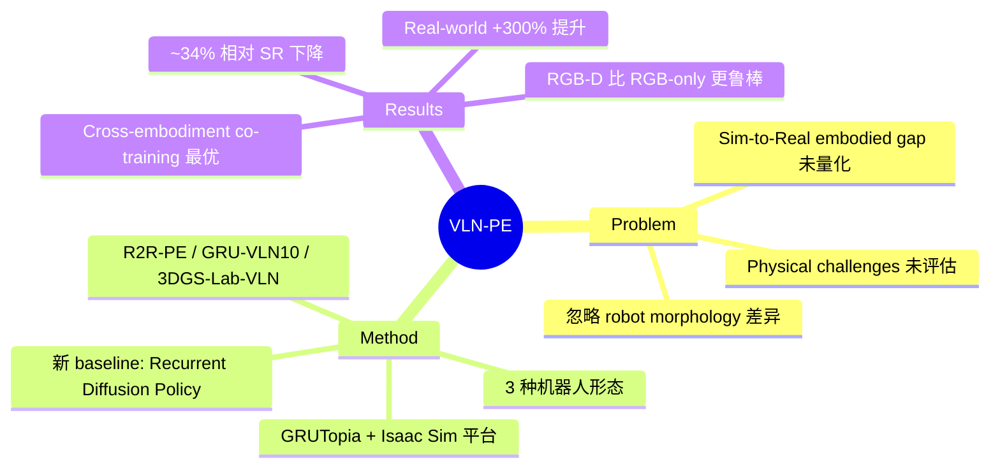

## Summary
VLN-PE 是首个支持 humanoid、quadruped、wheeled 三类机器人的 physically realistic VLN 平台，系统揭示了现有 VLN 方法从 simulation 迁移到 physical embodiment 时的性能退化（约 34% 相对 SR 下降），并发现 cross-embodiment co-training 和 depth 融合是缓解 embodied gap 的有效策略。

## Problem & Motivation
现有 VLN 研究建立在理想化 simulation 假设之上，大多面向 point-based 或 wheeled agent 设计，忽略了 physical embodiment 带来的核心挑战：（1）不同 robot morphology 导致 viewpoint shift 和 motion error；（2）真实环境中光照变化、碰撞、摔倒等 physical challenges 未被评估；（3）从 Habitat 等 simulator 到 physical robot 的 transfer gap 缺乏系统量化。VLN-PE 旨在填补这一空白，建立首个 physically grounded 的 VLN 评估体系。

## Method
### VLN-PE Platform
基于 GRUTopia + NVIDIA Isaac Sim 构建，支持三类机器人形态：
- **Humanoid**: Unitree H1, G1（RL-based locomotion controller）
- **Quadruped**: Unitree Aliengo（相机高度约 0.5m，视角与人类差异大）
- **Wheeled**: Jetbot

### 场景与数据集
- 90 个 Matterport3D 场景转换为 USD 格式（含手动修复）
- 10 个高质量合成场景（GRScenes）→ **GRU-VLN10** 数据集（441/111/1,287 episodes）
- 3D Gaussian Splatting 渲染的实验室环境 → **3DGS-Lab-VLN**（160 train, 640 eval）
- **R2R-PE**: 8,679/658/1,347 episodes（经 stair filtering 后）

### 评估 Metric 扩展
标准 VLN metrics（TL, NE, SR, OS, SPL）之外新增：
- **Fall Rate (FR)**: roll >15° 或 pitch >35°
- **Stuck Rate (StR)**: 位置/航向变化 <0.2m 和 15° 持续 50 步

### Baseline 方法
1. **End-to-End 单步**: Seq2Seq（~36M params）、CMA（~36M params）、NaVid（7B）
2. **Multi-step continuous（新提出）**: **Recurrent Diffusion Policy (RDP)** — LongCLIP encoder + ResNet50 depth encoder + GRU + Transformer-based diffusion decoder，预测 dense waypoints T×(Δx, Δy, Δyaw)
3. **Map-based train-free**: 改进版 VLMaps（LLM 解析 subgoals + LSeg semantic grounding + A* planning）

## Key Results
### VLN-CE → VLN-PE Transfer（Humanoid H1）
- NaVid zero-shot: val-unseen SR 22.42%（约 18% 下降）
- CMA zero-shot: val-unseen SR 16.04%（约 16% 下降）
- **关键发现**: 在 Habitat 上用 175K augmented samples 训练的模型，反而不如在 VLN-PE 上从头训练的模型，说明模型严重 overfit to specific simulation platform

### Physical Controller 一致性
- 训练/评估都不用 controller: val-seen SR 20.21%
- 仅评估时用 controller: val-seen SR 12.92%, FR 31.76%（大量摔倒）
- 训练+评估都用 controller: val-seen SR 21.12%, FR 23.40%（性能恢复）

### Cross-Embodiment 分析
- Quadruped zero-shot SR 仅 2.07%（因 0.5m 相机高度导致严重视角偏差）
- **One-for-All co-training**: Humanoid SR 26.44%, Quadruped SR 23.83%, Wheeled SR 20.02%（val-unseen）— 多机器人联合训练一致最优

### 光照鲁棒性
- NaVid（仅 RGB）在低光 DL300 下 SR 从 22.42% 暴跌至 9.95%（-12.47%）
- CMA 和 RDP（RGB-D）在不同光照下表现稳定，证明 multimodal fusion 提升鲁棒性

### Out-of-Domain（GRU-VLN10）
- RDP fine-tuned: SR 32.43%（+14.41% vs 无 FT）
- 3DGS-Lab-VLN: NaVid 完全失败（SR 5.81%），RDP SR 30.63%（3DGS artifacts 严重干扰 RGB-only 模型）

### 真实世界验证（Unitree Go2, 14 episodes）
- 无 VLN-PE fine-tuning: SR 7.14%
- 有 VLN-PE fine-tuning: SR 28.57%（+300% 提升）

## Strengths & Weaknesses
**Strengths**:
- 首次系统量化 physical embodiment gap，填补了 VLN 研究中长期缺失的 evaluation 维度
- Cross-embodiment 实验设计全面：3 种机器人、多种光照、多域场景，结论有说服力
- 新提出的 RDP baseline 将 diffusion policy 引入 VLN，为 continuous action 提供新方向
- One-for-All co-training 结果有实际意义：一个模型服务多种机器人
- Fall Rate / Stuck Rate 等 physical metric 对未来 embodied navigation 评估有重要参考价值

**Weaknesses**:
- 总体 SR 偏低（最佳约 28%），实用性有限，不过这本身就说明了 physically realistic VLN 的难度
- 仅在 14 个 real-world episodes 上验证，统计显著性不足
- Quadruped 性能极低，虽然归因于相机高度差异，但是否有更好的解决方案（如 multi-height fusion）未深入探索
- 场景主要基于 MP3D，outdoor 和更大规模场景的 generalization 未验证

## Mind Map

## Connections
- Related papers: [[2402-NaVid]]（VLN-PE 的主要 baseline 之一，在 physical setting 下暴露出 RGB-only 的脆弱性）、[[2304-ETPNav]]（VLN-CE topological planning，VLN-PE 是其 physically grounded 版本的自然延伸）、[[2210-VLMaps]]（VLN-PE 中改进 VLMaps 作为 map-based baseline）、[[2412-NaVILA]]（同关注 cross-embodiment navigation，NaVILA 面向 legged robot）、[[2305-NavGPT]]（LLM-based VLN，VLN-PE 中评估了类似 pipeline）、[[2603-PROSPECT]]（streaming VLN，VLN-PE 的 physical metric 可用于评估其 real-world 表现）、[[2512-EfficientVLN]]（Efficient VLN 方法）
- Related ideas: Cross-embodiment co-training 策略可推广到 VLA 领域；Physical metrics（FR, StR）应成为 embodied navigation 的标准评估维度
- Related projects:

## Notes
- 本文最核心的 insight 是 "models overfit to simulation platforms"：在 Habitat 上用大量数据训练的模型，迁移到 Isaac Sim 后性能反而不如少量 in-domain 数据训练的小模型。这对整个 VLN 社区都是重要警示
- Cross-embodiment co-training 的成功暗示了 data diversity 比 data volume 更重要的原则
- Quadruped 的极低性能（SR 2.07%）揭示了 camera height 是一个被严重低估的 factor，未来 VLN 方法需要设计 height-invariant representations
- 3DGS rendering artifacts 导致 NaVid 失败的发现，说明 RGB-only 方法在新型 scene representation 下的脆弱性
