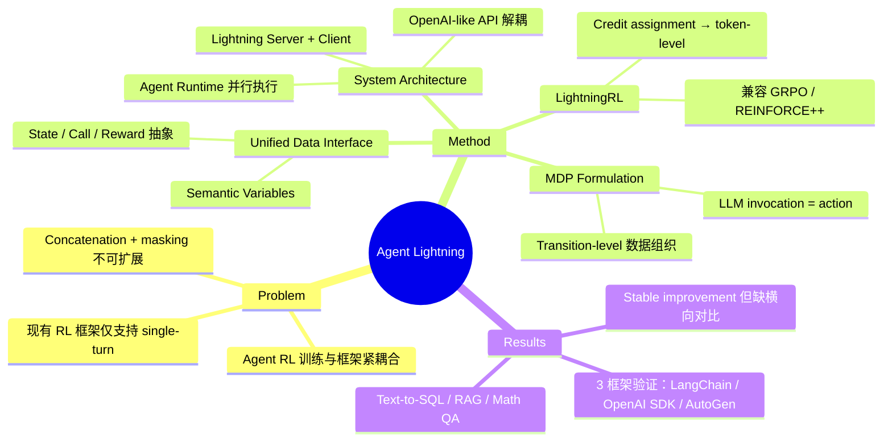

## Summary

提出 Agent Lightning 框架，通过将 agent 执行建模为 MDP 并设计 Training-Agent Disaggregation 架构，实现了 RL 训练与任意 agent 框架（LangChain、OpenAI Agents SDK、AutoGen 等）的完全解耦，使现有 agent 几乎无需修改代码即可用 RL 进行优化。

## Problem & Motivation

现有 LLM agent 在未训练场景中容易出错（multi-turn coding、私有领域数据、陌生工具等），prompt engineering 无法根本解决。RL 相比 SFT 的优势在于不需要昂贵的 step-by-step annotation，仅需 outcome-based reward。然而，将 RL 应用于 agent 训练面临三大挑战：(1) agent 执行涉及多次 LLM 调用、外部工具交互，复杂度远超 single-turn 场景；(2) 不同 agent 架构差异巨大；(3) 现有 RL 框架（VeRL、OpenRLHF 等）针对 single-turn 设计，要求 agent 逻辑紧耦合到训练框架中，迁移成本高且不可扩展。

## Method

**核心思想**：将 agent 执行与 RL 训练完全解耦，通过 unified data interface 抽象不同 agent 的执行逻辑。

### 1. Unified Data Interface
- **State**：定义为 agent 执行的快照，包含一组 semantic variables（被组件使用/修改的关键语义变量）
- **Call**：每次组件调用记录为 `(meta, input, output)`，其中组件 $C_i \in \mathcal{M} \cup \mathcal{T}$（LLM 或 tool）
- **Reward**：支持 intermediate reward 和 terminal reward，每次执行 augmented 为 $\{(\text{call}_i, r_i)\}_{i=1}^N$

### 2. MDP Formulation
将 single-LLM agent 建模为 POMDP $(\mathcal{S}, \mathcal{O}, \mathcal{A}, \mathcal{P}, \mathcal{R})$：
- LLM 的每次 invocation 的完整 token sequence 视为一个 action
- 训练数据提取为 $\{(\text{input}_t, \text{output}_t, r_t)\}_{t=1}^T$，忽略 agent 框架内部的复杂逻辑
- 支持 single-LLM multi-agent（同一 LLM 不同 prompt 扮演不同角色）和 multi-LLM 设置

### 3. LightningRL — Hierarchical RL Algorithm
两步机制：
1. **Credit assignment**：将 episode-level return 分配到各 action（当前实现简单地假设所有 action 等值）
2. **Token-level decomposition**：在 action 内部进一步分解到 token level，兼容 GRPO、REINFORCE++ 等 value-free 方法

关键优势：将 trajectory 分解为独立 transition，避免了 sequence concatenation + masking 方法的诸多问题（context 长度爆炸、RoPE position encoding 中断、application-specific mask 设计）。

### 4. Training-Agent Disaggregation Architecture
- **Lightning Server**：集成 RL 框架，管理训练，通过 OpenAI-like API 暴露模型
- **Lightning Client**：封装 agent runtime，支持 data parallelism（intra-node + inter-node）、OpenTelemetry 自动 trace 捕获、error handling、Automatic Intermediate Rewarding (AIR)

## Key Results

在三个任务上验证，均使用 Llama-3.2-3B-Instruct：

| 任务 | Agent 框架 | 数据集 | 工具 | Agent 数 | 优化 Agent 数 |
|:-----|:----------|:------|:-----|:---------|:------------|
| Text-to-SQL | LangChain | Spider | SQL executor | 3 | 2 |
| Open-domain QA (RAG) | OpenAI Agents SDK | MuSiQue | Wikipedia retriever | 1 | 1 |
| Math QA | AutoGen | Calc-X | Calculator | 1 | 1 |

三个任务均展示了 stable, continuous reward improvement。论文主要以训练曲线（Figures 5-7）展示结果，未给出与 baseline 方法的横向对比数字。Text-to-SQL 任务验证了 multi-agent selective optimization 能力；RAG 任务在 21M Wikipedia 文档上验证了开放域检索场景；Math QA 验证了 tool-augmented reasoning。

## Strengths & Weaknesses

**Strengths**:
- **工程价值突出**：Training-Agent Disaggregation 是实用的系统设计，解决了 agent 开发生态碎片化与 RL 训练框架耦合的现实痛点。"几乎零代码修改"显著降低了 agentic RL 的落地门槛
- **避免 concatenation + masking 的弊端**：transition-level 数据组织消除了 context 长度爆炸和 custom masking 的工程负担，这是相对于 RAGEN、Search-R1 等方法的结构性优势
- **通用性设计**：MDP formulation 和 unified data interface 对 single-LLM multi-agent、multi-LLM 等复杂编排模式都有清晰建模

**Weaknesses**:
- **Credit assignment 过于简单**：当前实现直接假设所有 action 等值，对于长 horizon、多步决策场景这是明显不足。论文承认未来需要更复杂的 credit assignment，但目前缺乏验证
- **缺乏横向对比**：实验只展示了训练曲线的提升趋势，没有与 concatenation + masking 方法（RAGEN 等）在相同 benchmark 上的定量对比，无法判断实际性能差异
- **实验规模有限**：仅用 3B 模型在相对简单的任务上验证，未展示在更大模型或更复杂 agent 场景（如 GUI agent、web agent）上的效果
- **MDP formulation 的局限**：将每次 LLM invocation 视为 action 意味着丢弃了 agent 内部逻辑的结构信息，这在解耦的同时可能损失了有价值的学习信号

**影响**：作为 Microsoft Research 推出的通用 agentic RL 训练框架，如果开源生态成熟，有望成为 agent RL training 的基础设施。但核心算法贡献（LightningRL）目前偏弱，更像是一个工程系统论文。

## Mind Map

## Notes

- 与 [[Papers/2508-ComputerRL|ComputerRL]] 关注类似问题（agent RL training），但 Agent Lightning 更侧重系统层面的通用性，ComputerRL 更侧重 computer-use 场景的算法设计
- Credit assignment 是 agentic RL 的核心难题，论文承认当前实现过于简单。未来若引入 learned value function 或 hindsight-based credit assignment，算法贡献会更显著
- Transition-level vs. concatenation 的 trade-off 值得关注：前者更灵活但丢失了 step 间的 attention 依赖，后者保留了完整上下文但面临工程问题
- Component of Interest (CoI) 概念有趣——不仅限于 RL，还可支持 automatic prompt optimization，但论文未深入展开
