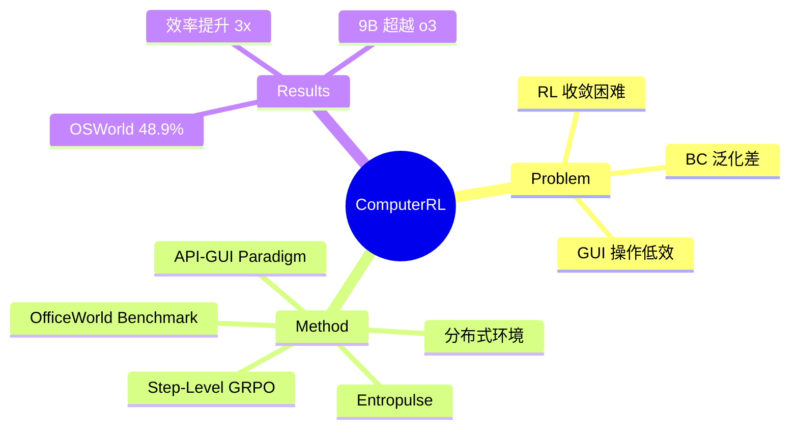

## Summary
提出 ComputerRL，通过 API-GUI 统一范式、step-level GRPO 和 Entropulse 训练策略，实现端到端在线 RL 训练 computer use agent，以 9B 模型在 OSWorld 上达到 48.9% 超越 OpenAI CUA o3。

## Problem & Motivation
现有 computer use agent 主要依赖 behavior cloning（人工标注或模型蒸馏），面临三大问题：(1) GUI 本为人类设计，agent 模拟人类操作既笨拙又低效；(2) behavior cloning 泛化差、缺乏错误恢复能力，且受限于 teacher model 上限；(3) RL 训练在复杂桌面环境中面临收敛慢、效率低等难题，阻碍大规模应用。核心 insight 是 agent 应同时利用 API 的高效性和 GUI 的通用性。

## Method
**API-GUI Paradigm**：统一程序化 API 调用与 GUI 交互。通过 LLM 自动化工作流为每个应用生成专用 API：需求分析→API 实现→测试用例生成（含 error feedback loop）。Agent 可灵活选择 API 或 GUI 操作。

**三阶段训练**：
1. **Behavior Cloning**：构建 8000 个任务，多个 LLM 采集轨迹，按结果分层筛选，任务级数据增强，得到 180k+ 正确步骤
2. **Step-Level GRPO**：将 GRPO 算法扩展到 step level，rule-based reward（成功格式化动作=1，否则=0），实现细粒度的 online RL
3. **Entropulse**：交替进行 RL 和 SFT 阶段，解决 entropy collapse 问题。RL 阶段成功的多样性 rollout 作为 SFT 数据，无需额外环境交互

**分布式基础设施**：基于 Docker + gRPC，标准化解耦接口（AgentBench API），轻量容器化 VM（qemu-in-docker），支持 1000+ 并发环境。

**OfficeWorld Benchmark**：新提出的 Office 软件操作基准（Word/Excel/PowerPoint）。

## Key Results
- OSWorld: AutoGLM-OS-9B 达 48.9%（RL 带来 66% 提升），超越 OpenAI CUA o3（42.9%）和 UI-TARS-1.5（42.5%）
- OfficeWorld: Word 30.0%、Excel 58.3%、PowerPoint 41.7%，平均 43.3%
- 效率：完成目标任务所需步数仅为最强 baseline 的 1/3
- 9B 模型即可达到 SOTA，说明方法而非规模是关键
- 算法已部署到 AutoGLM 产品

## Strengths & Weaknesses
**Strengths**:
- API-GUI 范式是重要的 insight——既保留 GUI 的通用性又获得 API 的高效性，符合人类实际使用软件的模式
- Entropulse 优雅地解决了 RL 训练中 entropy collapse 的核心难题，RL/SFT 交替无需额外环境交互
- 9B 模型超越 o3 等大模型，证明方法创新比 scaling 更重要
- Step-level GRPO 相比 trajectory-level reward 提供更密集的学习信号
- 已部署到产品系统（AutoGLM），证明实用性

**Weaknesses**:
- Rule-based reward（0/1）过于简单，可能限制复杂任务的学习
- 视觉感知错误是最大的 error category，但论文未深入探讨如何改进
- API 自动生成依赖 LLM 质量，在复杂或小众应用上可能不可靠
- OfficeWorld benchmark 任务量偏少（仅 120 个），评估充分性存疑
- 安全性问题仅一笔带过，autonomous desktop control 的风险值得更深入讨论

**影响**: Entropulse 有通用价值，可应用于其他多步决策 RL 场景。API-GUI 范式为 agent 效率提升指明方向。

## Mind Map

## Notes
- Entropulse 的核心 insight：entropy collapse 不是要"防止"而是要"周期性修复"，RL 和 SFT 交替是自然的解法
- API-GUI 范式 vs UI-TARS-2 的 GUI-SDK：方向一致但实现不同，ComputerRL 更强调自动生成应用专用 API
- 9B 模型的成功提出一个重要问题：GUI agent 的瓶颈到底在模型规模还是训练方法？
