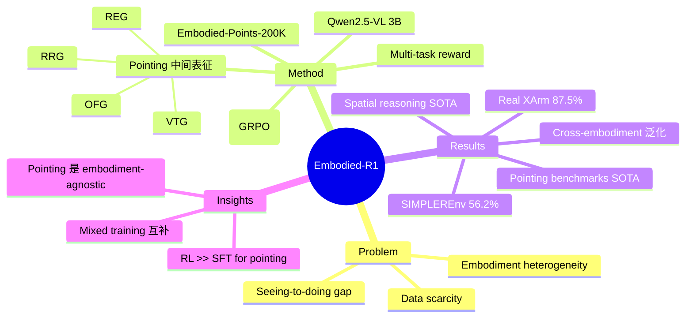

## Summary
Embodied-R1 提出以 "pointing" 作为 embodiment-agnostic 的中间表征，桥接 vision-language understanding 和 low-level action，通过 3B VLM + 两阶段 Reinforced Fine-Tuning（GRPO）在 Embodied-Points-200K 数据集上训练，实现 56.2% SIMPLEREnv 成功率和 87.5% 真实 XArm 任务成功率，无需 task-specific fine-tuning 即具备 zero-shot generalization。

## Problem & Motivation
当前 embodied AI 面临 "seeing-to-doing gap"：VLM 拥有强大的视觉语言理解能力，但难以可靠地将 perception 转化为有效的 robotic action。核心挑战有二：(1) embodied 数据稀缺，难以充分 ground language/vision 与物理动作；(2) 不同机器人形态（morphology）的异质性阻碍了知识迁移。现有方法要么端到端直接输出 action（难以泛化），要么依赖 task-specific 的 pipeline。作者认为需要一种 embodiment-agnostic 的中间表征——"pointing"（2D 点坐标），既保留视觉理解信息，又与具体机器人形态解耦，从而实现跨 embodiment 的通用 manipulation。

## Method
**核心思想**：用 "pointing"（图像上的 2D 点）作为统一中间表征，将 high-level vision-language comprehension 与 low-level action primitive 解耦。

**四种 Embodied Pointing 能力**：
1. **Referring Expression Grounding (REG)**：根据语言描述定位物体，在 object mask 内生成点
2. **Region Referring Grounding (RRG)**：根据关系性描述（如"杯子和碗之间"）定位空间区域
3. **Object Functional Grounding (OFG)**：识别物体功能性部位（affordance），如工具手柄
4. **Visual Trace Generation (VTG)**：生成有序点序列构成 manipulation trajectory

**模型架构**：基于 Qwen2.5-VL 的 3B VLM（ViT encoder + projector + LLM）。

**数据集 Embodied-Points-200K**：整合 RefCOCO、RoboRefIt、RoboPoint、HandAL 等数据源，结合 GPT-4o 和 automated pipeline 构建覆盖四种 pointing 任务的 200K 样本。

**两阶段 Reinforced Fine-Tuning**：
- Stage 1：在 Embodied-Spatial-84K + ViRL-subset-18K 上训练 spatial reasoning 基础（2 epochs）
- Stage 2：在 Embodied-Points-200K 上 mixed multi-task 训练 pointing 能力（1 epoch）
- 训练算法：GRPO（Generative Reward Policy Optimization），配合六种 task-specific reward（format、accuracy、point-in-mask、point distance、visual trace RMSE、environment reward）

**Action 执行**：两条部署路径——affordance points 分支（REG/RRG/OFG → CuRobo motion planner）和 visual traces 分支（VTG → 2D→3D 投影 → SE(3) trajectory）。

## Key Results
**Spatial Reasoning**：在 CVBench、BLINK、CRPE、SAT、EmbSpatial-Bench 共 15 个 subtask 上平均排名 2.1，3B 参数超越所有 open-source baseline。

**Pointing Benchmarks**：
- RoboRefit (REG): 85.58%（FSD 56.73%, RoboPoint 49.82%）
- Where2Place (RRG): 69.50%（FSD 45.81%）
- Part-Affordance (OFG): 56.63%（RoboPoint 27.60%）
- VABench-V (VTG): MAE 45.0, LLM Score 7.3（优于 FSD）

**机器人操作**：
- SIMPLEREnv: **56.2%** 平均成功率（SoFar 53.8%, SpatialVLA-FT 42.7%, Octo 30.0%）
- 真实 XArm 8 个任务: **87.5%** 成功率（FSD 25.0%, RoboPoint 12.5%），全部为 unseen tasks
- 跨 embodiment 泛化至 dual-arm AhaRobot、LIBERO、ManiSkill 等

**Ablation**：RL 范式显著优于 SFT（Where2Place: 65.50% vs 41.25%），mixed multi-task 训练优于 unmixed。

## Strengths & Weaknesses
**Strengths**:
- "Pointing" 作为中间表征的设计非常优雅：embodiment-agnostic、可解释、易于 debug，同时保留了丰富的空间语义
- 3B 参数量极小但效果超越 7B-13B 级别的 open-source 方法，参数效率极高
- 数据集构建流程完整且可复现（Embodied-Points-200K），覆盖四种互补的 pointing 能力
- Zero-shot 泛化能力强：跨 simulator、跨 embodiment（single-arm → dual-arm）、甚至对 hand-drawn sketch 有效
- 真实机器人实验充分（8 个 XArm 任务 + 鲁棒性测试），数据令人信服
- GRPO + multi-task reward 设计合理，ablation 充分证明了 RL > SFT 的优势

**Weaknesses**:
- Pointing 表征依赖 depth 信息做 2D→3D 投影，在 depth 不准确时可能退化
- VTG 将 trajectory 下采样为 8 个点，对需要精细力控或复杂接触的任务可能不够
- SIMPLEREnv 56.2% 的绝对成功率仍有较大提升空间
- 缺少与最新 end-to-end VLA（如 Pi-0、GR00T N1）在真实环境的直接对比
- Action execution 仍依赖 CuRobo motion planner 和 camera calibration 等外部组件，不是纯 end-to-end

## Mind Map

## Notes
- 项目主页：https://embodied-r1.github.io/
- 数据集：https://huggingface.co/collections/IffYuan/embodied-r1-684a8474b3a49210995f9081
- 与 Embodied-R 虽名称相近但来自不同团队（天津大学 vs 清华大学），方法路线也不同
- GRPO 训练用于 embodied pointing 是一个值得关注的趋势：Embodied-R、Robot-R1、Embodied-R1 三篇都采用了 GRPO
