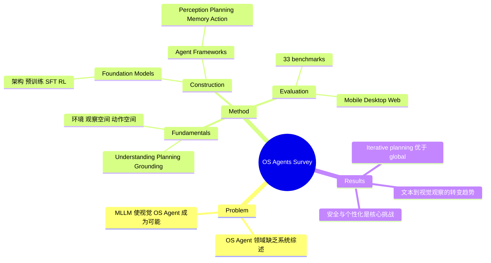

## Summary
系统性综述了基于 MLLM 的 OS Agent 领域，提出三层框架（Fundamentals / Construction / Evaluation），涵盖桌面、移动和 Web 三大平台，梳理了 33 个 benchmark 和主流方法，ACL 2025 Oral。

## Problem & Motivation
OS Agent——能在操作系统层面自动化计算设备任务的 AI 系统——正从研究原型走向产品（Anthropic Computer Use、Apple Intelligence、Google Project Mariner），但领域缺乏系统性整理。早期虚拟助手（Siri、Cortana、Alexa）因模型能力不足（如上下文理解有限）未能实现广泛采用；MLLM 的突破使得基于视觉理解的 OS Agent 成为可能，亟需一个统一框架来梳理研究现状。

## Method
### 三层组织框架

**Layer 1: Fundamentals**
- **环境**：桌面（Windows/macOS/Linux）、移动（Android/iOS）、Web 浏览器
- **观察空间**：文本描述（HTML/DOM/accessibility tree）或 GUI 截图
- **动作空间**：输入操作（鼠标/触屏/键盘）、导航操作（滚动/前进后退/标签管理）、扩展操作（代码执行/API 调用）
- **核心能力**：Understanding（复杂 OS 环境理解）、Planning（任务分解）、Grounding（指令到可执行动作的映射）

**Layer 2: Construction**
- **Foundation Models**：
  - 架构类型：现有 LLM（T5/LLaMA 处理 HTML）、现有 MLLM（LLaVA/Qwen-VL/InternVL）、拼接式 MLLM、改进式 MLLM（增强分辨率处理、GUI 专用编码器）
  - 训练策略：Pre-training（screen grounding/understanding/OCR）→ SFT（渲染 GUI 合成数据 + trajectory 合成）→ RL（curriculum learning + error recovery）
- **Agent Frameworks**：
  - Perception：文本描述（DOM filtering）vs GUI 截图（SoM prompting / HTML reference / dual approach）
  - Planning：Global（CoT 一次规划）vs Iterative（ReAct/Reflexion/CoAT 动态重规划）
  - Memory：Internal（action history/截图/状态）、External（知识库/API）、Specific（任务信息/用户偏好）
  - Action：输入/导航/扩展操作

**Layer 3: Evaluation & Challenges**
- 梳理了 33 个 benchmark，涵盖 Mobile、Desktop、Web 三平台
- 关键挑战：安全与隐私、个性化与自我演进

### 关键 Benchmark 分类
- **Mobile**：AndroidWorld、AndroidControl、B-MoCA、LlamaTouch
- **Desktop**：WindowsAgentArena、OSWorld、OfficeBench
- **Web**：Mind2Web-Live、WebArena、VisualWebArena、WorkArena

## Key Results
- 这是一篇 survey，无自有实验结果
- 核心贡献是系统性的 taxonomy 和 33 个 benchmark 的统一比较
- 识别出的关键趋势：从文本观察（DOM/HTML）向视觉观察（GUI 截图）转变；从 global planning 向 iterative planning 演进；RL 在 agent 训练中的重要性日益增长
- ACL 2025 Oral 说明社区对该领域的高度关注

## Strengths & Weaknesses
**Strengths**:
- 覆盖面极广，是目前 OS Agent 领域最全面的综述之一
- 三层框架（Fundamentals/Construction/Evaluation）清晰且逻辑自洽
- 33 个 benchmark 的统一比较表极具参考价值
- 对 perception modality 的分类（textual vs visual vs dual）切中当前领域的核心设计决策
- ACL 2025 Oral，质量有保证

**Weaknesses**:
- 发展极快的领域，2025 年下半年的工作（如 GroundCUA、ScreenSpot-Pro）可能未完全覆盖
- 对安全与隐私的讨论相对浅层，缺乏具体的 defense 方案分析
- 未深入分析不同方法在相同 benchmark 上的公平比较（缺少统一的 leaderboard 视角）
- 对 multi-agent 协作、长程任务记忆等前沿方向的讨论有限
- 对产业界系统（Anthropic Computer Use、Google Mariner）的技术细节分析受限于公开信息

## Mind Map

## Notes
- 作为 reference survey 非常有价值，特别是 benchmark 比较表可作为选择 evaluation 方案的参考
- 三个核心能力（Understanding/Planning/Grounding）的分解框架可以指导研究方向选择——grounding 是当前瓶颈（参见 ScreenSpot-Pro 和 GroundCUA 的工作）
- Observation space 的 textual vs visual 之争是一个重要的架构选择：textual（DOM）更精确但依赖平台 API，visual（截图）更通用但 grounding 更难
- 值得追踪该 survey 的 GitHub 仓库更新，了解领域最新进展
