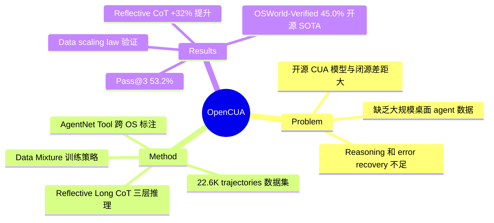

## Summary
提出 OpenCUA，一个开源的 computer-use agent 框架，包含标注工具 AgentNet Tool、大规模桌面 agent 数据集 AgentNet（22.6K trajectories, 3 OS, 140+ apps）、以及 reflective long CoT 训练方法，训练的 OpenCUA-72B 在 OSWorld-Verified 上达到 45.0% 成功率，为开源模型 SOTA。

## Problem & Motivation
Computer-use agent 的核心瓶颈是**高质量训练数据的缺乏**——现有数据集规模小、覆盖面窄、且缺少真实用户行为的复杂性。同时开源模型与闭源模型（如 Claude Sonnet 4.5 达 61.4%）之间存在巨大差距。现有方法的 reasoning 质量不足，缺乏 error recovery 能力。OpenCUA 旨在从数据基础设施、数据规模和训练方法三个层面系统性地解决这些问题。

## Method
**1. AgentNet Tool（标注基础设施）**
- 跨 OS（Windows/macOS/Ubuntu）的桌面操作采集工具
- 非侵入式后台运行，记录屏幕视频、鼠标/键盘信号、accessibility tree
- 基于 DuckTrack、OpenAdapt、OBS Studio 构建

**2. AgentNet Dataset**
- 22,625 个人工标注桌面任务（41,428 条 training trajectories）
- 12K Windows + 5K macOS + 5K Ubuntu，覆盖 140+ 应用、190+ 网站
- 平均每条 trajectory 18.6 步，要求任务复杂度 >15 步

**3. Data Processing Pipeline**
- **Action Reduction**: 压缩冗余信号（合并鼠标移动、滚动、连续按键）
- **State-Action Matching**: 提取动作前关键帧，回溯鼠标移动前状态避免信息泄露

**4. Reflective Long Chain-of-Thought（核心创新）**
- 三层结构化 CoT：L3（视觉/文本观察）→ L2（反思推理、error correction、规划）→ L1（可执行动作）
- **Reflection Augmentation Pipeline**: Reflector（对比前后截图检测错误）→ Generator（生成结构化 CoT）→ Summarizer（精炼目标、打分）
- 使用 Claude 3.5 Sonnet 合成

**5. Training Data Mixture**
- CoT Format Mixture: 混合 L1/L2/L3 推理格式（比纯 L2 提升 41%）
- Domain Mixture: grounding 数据 + planning 数据 + general SFT
- 三种训练策略：Stage 2 Only / Stage 1+2 / Joint Training

**6. Context Encoding**
- Textual History: L1 CoT 对话式内心独白
- Visual History: 3 张截图为最优平衡点（比 1 张提升 52%）
- Test-time 使用 L2 CoT 提供更丰富推理

## Key Results
- **OSWorld-Verified (100-step)**: OpenCUA-72B **45.0%**（开源 SOTA），超过 Claude 4 Sonnet (41.5%), UI-TARS-72B-DPO (27.1%)
- **Pass@3**: 53.2%，显示 test-time compute scaling 潜力
- **GUI Grounding**: UI-Vision 37.3%（超 UI-TARS 25.5%），ScreenSpot-V2 92.9%
- **AgentNetBench**: OpenCUA-32B 79.1% avg SR，超过 OpenAI CUA (73.1%)
- **Data Scaling**: Ubuntu 3K→10K 数据提升 72%，Win/Mac 3K→14K 提升 125%
- **Reflective CoT**: 比无反思版本提升 32.2%

## Strengths & Weaknesses
**Strengths**:
- **系统性工程贡献**: 从标注工具到数据集到模型的完整开源 pipeline，降低了 computer-use agent 研究的门槛
- **Data scaling law 验证**: 证明了桌面 agent 数据的 scaling 效果，方向正确
- **Reflective CoT 设计精巧**: 三层结构化推理 + reflection augmentation 显著提升 error recovery，是关键 insight
- **全面的 ablation**: 对 CoT 格式、visual history、data mixture 等均有细致消融，结论可信

**Weaknesses**:
- **与 Claude Sonnet 4.5 仍有 16.4% 差距**——gap 的来源是 base model 能力还是数据质量？未充分分析
- **Robustness 问题严重**: 即使 deterministic decoding，环境微小变化导致 18.5% 性能波动，说明策略的鲁棒性不足
- **CoT 合成依赖 Claude 3.5 Sonnet**: 数据质量上限受限于 teacher model，且成本不透明
- **Real-world applicability 存疑**: 平均 18.6 步的任务在真实场景中偏简单，长 horizon 任务（>50 步）收益递减
- **Privacy concern**: 采集真实用户桌面操作的隐私和安全考量未充分讨论

## Mind Map

## Notes
- 与 AgentTrek (2412.09605) 来自同一团队 XLANG Lab，OpenCUA 是后续更大规模的工作
- Reflection augmentation 的思路可推广到其他 agent 领域——embodied agent 的 error recovery 同样是核心挑战
- 关键开放问题：data scaling 的天花板在哪里？是否存在 data quality > data quantity 的拐点？
- AgentNetBench 作为 offline evaluation 的设计值得关注——在线评估成本太高时的替代方案
