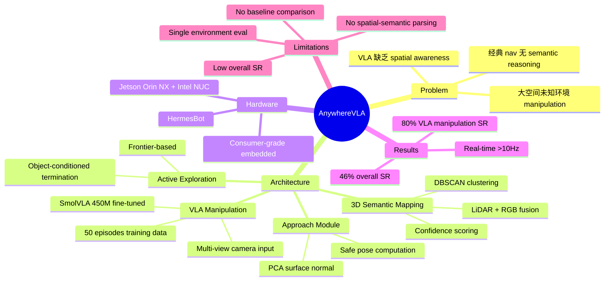

## Summary

AnywhereVLA 是一个模块化系统，将经典 SLAM + frontier-based exploration 与 fine-tuned SmolVLA (450M) 结合，实现在未知室内环境中基于自然语言指令的 mobile pick-and-place。系统在 consumer-grade embedded hardware 上实时运行，整体任务成功率 46%。

## Problem & Motivation

当前 mobile manipulation 面临三难困境：
1. **End-to-end VLA** 缺乏 spatial awareness，局限于 room-scale 环境，无法处理大空间探索
2. **End-to-end VLM** 方法需要预提供环境知识和 landmark
3. **经典 navigation stack** 缺乏 semantic reasoning，无法理解自然语言指令

核心 gap：如何在大规模未知室内环境中统一 language-based control、environment exploration 和 manipulation。

## Method

系统由四个模块顺序组成 pipeline：

### 1. 3D Semantic Mapping (SM)
- 融合 RGB image、LiDAR point cloud、2D bounding box detection
- **Densification**：在相邻 LiDAR elevation rings 之间做线性插值，解决稀疏扫描问题
- **Projection & Aggregation**：将 LiDAR 点投影到 camera frame，关联 detection，转换到 world coordinate 并按 object class 累积
- **Clustering & Confidence**：用 radius-based DBSCAN 聚类，MAD 滤除 outlier，通过 logistic mapping 计算 object-level confidence（综合 point density、angular coverage、inlier count、mean detector score）

### 2. Active Environment Exploration (AEE)
- Frontier-based exploration，conditioned on target object class
- 通过 morphological dilation 提取 frontier，计算 centroid 并优化 yaw angle 以最大化 FoV coverage
- 多重过滤：cluster filtering (20px)、chunking (50px)、NMS (1m)
- 用 Nav2 验证 goal feasibility；检测到目标或 frontier 耗尽时终止
- 关键参数：exploration radius $R_e$，FoV yaw $\alpha=35°$，goal range $R_g=1.5m$

### 3. Approach Module
- 计算安全的 manipulation approach pose
- 隔离 support surface（如桌面），用 PCA 估计 surface normal
- 将 robot 放置在 surface edge 外、垂直于 surface 的位置
- 用 Nav2 做 collision-free 验证

### 4. VLA Manipulation
- Fine-tuned **SmolVLA 450M**，用于 pick-and-place 执行
- 训练数据：仅 50 个 teleoperation episodes on SO-101 manipulator
- 训练配置：batch size 16, AdamW (wd=0.01), lr=1e-4 cosine decay, warmup 100 steps, gradient clipping norm 10.0
- 硬件：RTX 4090 (16GB VRAM)
- 输入：三视角 RealSense D435 camera（third-person、wrist、base）

### Hardware: HermesBot
- 双轮差速底盘 + SO-101 manipulator
- 感知：Velodyne VLP-16 LiDAR + Intel RealSense D435i (SLAM) + 3x RealSense D435 (VLA)
- 计算：Jetson Orin NX 16GB (perception, VLA) + Intel NUC i7 32GB (SLAM, exploration, control)
- 所有模块 >10Hz 实时运行

## Key Results

| 指标 | 数值 |
|---|---|
| Overall task SR | **46%** |
| SLAM SR | 100% |
| AEE SR | 75% |
| Navigation SR | 90% |
| Object Detection SR | 85% |
| VLA Manipulation SR | 80% |
| VLA SR w/o fine-tuning | 10% |
| 5m 半径任务平均时间 | <133s |
| 10m 半径任务平均时间 | <10min |
| 试验次数 | 50 episodes |

- Fine-tuning 带来 **+36pp** 的 manipulation success rate 提升（10% → 80%？文中数据：fine-tuned 85% vs w/o 10% overall）
- 主要失败模式：VLA 阶段物体从 gripper 滑落；AEE 在杂乱空间中无法在 exploration radius 内找到目标

## Strengths & Weaknesses

### Strengths
- **实用导向**：在 consumer-grade embedded hardware 上实现实时 mobile manipulation，工程价值明确
- **模块化设计**：每个组件可独立 debug 和替换，便于迭代
- **端到端 pipeline**：从自然语言到执行的完整链路，包含 exploration，比大多数 VLA 工作更 complete
- **开源承诺**：计划开源 code、model、dataset

### Weaknesses
- **成功率偏低**：46% overall SR 在实际部署中不够可靠，且各模块 SR 的乘积效应意味着 pipeline 越长越脆弱
- **方法 novelty 有限**：本质是 classical SLAM/navigation + off-the-shelf VLA 的工程集成，每个模块都是已有技术的组合，缺乏新的 algorithmic insight
- **实验规模不足**：仅 50 episodes，单一实验室环境，无 cross-environment generalization 评估
- **语言理解能力弱**：作者承认无法处理 spatial-semantic constraints（如 "pick the bottle from the table" vs "pick any bottle"），instruction following 能力实质上很有限
- **训练数据极少**：仅 50 个 teleoperation episodes fine-tune VLA，data scaling 行为未探索
- **缺乏有意义的 baseline 对比**：没有与其他 mobile manipulation 系统（如 SayCan、OK-Robot 等）的直接对比
- **评估 metric 单一**：仅报告 success rate，缺乏 efficiency、robustness 等多维评估

## Mind Map

## Notes

- **定位**：这是一篇系统集成论文而非方法创新论文。核心贡献是将已有组件（SLAM、frontier exploration、SmolVLA）组装成 working pipeline 并在 embedded hardware 上运行。
- **Rating 2 的理由**：novelty 不足，实验不充分，46% SR 在 50 episodes 上的评估难以支撑 strong claim。对 research community 的启发有限——我们已经知道 modular pipeline 可以工作，问题是如何做得更好。
- **与 OK-Robot 的关系**：类似的 modular 思路（navigation + manipulation），但 OK-Robot 在 open-vocabulary 和 generalization 上做得更系统。AnywhereVLA 的 exploration 模块是一个差异点，但 frontier-based exploration 本身不新。
- **值得关注的点**：SmolVLA 450M 仅用 50 episodes fine-tune 就达到 80% manipulation SR，暗示小规模 VLA 在 narrow domain 的 sample efficiency 可能比想象中好。但需要更多 evidence 来确认这不是 evaluation bias（单一环境、有限物体种类）。
- **Future work 中提到的 scene graph + VLM checking** 方向更有意思，但那是另一篇论文的事了。
