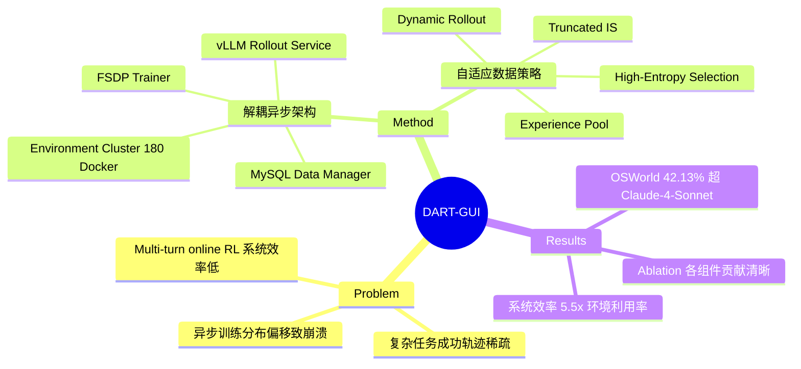

## Summary
提出 DART，一个面向 GUI agent 的解耦异步 RL 训练框架，将训练系统拆分为四个非阻塞模块（环境集群、rollout 服务、数据管理器、训练器），并设计自适应数据策略解决 multi-turn online RL 中的稀疏奖励和分布偏移问题。DART-GUI-7B 在 OSWorld 上达到 42.13% 成功率，超越 Claude-4-Sonnet。

## Problem & Motivation
将 RL 应用于 VLM-based GUI agent 面临三大挑战：(1) 系统效率——环境交互（真实桌面 Docker）耗时远超训练，GPU 利用率极低（仅 12-29%）；(2) 数据质量——复杂任务的成功轨迹极度稀疏，agent 容易 overfit 简单任务；(3) 训练稳定性——异步架构下 rollout 策略与训练策略的分布偏移导致训练崩溃。现有 RL 框架（如 OpenRLHF、veRL）设计面向单轮对话，无法有效处理 multi-turn agentic interaction 的长序列和环境依赖。

## Method
**DART 系统架构**：四个解耦异步模块——
- **Environment Cluster**：180 个并行 Ubuntu Docker 容器，通过 Kubernetes 编排，独立接收 action、返回 screenshot observation
- **Rollout Service**：基于 vLLM 的多 GPU 推理服务，带负载均衡，支持 worker-wise 模型同步（非全局同步）
- **Data Manager**：MySQL 后端管理轨迹、奖励和模型版本，11 张关联表，支持 rollout-wise trajectory sampling
- **Trainer**：FSDP 分布式 GRPO 训练，8×H100 GPU，step-wise 更新

**自适应数据策略**：
1. **Experience Pool**：预收集成功轨迹，当某任务所有 rollout 全部失败时自动注入成功样本，缓解稀疏奖励
2. **Dynamic Rollout Adjustment**：根据任务成功率动态调整采样次数——高成功率（>60%）任务减少 rollout，将资源倾斜至困难任务
3. **High-Entropy Step Selection**：仅选择 top 80% 高熵 step 训练，聚焦关键决策分叉点而非常规操作
4. **Truncated Importance Sampling**：用 min(π_train/π_rollout, C) 加权修正 rollout 和训练策略间的分布偏移，防止训练崩溃

**训练细节**：基座模型 UI-TARS-1.5-7B，lr=1e-6，KL 系数 β=0.1，clip 范围 [0.2, 0.28]，温度 1.0，最大 30 步/episode，203 个 OSWorld 任务。

## Key Results
- **OSWorld**：DART-GUI-7B 42.13%（30 步），超越 Claude-4-Sonnet 41.39%（100 步），比基座 UI-TARS-1.5-7B (27.52%) 提升 +14.61%
- 复杂任务提升尤为显著：OS 任务 +31.25%，LibreOffice Writer +21.73%，Thunderbird +20.00%
- **系统效率**：GPU 利用率 1.6×（29.6%→46.7%），训练吞吐 1.9×（22.6→43.6 actions/min），环境利用率 5.5×（12.2%→67.7%）
- **Ablation**（内部 benchmark Pass@1）：decoupled baseline 28.67% → +dynamic rollout 50.90% → +dynamic traj length 66.11% → +high-entropy 68.33% → +distribution alignment 70.55% → full 72.28%
- Distribution alignment 是稳定性关键：没有它训练会从 55% 崩溃到 0%

## Strengths & Weaknesses
**Strengths**：
- 工程贡献扎实：解耦异步架构把环境利用率从 12% 提到 68%，这对 multi-turn RL 的可行性至关重要
- 自适应数据策略设计合理，每个组件都有清晰的 ablation 支撑，尤其 distribution alignment 防崩溃的效果令人印象深刻
- 仅用 7B 单模型、30 步就超越 Claude-4-Sonnet（100 步），说明 online RL 在 GUI agent 上的 scaling 潜力巨大
- 开源框架、数据和 checkpoints

**Weaknesses**：
- 仅在 OSWorld 一个 benchmark 上评估，缺乏 WebArena、AndroidWorld 等跨平台泛化验证
- Experience pool 的预收集依赖已有强模型生成成功轨迹，本质是 warm-start，对全新环境可能不适用
- Action space 存在限制（如无法执行 Ctrl+Click 组合键），这是环境接口而非 RL 方法的问题，但限制了上限
- 203 个训练任务 → 375 个测试任务的泛化性存疑，未见 held-out 任务类型分析
- 异步训练带来的 staleness 问题仅用 truncated IS 缓解，未讨论理论收敛保证

## Mind Map

## Notes
- 与 UI-TARS-2 的关系：UI-TARS-2 也做 multi-turn RL 但用 search-based RL（MCTS-like），DART 走的是 GRPO + 工程优化路线，两者互补
- Distribution alignment (truncated IS) 的重要性被低估——多数 async RL 工作没有处理这个问题就直接崩了
- 核心 insight：GUI agent 的 RL 瓶颈不在算法而在系统效率和数据质量，工程上的 5.5× 利用率提升可能比算法改进更关键
- 开放问题：experience pool 的注入比例如何影响 exploration-exploitation balance？过多注入是否会退化为 imitation learning？
