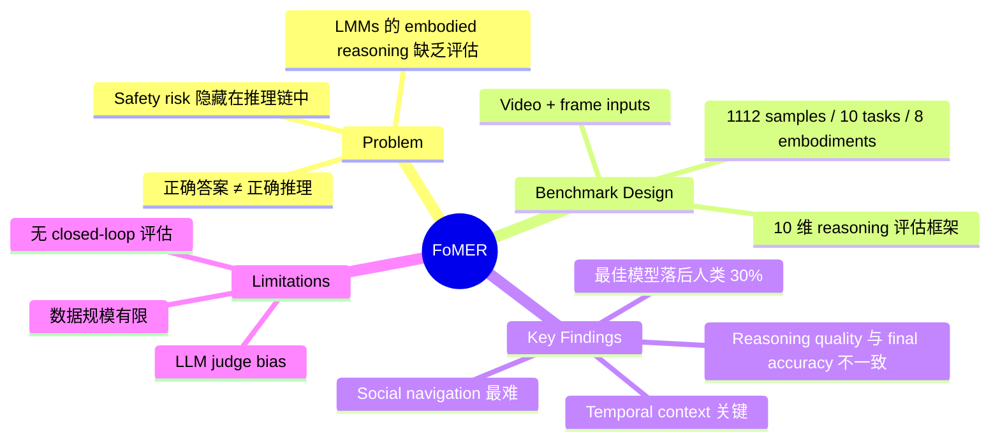

## Summary
FoMER 是一个系统评估 large multimodal models (LMMs) 在 embodied environments 中 **step-by-step reasoning** 能力的 benchmark。包含 1,112 个样本，覆盖 10 类任务、8 种 embodiment（3 种机器人类型），核心贡献是将 **perceptual grounding** 和 **action reasoning** 分离评估，揭示了模型"答对但推理错"的安全隐患。最佳模型（o4-mini / Gemini 2.5 Pro）与人类 baseline 仍有 ~30% 的差距。

## Problem & Motivation
现有 LMMs 在 general visual understanding 上表现出色，但其在 embodied scenarios 中的 step-by-step reasoning 能力缺乏系统评估。核心问题：
1. **Reasoning ≠ Correctness**：模型可能通过错误的推理路径得到正确答案，这在 robot safety 场景中不可接受
2. **已有 benchmark 的局限**：general reasoning benchmarks（CLEVR, VCR）缺少 embodied grounding；embodied benchmarks（OpenEQA, RoboVLM）缺少 reasoning trace 评估；physical AI benchmarks（Cosmos-R1）缺少 step-by-step reasoning 分析
3. **评估维度单一**：仅看 final accuracy 无法发现推理链中的 spatial reasoning 错误、safety violations、hallucination 等问题

## Method
### Benchmark 设计
- **规模**：1,112 samples，10 task categories，8 embodiments（Agibot G1, Widow X, UR5e 等）
- **视觉输入**：Video + 均匀采样 8 帧（长视频 32 帧）
- **问题类型**：True/False、multiple-choice、open-ended

### 10 类任务
Task completion verification, next-action prediction, action affordance, physical common sense, robot-centric reasoning, temporal reasoning, tool use/manipulation, social navigation, human-robot object interaction, risk assessment

### 数据 Curation Pipeline
1. Qwen2.5-VL-32B 生成 exhaustive scene inventory + chain-of-thought QA pairs
2. 人工审核删除 ~12% trivial/misaligned 问题
3. 标注 fine-grained reasoning labels（spatial relations, safety constraints, task alignment）

### 评估框架（10 维度，1-10 分）
Faithfulness, Spatial Reasoning, Physical Causality, Safety, Commonsense, Hallucination Detection, Redundancy, Semantic Coverage, Reasoning Alignment, Missing Steps

- **Judge model**: GPT-4o（主）+ Qwen3-32B（验证）

## Key Results
- **最佳 Reasoning Accuracy (RA)**：o4-mini 76.34%，Gemini 2.5 Pro 72.26%
- **最佳 Final Accuracy (FA)**：Gemini 2.5 Pro 60.58%，o4-mini 58.14%
- **人类 baseline**：84.47%，最佳模型落后约 30%
- **问题类型**：True/False 最高，multiple-choice 最低
- **任务类型**：Action affordance 最简单（80%+），human-robot interaction 和 social navigation 最难
- **Video vs. Frames**：Gemini 2.5 Pro 全视频 69.62% vs. 8 帧 62.97% vs. 单帧 51.89%，证明 temporal context 的重要性
- **关键发现**：Cosmos-R1 的 FA (54.49%) 接近其他模型，但 RA (62.88%) 明显偏低，说明它"蒙对"的比例更高

## Strengths & Weaknesses
### Strengths
- **评估框架创新**：将 reasoning quality 从 final accuracy 中解耦，10 维度细粒度评估比单一指标更有信息量
- **多样性**：10 类任务 × 8 种 embodiment × 3 种问题格式，覆盖面广
- **安全视角**：强调 reasoning trail 中隐藏的 safety risk，对 real-world deployment 有实际意义
- **Human validation**：通过人类实验验证了 benchmark 和 judge model 的可靠性

### Weaknesses
- **数据规模有限**：1,112 样本在 10 类任务上平均每类仅 ~110 样本，统计显著性存疑
- **LLM-as-Judge 偏差**：虽有人类验证，核心评估仍依赖 GPT-4o，可能引入 systematic bias
- **缺少 closed-loop 评估**：仅评估单步推理，未涉及多步决策的 error propagation
- **Embodiment 覆盖**：主要为 tabletop manipulation 和简单 navigation，缺少 legged locomotion、dexterous manipulation 等复杂形态

## Notes
- 本文的 10 维评估框架值得借鉴——在我们自己的 embodied agent 评估中，也应该关注 reasoning trail 而非仅 final metric
- 数据来源包括 BridgeDataV2、RoboVQA、HoloAssist 等多个公开数据集的 video
- 项目主页：https://mbzuai-oryx.github.io/FoMER-Bench/
