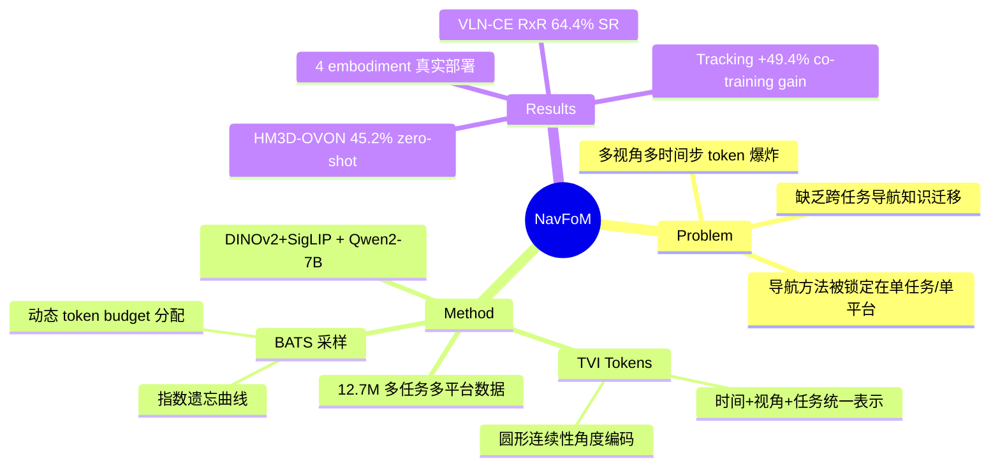

## Summary
NavFoM 是首个跨 embodiment、跨任务的统一导航 foundation model，基于 DINOv2+SigLIP 视觉编码 + Qwen2-7B LLM backbone，通过 Temporal-Viewpoint Indicator (TVI) tokens 和 Budget-Aware Temporal Sampling (BATS) 两项核心设计，在 12.7M 样本上单次训练即可 zero-shot 覆盖 VLN、ObjectNav、visual tracking、autonomous driving 四类任务和 quadruped/drone/wheeled/vehicle 四类平台，多个 benchmark 达到或超越 SOTA。

## Problem & Motivation
现有 embodied navigation 方法被锁定在狭窄的任务域（VLN / ObjectNav / tracking）、特定 embodiment（轮式 / 四足 / 无人机）和固定的 camera 配置中，无法共享跨任务的导航知识。VLM 在通用视觉语言任务上展示了强 zero-shot 泛化，但导航领域缺乏类似的 foundation model。核心挑战：（1）不同任务/平台的 camera 数量（1-8）、FoV、history 长度差异巨大，如何用统一架构处理？（2）多视角多时间步的 token 数量爆炸，如何在固定 token budget 内保留关键信息？

## Method
### 整体架构
Dual-branch VLM 设计：
- **Vision encoder**: DINOv2 + SigLIP（concat），576 patch features per image
- **LLM backbone**: Qwen2-7B（预训练权重）
- **Dual output heads**: language modeling head（QA 任务）+ planning head（3-layer MLP，预测 8 个 waypoints）
- 训练损失：L = β·L_nav + L_QA，β=10 放大导航损失

### Temporal-Viewpoint Indicator (TVI) Tokens（核心创新）
为每帧图像附加一个 TVI token，同时编码 camera viewpoint 和时间步信息：
- **Angle embedding**：对方位角 φ 的 cos/sin 施加 sinusoidal PE，**保持圆形连续性**（0° 和 360° 的表示相近）
- **Time embedding**：对时间步 t 施加 sinusoidal PE
- **Base embedding**：可学习向量，标识任务类型
- 导航任务用完整 TVI（base + time + angle），video QA 省略 angle，image QA 仅用 base
- 关键优势：无需为不同 camera 数量设计不同架构，模型自动适配 1-8 相机配置

### Budget-Aware Temporal Sampling (BATS)
在固定 token budget B 下，用指数遗忘曲线动态采样历史帧：
- P(t) = (1-ε)·e^(k(t-T)/T) + ε，k > 0
- 近期帧高概率保留，远期帧逐渐稀疏，ε=0.1 保证最低历史覆盖
- 通过 Brent 方法动态求解 k 以适配不同 budget
- 配合 Grid Pooling：最新帧用 fine-grained 64 tokens，历史帧用 coarse 4 tokens

### Action Space
- 统一归一化 waypoint trajectory prediction（8 waypoints，归一化到 [-1, 1]）
- 不同任务通过 α_task 缩放因子映射到实际距离（室内 ~5m，自动驾驶 20-50m，无人机含 z 轴）
- 推理延迟 ≤0.5s per trajectory（1600-token budget）

### 训练数据：12.7M 样本
| 任务 | 样本数 | 来源 |
|:-----|:------|:-----|
| VLN | 3.37M | VLN-CE R2R/RxR, OpenUAV |
| ObjectNav | 1.02M | HM3D ObjectNav via L3MVN |
| Visual Tracking | 897K | EVT-Bench |
| Autonomous Driving | 681K | nuScenes + OpenScene |
| Web-Video Navigation | 2.03M | Sekai (YouTube) |
| Image QA | 3.15M | 标准 VLM 数据 |
| Video QA | 1.61M | 标准 VLM 数据 |

训练配置：56× H100 GPUs，~72 小时，visual feature caching 实现 2.9× 加速。

## Key Results
### 多任务 SOTA（均无 task-specific fine-tuning）

| Benchmark | NavFoM | Previous SOTA | 提升 |
|:----------|:-------|:-------------|:----|
| VLN-CE RxR 4-view SR | **64.4%** | 56.3% (HNR) | +8.1% |
| VLN-CE R2R 4-view SR | **61.7%** | 56.0% (HNR) | +5.7% |
| VLN-CE RxR 1-view SR | **57.4%** | 51.8% (StreamVLN) | +5.6% |
| HM3D-OVON Zero-shot SR | **45.2%** | 40.8% (MTU3D, fine-tuned) | +4.4% |
| EVT-Bench Single Target SR | **85.0%** | 85.0% (TrackVLA) | = |
| NAVSIM PDMS | **84.3** | competitive | 仅用 RGB |
| OpenUAV Seen SR | **29.17%** | 17.45% (TravelUAV) | +11.7% |

### 关键 Ablation
**Multi-task co-training 的协同效应**：
- Searching 任务：单任务 10.3% → 加入全部数据 **45.2%**（+34.9%）
- Tracking 任务：单任务 12.6% → **62.0%**（+49.4%）
- 协同增益在 train/test 视角不匹配的任务上最显著

**TVI tokens vs 替代方案**：TVI（64.4% SR）远优于 viewpoint-history PE（52.3%）、learned special tokens（59.1%），验证了圆形连续性角度编码的关键价值。

**Camera 数量**：4 camera 是甜点（64.4% SR），6 camera 反而下降（63.8%），因为固定 token budget 下更多相机压缩了历史 context。

**真实世界**：110 个可复现测试案例（50 VLN + 30 search + 30 tracking），跨四足/humanoid/无人机/轮式多 embodiment 部署成功。

## Strengths & Weaknesses
**Strengths:**
- **统一性令人印象深刻**：单一模型 zero-shot 覆盖 4 类导航任务 × 4 类 embodiment，实验全面且有说服力
- **TVI tokens 设计优雅**：用圆形连续性角度编码解决了多视角相机的灵活处理，ablation 验证了其对 learned tokens 的巨大优势（+5.3% SR）
- **Multi-task co-training 的协同效应是核心 insight**：tracking +49.4%、searching +34.9% 的提升证明不同导航任务之间存在强烈的知识迁移，这与 VLA 领域的 co-training 发现高度一致
- **BATS 是实用的工程创新**：在固定 compute budget 下平衡 spatial resolution 和 temporal coverage，指数遗忘曲线有认知科学直觉支撑
- **训练效率**：visual feature caching 实现 2.9× 加速，56 H100 × 72h 的训练成本相对可控

**Weaknesses:**
- **"Foundation model" 的称号有些过誉**：8M 导航样本覆盖的多样性仍有限，OpenUAV unseen-map SR 仅 6.3%，大规模户外导航能力不足
- **没有 manipulation**：这是一个纯 navigation model，不涉及 mobile manipulation。与 DM0、π0.5 等统一 nav+manip 的工作相比，这限制了其作为 "embodied foundation model" 的完整性
- **Action space 过度简化**：统一的 8-waypoint trajectory 对所有任务用同一表示，忽略了自动驾驶的安全约束、无人机的动力学限制等 task-specific 需求
- **真实世界验证不够充分**：110 个测试案例在 5m×5m 受控空间中，与 building-scale 或 outdoor 部署差距很大
- **Web-video 数据的 2M 样本标注质量存疑**：由 SLAM + VLM 自动生成，论文承认包含 noisy labels，但未量化其影响
- **Camera 数量的 trade-off 暴露了架构局限**：6 camera 反而降低性能（因为 token budget 固定），说明 BATS 并未完全解决多视角-长 history 的 tension

## Mind Map

## Notes
- TVI tokens 的圆形连续性角度编码是值得借鉴的设计。在 mobile manipulation 中，机器人底盘的朝向也是圆形变量，TVI 的 sinusoidal cos/sin 编码可以直接迁移。
- Multi-task co-training 的巨大协同效应（tracking +49.4%）与 VLA 领域的发现一致（Mobile ALOHA co-training +90%，π0.5 的 heterogeneous data）。这强化了一个跨域规律：**数据多样性的边际收益远大于数据数量**。
- NavFoM 定位为纯 navigation model，而 mobile manipulation 需要的是 navigation + manipulation 的统一。如果将 NavFoM 的 navigation 能力与 table-top VLA（如 π₀）的 manipulation 能力结合，可能形成一个 hierarchical mobile manipulation 系统——NavFoM 做 building-scale navigation，VLA 做 fine-grained manipulation。这与 [[Topics/LanguageConditioned-MobileManipulation-Survey|LCMM Survey]] 中识别的 "路线 3: 统一 Navigation-Manipulation 架构" 直接相关。
- BATS 策略（指数遗忘 + 动态 budget 分配）对 VLA 的长 horizon 推理也有启发：VLA 在执行 10+ 步的 mobile manipulation 任务时也面临 token budget 与 history length 的 trade-off。
- 与 [[Papers/2412-NaVILA|NaVILA]] 的对比：两者都是 VLM-based navigation model，但 NaVILA 用语言化 mid-level action 而 NavFoM 用连续 waypoint trajectory，NavFoM 覆盖了更多 embodiment 和任务类型。NaVILA 在 R2R-CE 上 54% SR vs NavFoM 61.7%，但 NaVILA 有真实 legged robot 部署经验。
- 与 [[Papers/2602-DM0|DM0]] 的关系：DM0 首次在同一框架中训练 navigation 和 manipulation，但 navigation 数据仅来自 Habitat simulation。NavFoM 的 12.7M 多源 navigation 数据（含 web-video 真实数据）如果能与 DM0 的 manipulation 训练融合，可能产生更强的 unified embodied model。
