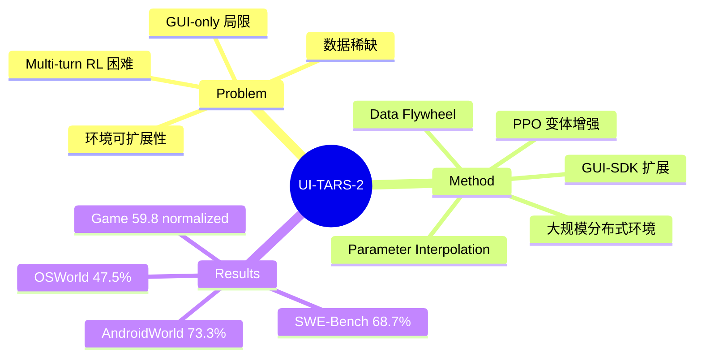

## Summary
提出 UI-TARS-2，通过 data flywheel + multi-turn RL + 大规模并行环境基础设施，训练 GUI agent 在 OSWorld、AndroidWorld 等多个 benchmark 上取得 SOTA，并将 GUI 操作扩展到游戏和软件工程场景。

## Problem & Motivation
GUI agent 面临四个核心挑战：(1) 高质量交互轨迹数据极度稀缺且采集成本高；(2) multi-turn RL 中 sparse reward、delayed feedback 和 long-sequence credit assignment 困难；(3) 仅依赖 GUI 交互不足以应对需要文件系统、终端等工具的真实工作流；(4) 大规模 RL 环境的可复现性和容错性是工程瓶颈。现有方法主要依赖 behavior cloning，泛化性差且缺乏错误恢复能力。

## Method
**Data Flywheel**：模型生成的轨迹按质量分流——低质量用于 continual pre-training，高质量经验证后用于 SFT，可验证任务用于 RL，形成"更好模型→更好数据→更好模型"的自增强循环。

**Multi-Turn RL 训练**：
- **任务设计**：覆盖三个领域——GUI-Browsing（信息检索，含 obfuscated questions）、GUI-General（690+ 网站的操作任务）、Gameplay（HTML5/WebGL 游戏）
- **Reward 系统**：确定性可验证任务用 function-based verifier 或 LLM-as-Judge；开放任务用模型自身作为 generative outcome reward model
- **RL 算法**（PPO 变体增强）：reward shaping、Decoupled GAE（分离 policy/critic 系数）、Length-Adaptive GAE、value pretraining、asymmetric clipping 促进探索

**GUI-SDK 扩展**：统一 GUI 操作与系统级工具（终端、文件系统），支持 SWE-Bench 等软件工程任务。

**大规模环境基础设施**：分布式 VM 平台（Windows/Ubuntu/Android），支持数千并发实例；游戏环境使用 GPU 加速浏览器沙箱。

**Parameter Interpolation**：多个 domain-specific agent 通过加权参数平均合并：θ(merge) = Σ αk·θ(k)，避免联合优化成本。

## Key Results
- OSWorld: 47.5%（+5.0% vs UI-TARS-1.5）
- WindowsAgentArena: 50.6%（+8.5%）
- AndroidWorld: 73.3%（+9.1%）
- Online-Mind2Web: 88.2%（+4.5%）
- SWE-Bench（GUI-SDK）: 68.7%
- BrowseComp-zh: 50.5%，BrowseComp-en: 29.6%
- 15-Game Suite: mean normalized score 59.8（超 OpenAI CUA +35.0，超 Claude +38.2）
- 基座模型：Seed-thinking-1.6

## Strengths & Weaknesses
**Strengths**:
- Data flywheel 是优雅的解法，将数据质量分层自动化，避免浪费
- Multi-turn RL 的工程实现非常扎实，Decoupled GAE 和 Length-Adaptive GAE 解决了实际训练中的关键问题
- 跨域泛化令人印象深刻：browser 上的 RL 训练迁移到 OSWorld/AndroidWorld
- Parameter interpolation 是实用的多域整合策略，成本远低于联合训练

**Weaknesses**:
- VLM-as-verifier 假阳性率高（F1 仅 83.8），reward signal 噪声可能限制 RL 上限
- 计算资源需求巨大（数千 VM 实例），可复现性存疑
- 游戏训练出现明显 plateau 和 regression，暗示 reasoning 能力可能存在天花板
- GUI-SDK 扩展虽有前景，但与专用系统差距仍大
- 缺乏系统性的 failure mode 分析

**影响**: 为 GUI agent 的 RL 训练建立了工程范式，data flywheel 思路可迁移到其他 embodied agent 领域。

## Mind Map

## Notes
- Data flywheel 的关键 insight：不是所有数据都适合所有训练阶段，按质量分流是比过滤丢弃更高效的策略
- Length-Adaptive GAE 值得关注——multi-turn agent 的 trajectory 长度方差极大，统一超参显然不合理
- 与 ComputerRL 的对比：两者都用 RL 训练 GUI agent，但 UI-TARS-2 更偏工程系统，ComputerRL 更偏算法创新（Entropulse）
