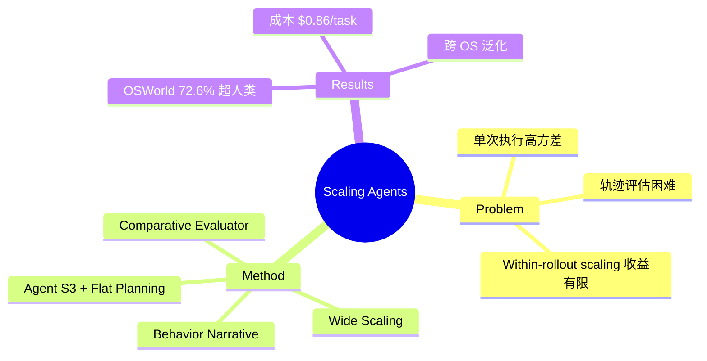

## Summary
提出 Behavior Judge (BJudge) 框架，通过 multi-rollout "wide scaling" + 结构化轨迹评估，在 OSWorld 上达到 72.6% 超越人类水平（72.36%），证明 test-time scaling 在 computer use agent 中的巨大潜力。

## Problem & Motivation
当前 computer use agent 在 long-horizon 任务上可靠性差，根本原因是错误累积、延迟反馈和环境噪声。单次执行（single rollout）方差极高。先前工作探索了 within-rollout scaling（step-wise 改进），但收益有限。核心瓶颈在于**评估**：agent 执行轨迹信息密集、多模态、难以系统性解读，如何从多个完整轨迹中选出最佳是关键未解问题。

## Method
**核心思想**：Wide scaling——生成多个独立 rollout，通过结构化评估选择最优，而非改进单次执行过程。

**Behavior Narrative Generation**：将轨迹转化为紧凑摘要。对每个 transition（前截图→动作→后截图），VLM 提取与任务相关的事实，过滤无关细节。加入 visual augmentation（指针标记、裁剪放大）增强像素级交互的精度。最终 narrative 仅保留首尾截图 + 推导出的事实。

**Comparative Behavior Evaluator**：VLM 在单轮中对所有 narrative 进行 multiple-choice 比较，选出最佳轨迹。Prompt 要求引用事实并对比候选行为。关键设计：比较式评估显著优于独立打分。

**Agent S3**：基于 Agent S2 改进——(a) 集成 coding agent，支持程序化编辑与 GUI 操作并行；(b) flat planning 替代层级 manager-worker，减少 52.3% LLM 调用和 62.4% 延迟。

## Key Results
- OSWorld（361 Ubuntu 任务，100-step）：Agent S3 单独 62.6%，+BJudge(GPT-5) 69.9%，+BJudge(GPT-5+Opus 4.5) **72.6%** 超人类水平
- WindowsAgentArena: 56.6%（+6.4%）
- AndroidWorld: 71.6%（+3.5%）
- BJudge 轨迹选择准确率 78.4%，与人类对齐率 92.8%
- Behavior narrative 显著优于 screenshot-only（56.0%）、trajectory summary（55.0%）、naive captioning（56.8%）
- Flat planning vs hierarchical：LLM 调用减少 52.3%，时间减少 62.4%
- 成本：$0.72/task（rollouts）+ $0.11（narrative）+ $0.03（judging）

## Strengths & Weaknesses
**Strengths**:
- 核心 insight 深刻且简洁：有效 scaling 需要结构化的轨迹表示和选择，而非简单增加 rollout
- Behavior narrative 是精妙的设计——将多模态轨迹压缩为可比较的结构化文本，大幅降低评估复杂度
- 比较式评估优于独立打分，符合人类判断直觉
- 超越人类水平是里程碑式结果，证明 test-time compute scaling 在 agent 领域的潜力
- Flat planning 替代 hierarchical 是反常识但有效的简化，呼应"简洁方法优先"原则
- 跨 OS 泛化（Ubuntu/Windows/Android）证明方法的通用性

**Weaknesses**:
- 假设独立 rollout 从相同初始状态开始，在真实桌面环境中不成立（状态污染问题）
- 多 rollout 间共享在线资源（邮件、云存储）会造成交叉干扰
- VLM 生成 behavior narrative 时存在 hallucination，尤其在细粒度视觉细节上
- 依赖强力 VLM（GPT-5、Opus 4.5）作为 judge，成本和可及性是限制
- 未探索 rollout 数量与收益的 scaling law，多少 rollout 是最优的？

**影响**: 开辟了 computer use agent 的 test-time scaling 新范式，Behavior Judge 框架可泛化到其他 sequential decision-making 场景。

## Mind Map

## Notes
- 这篇与前两篇形成有趣对比：UI-TARS-2 和 ComputerRL 靠 RL 训练提升模型能力，本文靠 test-time scaling 提升推理能力。两个方向正交且可组合
- Behavior narrative 的思路可以迁移到 VLN——将导航轨迹转为结构化描述用于评估和选择
- Flat planning > hierarchical planning 是重要经验，在 agent 设计中不应盲目增加复杂度
- 未来关键问题：RL training scaling vs test-time scaling 的 Pareto frontier 在哪里？
