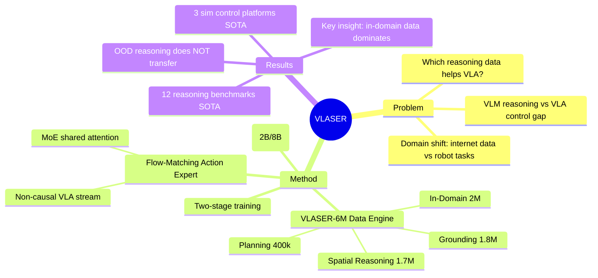

## Summary
VLASER 系统性地研究了 VLM embodied reasoning 能力与下游 VLA 机器人控制性能之间的关系。基于 InternVL3 构建，提出 VLASER-6M 数据引擎覆盖 grounding、spatial reasoning、planning 和 in-domain QA 四大类 embodied reasoning 数据，结合 flow-matching action expert 实现端到端控制。核心发现：**out-of-domain embodied reasoning 提升几乎不迁移到 VLA 性能；in-domain（与目标机器人环境对齐的）reasoning 数据才是关键**。在 12 个 embodied reasoning benchmark 和 3 个仿真控制平台上达到 SOTA。

## Problem & Motivation
VLM 擅长 reasoning，VLA 擅长 robot control，但两者之间的桥梁机制仍不清楚。核心问题：**哪些 multi-modal data streams / reasoning abilities 对提升下游 VLA 最关键？** 现有 VLM 的 embodied reasoning 能力（grounding、spatial understanding、planning）不足，且 internet-scale pretraining 数据与 robot-specific task 之间存在严重 domain shift。已有工作要么只做 reasoning 不做 control，要么直接做 VLA 但忽略 reasoning 对 action quality 的影响。

## Method
**1. VLM Backbone**
- 基于 InternVL3（2B / 8B 两个尺寸），包含 InternViT vision encoder + Qwen2.5 language model
- 通过 VLASER-6M 数据进行 embodied reasoning supervised fine-tuning

**2. VLASER-6M 数据引擎**（四大类）
- **Embodied Grounding (1.8M)**：bounding box 和 center point 标注，来自 RoboPoint、ShareRobot、Pixmo-Points 等，另有 300k 基于 SA-1B 的合成数据
- **General & Spatial Reasoning (1.7M)**：1.2M RoboVQA + 500k spatial intelligence（SPAR、SpaceR-151k、VILASR）+ 100k 从 3D 数据集人工标注
- **Planning (400k)**：language-based 和 multimodal planning，来自 Alpaca、MuEP、WAP、LLaRP 等 + egocentric video 数据
- **In-Domain Data (2M)**：从 SimplerEnv 和 RoboTwin2.0 生成的 robot-specific QA pairs，覆盖 grounding、spatial reasoning 和 planning

**3. Action Expert Module**
- Flow-matching-based action prediction head
- 以 mixture-of-experts 方式与 language model 共享 self-attention
- 输入 observations（images, language, robot state），输出 action sequences
- VLA stream 采用 non-causal attention

**4. 两阶段训练**
- **Stage 1 - VLM Pretraining**：在 VLASER-6M 上做 SFT，学习 embodied reasoning
- **Stage 2 - VLA Finetuning**：flow-matching 训练，学习 denoising vector field 从 noise 生成 clean actions

## Key Results
**Embodied Reasoning（12 个 benchmark 平均）：**
- VLASER-2B：45.3%（base InternVL3-2B 仅 15.2%，+30.1）
- VLASER-8B：51.3%（base InternVL3-8B 仅 22.3%，+29.0）
- 超过 RoboBrain2.0、Embodied-R1 等同类模型约 10%

**Closed-Loop Robot Control：**
- WidowX：VLASER-All-2B 65.1% 成功率（baseline 41.8%，+23.3）
- Google Robot：59.0%（baseline 54.7%，+4.3）
- RoboTwin Aloha-AgileX：67.5%（RDT-1B baseline 36.8%，+30.7）

**核心消融发现——In-Domain Data Dominance：**
- Out-of-domain embodied reasoning 提升（VLASER-OOD）对 VLA 性能几乎无帮助
- In-domain data 各子类贡献：QA +20.8, Grounding +20.2, Spatial +19.0（WidowX）
- 说明 domain-specific annotation 与实际 embodied task 对齐是决定性因素

## Strengths & Weaknesses
**Strengths：**
- 系统性地回答了"哪种 reasoning data 对 VLA 有用"这一关键问题，实验设计严谨
- VLASER-6M 数据引擎覆盖面广，且公开数据生成 pipeline
- In-domain vs. out-of-domain 的消融实验揭示了 domain alignment 的核心重要性，对社区有指导意义
- 同时在 reasoning benchmark 和 control benchmark 上评估，避免只看单一指标
- Flow-matching action expert 与 VLM backbone 的 MoE 集成方案优雅

**Weaknesses：**
- **无真实机器人实验**，所有结果均在仿真中完成，sim-to-real gap 未验证
- In-domain data 依赖于 target environment 的仿真标注，实际部署到新环境时数据获取成本不明
- 核心发现（OOD reasoning 不迁移）可能部分归因于 domain shift 过大，缺乏对"中等 domain gap"场景的分析
- 8B 模型相对 2B 的提升不显著（reasoning +6, control 未全面对比），efficiency-performance tradeoff 分析不足

## Mind Map

## Notes
- 代码和数据已承诺开源：https://github.com/OpenGVLab/Vlaser/
- 训练超参：VLM stage lr=2e-5, cosine decay, 5000 steps, batch=128；VLA stage lr=5e-5, 10 epochs, batch=1024
- 默认 action prediction 设置：prediction length P=4, execute length H=4, flow-matching steps δ⁻¹=10
- 数据质量控制：使用 LLM-as-judge 过滤，与人工标注 80% 一致率
- **对我们的启示**：如果要提升 VLA 在特定场景的性能，应优先投入 in-domain reasoning data 的构建，而非盲目扩大 general embodied reasoning 数据规模
