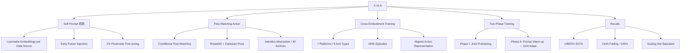

## Summary
X-VLA 提出了一种基于 soft prompt 的 cross-embodiment VLA 架构，通过为每个数据源分配可学习的 embedding 来吸收不同机器人平台间的异构性，结合 flow matching 生成连续动作，仅 0.9B 参数即在 6 个仿真 benchmark 和 3 个真实机器人平台上达到 SOTA，展示了良好的 scaling 特性。

## Problem & Motivation
现有 VLA 模型在 cross-embodiment 训练中面临严重的异构性问题：不同机器人平台的 action space、camera 配置、visual domain 和 task distribution 存在巨大差异，导致联合训练时出现 distributional shift。已有的异构性处理策略各有缺陷：domain-specific action projection 仅在最终阶段处理差异；HPT-style input projection 训练不稳定；language prompt 需要手工设计描述。X-VLA 希望找到一种参数高效、训练稳定且灵活的方案来统一多平台数据。

## Method
核心架构：**Florence-Large (Vision-Language Encoder) + 24-layer Transformer Encoder (Backbone) + Flow Matching (Action Generation)**

**1. Soft Prompt 机制**
- 为每个数据源分配一组可学习的 embedding 作为 embodiment-specific prompt
- Soft prompt 在 feature fusion pipeline 的早期阶段注入，引导 backbone 区分不同平台
- Backbone 本身保持 embodiment-agnostic，由 soft prompt 承载平台差异信息
- Fine-tuning 时仅需调整约 1% 的参数（soft prompt + 少量适配层）

**2. 多模态输入处理**
- **高维观测流**：Florence-Large 处理固定视角图像和语言指令；辅助视角（如 wrist camera）使用独立 vision backbone 避免 semantic misalignment
- **低维本体感知流**：关节位置和 end-effector pose 与 time embedding 拼接，经轻量 linear projection 后与其他模态 early fusion

**3. Flow Matching Action Generation**
- 用 conditional flow matching 对连续 action distribution 建模
- 从 noise sample 出发，通过 Transformer backbone 去噪生成动作序列
- 统一的 action representation：Cartesian position + Rotate6D rotation + gripper state

**4. 数据处理增强**
- **Aligned action representation**：统一不同平台的 end-effector pose 表示
- **Intention abstraction**：temporal downsampling 至 4 秒内 30 个 anchor points，过滤噪声动作
- **Balanced sampling**：跨 domain 和 trajectory 打乱，防止数据分布偏差

**5. 两阶段训练**
- **Phase I (Pretraining)**：在 290K 异构 episodes（7 个平台、5 种机械臂）上联合优化 backbone 和 soft prompts
- **Phase II (Domain Adaptation)**：先冻结 backbone 做 prompt warm-up，再联合优化 backbone 和 adapted prompts

## Key Results
**仿真 Benchmark（X-VLA-0.9B）：**
- LIBERO：Spatial 98%、Object 75.7%、Goal 95.8%、Long-horizon 80.4%，均为 SOTA
- Simpler-WidowX：96% 成功率
- CALVIN、RoboTwin-2.0、VLABench、NAVSIM：均达到 SOTA

**真实世界验证：**
- 在 3 个物理机器人平台上测试
- Dexterous cloth folding：约 100% 成功率，33 folds/hour（与 π₀ 可比）
- 发布 Soft-Fold 数据集（1200 条 cloth folding trajectories）

**参数高效 Fine-tuning：**
- 仅调 9M 参数：LIBERO 93%、Simpler-WidowX 54%

**Scaling 特性：**
- 模型规模（0.1B → 0.9B）、数据多样性（1 → 7 sources）、数据量（95K → 290K episodes）三个维度均未出现饱和

**Soft Prompt vs. 其他策略对比（Figure 4）：**
- Soft prompt 在收敛稳定性和最终性能上显著优于 domain-specific projection、HPT-style projection 和 language prompt

## Strengths & Weaknesses
**Strengths:**
- Soft prompt 设计简洁优雅，仅需极少额外参数即可处理 cross-embodiment 异构性，避免了对 backbone 的侵入式修改
- Flow matching + standard Transformer encoder 的架构相比 π₀ 的 action expert 更为简洁，scalability 更好
- 实验覆盖 6 个仿真 + 3 个真实平台，评测全面；cloth folding 结果与 π₀ 可比是强有力的验证
- Intention abstraction（temporal downsampling to anchor points）是实用的数据处理创新
- 四种异构性处理策略的系统对比实验（Figure 4）具有参考价值

**Weaknesses:**
- 0.9B 模型规模虽然参数效率高，但能否继续 scale up 到更大规模仍需验证
- Pretraining 数据（290K episodes）规模相对有限，远小于 π₀ 的 903M timesteps
- Cross-embodiment zero-shot transfer（无需 fine-tuning 直接部署到新平台）尚未展示
- Soft prompt 的最优设计（维度、数量、注入位置）缺乏理论分析，主要靠经验调参
- 论文未详细讨论不同 embodiment 之间 knowledge transfer 的机制和程度

## Mind Map

## Notes

