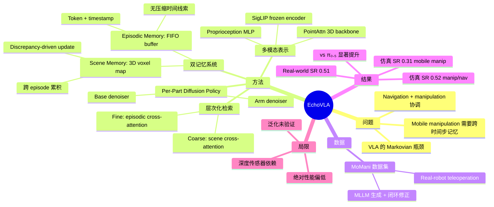

## Summary
提出 EchoVLA，一个受人类 declarative memory 启发的 memory-aware VLA 模型，通过 scene memory（3D voxel 空间语义地图）和 episodic memory（token FIFO buffer）的双记忆系统解决 mobile manipulation 中的 non-Markovian 长horizon决策问题，在仿真中达到 0.52（manipulation/navigation）和 0.31（mobile manipulation）的成功率，real-world 达 0.51 平均成功率。

## Problem & Motivation
现有 VLA 模型主要局限于短 horizon 的 table-top manipulation，采用 Markovian 控制（决策仅依赖当前观测），缺乏跨时间步的记忆与推理能力。Mobile manipulation 要求 agent 协调 navigation 和 manipulation，面临空间上下文持续变化的挑战——视觉上相似的两帧可能代表完全不同的任务进度（如"柜子已打开"vs"即将打开"）。作者认为需要显式的 declarative memory 机制来打破 Markovian 假设。

动机来源于神经科学：模仿人脑海马旁回（PHC）的空间语义编码和海马体（hippocampus）的 episodic trace 整合。这个 neuroscience analogy 提供了直觉，但实际实现与生物机制的对应关系比较松散。

## Method
### 多模态状态表示
编码四种模态为统一 token：
- **Language**：SigLIP text encoder（frozen）
- **RGB**：SigLIP vision tower（frozen），三个固定相机
- **3D Structure**：可训练 PointAttn backbone 处理 depth point cloud
- **Proprioception**：MLP 变换的关节状态

组合表示：`S_t = [L, V_t, P_t, R_t]`

### 双记忆系统（Dual-Memory System）
**Scene Memory**：
- 维护 voxelized 3D feature map（`V_t^{3D} ∈ R^{X×Y×Z×C}`），跨 episode 累积空间信息
- 基于 discrepancy-driven update：仅重建误差超过阈值的区域更新，实现跨 episode 稳定收敛
- 捕获持久性结构元素（表面、自由空间、容器几何）
- inference 时支持 online adaptation

**Episodic Memory**：
- 固定大小 FIFO buffer，存储近期 token 序列与时间戳
- 保留细粒度时间信息（抽屉开合度、抓取历史、末端执行器配置）
- 无压缩的时间线索，用于解决 non-Markov 歧义

### 层次化检索机制（Hierarchical Retrieval）
两级 coarse-to-fine attention：
1. **Coarse Attention（Scene）**：当前 3D 观测 query voxel map，cosine similarity 选 top-k，cross-attention
2. **Fine Attention（Episodic）**：当前多模态 token query 历史 buffer，cosine similarity 选相关子集，cross-attention

融合表示 `H_t = [Z_t^{scene}, Z_t^{epi}]` 送入 diffusion policy。

### Per-Part Diffusion Policy
将异构 action space 分解为 base 和 arm 的独立 denoiser：
`ε_θ^(p) = Denoiser_p(z_t, H_t, t), p ∈ {base, arm}`

这一设计允许 locomotion 和 manipulation 行为结构化学习、解耦但协调。

### MoMani 数据集
- **仿真数据**：MLLM 生成 executable task script → 物理仿真执行 → 闭环修正
- **真实数据**：Kinova Gen3 7-DoF + holonomic mobile base（TidyBot++ 平台），30Hz 时间同步采集
- 仿真轨迹长度 630-756 步（是 RoboCasa baseline 的 2.7 倍），真实世界 126-191 步

## Key Results
### 仿真（RoboCasa，50 episodes 平均）
- **Manipulation/Navigation 平均 SR**：EchoVLA 0.52 vs. π₀.₅ 0.44（+18% 相对提升）
- **Navigation only**：EchoVLA 0.51 vs. π₀.₅ 0.31（+64% 相对提升）
- **Mobile Manipulation 平均 SR**：EchoVLA 0.31 vs. π₀.₅ 0.20（+55% 相对提升）
- 传统方法（BC-T, DP3, Diffusion Policy）在 mobile manipulation 上几乎完全失败（~0.01-0.06）

### Real-World（4 个家庭任务）
- **EchoVLA 平均 SR**：0.51 vs. π₀.₅ 0.40 vs. Diffusion Policy 0.45
- 最佳单任务：Close Microwave 0.70

### Ablation
- 去除 Scene Memory：mobile manipulation SR 从 0.17 降至 0.14
- 去除 Episodic Memory：从 0.17 降至 0.09
- 去除 Point Cloud：从 0.17 降至 0.09
- 双记忆 + 多模态观测缺一不可，mobile manipulation 对记忆消融更敏感

## Strengths & Weaknesses
**Strengths**:
- 问题定义清晰：mobile manipulation 的 non-Markovian 挑战是真实痛点，双记忆系统的设计有合理的直觉支撑
- Scene memory 的 discrepancy-driven update 是实用的工程选择，避免了全量更新的计算开销
- Per-part diffusion policy 的 base/arm 解耦设计对异构 action space 合理
- 提供了仿真 + real-world 的完整评估，ablation 覆盖了核心组件
- 相比 π₀.₅ 在 navigation 上有显著提升（+64%），说明 scene memory 对空间推理有效

**Weaknesses**:
- **绝对性能偏低**：mobile manipulation 最高 0.31 SR，即便最好的 manipulation/navigation 也仅 0.52，离实用距离很大。这既是问题的难度体现，也限制了方法的说服力
- **Neuroscience analogy 过度包装**：PHC/hippocampus 的类比主要是 narrative，实际 scene memory 就是 3D feature map + 增量更新，episodic memory 就是 FIFO buffer，与生物机制的对应很表面
- **Baseline 选择有疑问**：WB-VIMA 表现极差（0.15），Diffusion Policy 几乎为零（0.01），这些 baseline 是否经过充分调优存疑。主要竞争者仅 π₀.₅
- **Ablation 数值波动大**：mobile manipulation 的 ablation 中数值在 0.09-0.17 之间，样本量可能不足以得出可靠结论（仅 50 episodes）
- **强依赖深度传感器**：作者自己承认对 noisy/incomplete depth 敏感，这在真实部署场景中是实质性限制
- **Scene memory 的注意力可视化**（Figure 13）显示对机器人自身部件有非预期关注，暗示检索机制存在 noise
- **缺乏 generalization 实验**：仅在同类 kitchen 任务上评估，未测试跨场景/跨 embodiment 的泛化能力

## Mind Map

## Notes
- 核心贡献更多是工程集成（3D voxel map + FIFO buffer + per-part diffusion）而非方法论突破。每个组件单独看都不新颖，价值在于将它们整合到 mobile manipulation VLA 中
- 与 MemoryVLA 的区别在于引入了显式 3D spatial memory，但 MemoryVLA 的 perceptual-cognitive memory 路线是否真的不如 explicit 3D map 需要更公平的对比
- Mobile manipulation 的 0.31 SR 说明这个问题确实很难，但也意味着方法离 deployment 很远。这篇更像是 proof-of-concept
- MoMani 数据集的 MLLM-guided 自动生成 pipeline 可能是最有长期价值的贡献——如果开源的话
- Rating 3/5：问题重要，方法合理但不够新颖，绝对性能较低，neuroscience narrative 过度包装
