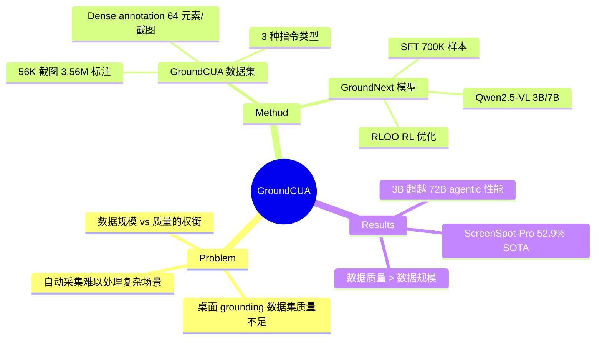

## Summary
通过构建大规模高质量桌面 grounding 数据集 GroundCUA（56K 截图，3.56M 标注，87 个应用），训练 GroundNext grounding 模型（SFT + RL），以不到 10% 的训练数据量超越先前方法，在多个 benchmark 上达到 SOTA。

## Problem & Motivation
Desktop GUI grounding 是 computer-use agent 的核心瓶颈。现有数据集规模和质量有限：自动化采集方法难以处理小图标、密集布局和应用特定的视觉 pattern；桌面环境的高质量标注资源匮乏。此前工作（如 OS-Atlas 使用 9M 样本）依赖大规模但质量参差的数据，而本文证明高质量的人工标注数据可以用远少的数据量达到更好效果。

## Method
### GroundCUA 数据集
- **规模**：56K 截图，3.56M+ 标注元素，87 个桌面应用，12 个类别
- **采集方式**：专家标注员执行真实任务，捕获自然交互状态（而非随机界面配置）
- **Dense annotation**：每张截图平均 64 个标注元素（OS-Atlas 的 3 倍），每个元素包含 bounding box、文本描述和类别信息
- **指令生成**：三种类型
  - **Direct**：基于元素属性/位置（"点击放大镜图标"）
  - **Functional**：基于预期动作（"打开新标签页"）
  - **Spatial**：基于相对位置关系（"点击 'Files' 左边的元素"）

### GroundNext 模型
基于 Qwen2.5-VL（3B 和 7B），两阶段训练：
1. **SFT 阶段**：700K instruction-image pairs，8 张 H100，batch size 128
2. **RL 阶段**：额外 10K 样本，使用 RLOO（Relative Leave-One-Out）策略优化，设计了离散的 distance-based reward function，将预测距离归一化到图像最大距离

### 关键设计选择
- 数据质量 > 数据规模：700K 样本（OS-Atlas 9M 的 <10%）即可超越
- Dense annotation 确保覆盖细粒度桌面复杂性
- RL 提供一致但温和的额外提升（1-2pp）

## Key Results
- **ScreenSpot-Pro**：GroundNext-7B (RL) 52.9%，超越同期所有模型
- **OSWorld-G**：GroundNext-7B (RL) 67.7%
- **UI-Vision**：GroundNext-3B (RL) 62.1%（3B 模型在此 benchmark 上反而优于 7B）
- **加权平均（含 UI-V）**：GroundNext-7B (RL) 70.5%
- **Agentic 性能（OSWorld-Verified + o3 planner）**：GroundNext-3B 达 50.6%，超越 OpenCUA-72B（46.1%），匹配 JEDI-7B（51.0%），仅用不到一半参数量
- 核心发现：**数据质量胜过数据规模**，700K 高质量样本 > 9M 自动采集样本

## Strengths & Weaknesses
**Strengths**:
- 强有力地验证了 "data quality > data quantity" 的假说——用不到 10% 的数据超越 9M 样本训练的模型，这一发现对整个领域有指导意义
- Dense annotation（64 元素/截图）是关键创新，捕获了桌面环境的细粒度复杂性
- 3B 模型在 agentic 场景下超越 72B 模型，证明 grounding 能力可以独立于模型规模
- 完整的开源承诺（数据集 + 模型），有利于社区复现和推进
- 系统性的 ablation 分析（RL 增益、跨域泛化、icon 识别提升）

**Weaknesses**:
- RL 提升幅度有限（1-2pp），reward function 设计可能还有优化空间
- 仅覆盖开源软件，可能无法反映企业专有应用的特殊 pattern
- Web/mobile 端泛化略有差距，说明桌面数据不完全迁移到其他平台
- 人工标注成本高（每个任务 60-90 分钟），规模化受限
- 未探索 active learning 或 curriculum learning 策略来进一步提升数据效率

## Mind Map

## Notes
- "Data quality > data quantity" 是本文最重要的 insight，与 scaling law 叙事形成有趣张力——在特定任务上，精心设计的数据可以显著降低 compute 需求
- Dense annotation 的思路是否可推广到其他 grounding 任务？如 embodied navigation 中的 scene grounding
- GroundNext-3B 在 agentic 场景超越 72B 模型的发现值得深思——grounding 作为独立模块可能比 end-to-end 大模型更高效
- 与 ScreenSpot-Pro 的联系：本文的 GroundNext 在 ScreenSpot-Pro 上取得了 52.9%，超越了 ScreenSeekeR 的 48.1%，且无需 GPT-4o planner
