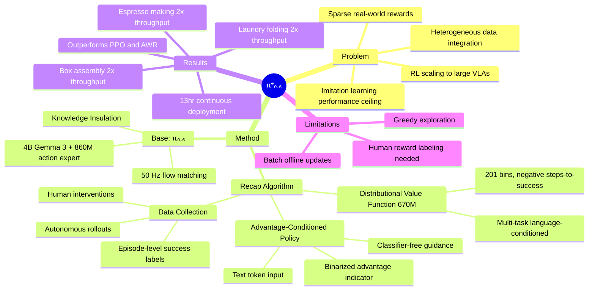

## Summary
π\*₀.₆ 提出了 **Recap**（RL with Experience and Corrections via Advantage-conditioned Policies），首次实现了通用 VLA 模型通过真实世界部署经验进行 **RL 自我改进**。核心创新是 advantage-conditioned policy extraction——不需要复杂的 policy gradient（如 PPO），而是通过 distributional value function 判断每个 action 的 advantage，将其作为文本条件（"Advantage: positive/negative"）输入 VLA，实现端到端的 flow-matching VLA 强化学习。

## Problem & Motivation
- Imitation learning 的性能上限是 demonstration 数据质量——"can only be as performant as demonstration data"
- 现有 RL 方法难以 scale 到大规模 VLA 模型（4B+ 参数 + flow matching action head）
- 真实部署中需要整合异构数据源：demonstrations、autonomous rollouts、human interventions
- Reward 信号稀疏且有噪声（episode-level success labeling）

核心目标：让 VLA 像人类一样通过**练习**（practice）来提升，从自身部署错误中学习。

## Method

### Base Model: π₀.₆
- 4B Gemma 3 language backbone + 860M flow-matching action expert
- 50 Hz action prediction + discrete subtask tokens
- **Knowledge Insulation** training：discrete tokens 和 continuous actions 独立预测，互不干扰

### Recap 算法三步骤

**1. Data Collection**
- Autonomous rollouts + optional human interventions（expert 在 agent 犯错时接管纠正）
- Episode-level sparse reward（success/failure 二值标注）

**2. Distributional Value Function**
- 670M Gemma 3 backbone，预测 negative steps-to-success
- 201 discretized bins，minimize cross-entropy
- Multi-task language-conditioned：同一个 value function 处理所有任务
- 用于判断每个 timestep 的 advantage $A^{\pi}(s_t, a_t)$

**3. Advantage-Conditioned Policy Extraction**
- 计算 binarized improvement indicator：$I_t = \mathbb{1}(A^{\pi_{ref}} > \epsilon_\ell)$
- 将 $I_t$ 作为文本 token 附加到 VLA 输入："Advantage: positive" / "Advantage: negative"
- 训练损失：$-\log \pi_\theta(a_t|o_t, \ell) - \alpha \log \pi_\theta(a_t|I_t, o_t, \ell)$
- Inference 时设 $I_t$ = positive + classifier-free guidance (β 权重)
- **核心优势**：避免了 PPO 对 flow-matching policy 的 trust region 和 importance sampling 问题

### 训练流程
1. Pre-training：在 demonstration 数据上训练 value function + advantage-conditioned policy
2. Fine-tuning（迭代式）：SFT on task demos → collect autonomous data → retrain value + policy → repeat K iterations

## Key Results

### 任务与性能
| 任务 | Throughput 提升 | Success Rate |
|------|----------------|-------------|
| Diverse laundry folding | >2× | >90% |
| Espresso making（8步） | >2× | >90% |
| Box assembly | 2× | ~90% |
| Simple laundry | ~50% | >95% |

### vs. Baselines
- 大幅超越 pre-trained π₀.₅ 和 π₀.₆（无 RL）
- AWR（Advantage-Weighted Regression）能提升 success rate 但 throughput 较低
- PPO 需要非常 conservative 的 trust region (η=0.01) 才能稳定，性能仍不如 Recap
- Offline RL + SFT 提供了好的初始化，但需要迭代 Recap 才能达到最优

### 实际部署
- 13 小时连续 espresso 制作
- 2+ 小时在新家庭环境中折叠衣物
- 工厂环境纸箱组装

### 迭代改进
- 两轮迭代后 throughput 持续提升
- Failure mode 针对性消除（如衣领朝上）：1200 条 autonomous trajectories + 2 轮迭代 → 97% success

## Strengths & Weaknesses
### Strengths
- **首次实现通用 VLA 的 RL 自我改进**：不是 toy task，而是真正的 long-horizon 家务任务
- **Advantage conditioning 设计优雅**：绕过了 policy gradient 对 flow-matching policy 的兼容性问题
- **异构数据统一处理**：demonstrations、autonomous rollouts、interventions 在同一框架下训练
- **实际部署规模可观**：13 小时 espresso、工厂环境验证
- **迭代改进有效**：两轮即可显著提升

### Weaknesses
- 仍需 human labeling（reward）和 interventions，非完全自主
- Exploration 策略简单（靠 policy stochasticity + human intervention），没有 sophisticated exploration
- Batch offline updates 而非 continuous online RL
- **对 VLN-VLA 统一的启示**：Recap 目前只用于 manipulation tasks，navigation 场景下的 value function 设计和 advantage estimation 可能需要不同策略（navigation 的 reward 更 dense——到达目标距离）

## Mind Map

## Notes
### 对 VLN-VLA Unification 的启示
1. **Advantage conditioning 是一种 model-agnostic 的 RL 方法**：理论上可以同时用于 navigation head 和 manipulation head 的 RL 训练。Navigation 的 value function 可以用到达目标的距离/步数作为 reward。
2. **Knowledge Insulation** 对统一系统特别重要：它允许 discrete tokens（如 navigation waypoint selection）和 continuous actions（如 manipulation flow matching）独立训练，不互相干扰——这正是 hierarchical VLA with dual action heads 需要的技术。
3. **迭代改进范式**可以扩展到 Nav+Manip：先部署 → 收集 failure cases → 训练 value function → advantage-conditioned re-training → 部署。
4. π₀.₆ 的 Gemma 3 4B backbone 比 π₀/π₀.₅ 的 PaliGemma 3B 更强，暗示 VLM backbone 仍在快速升级。
