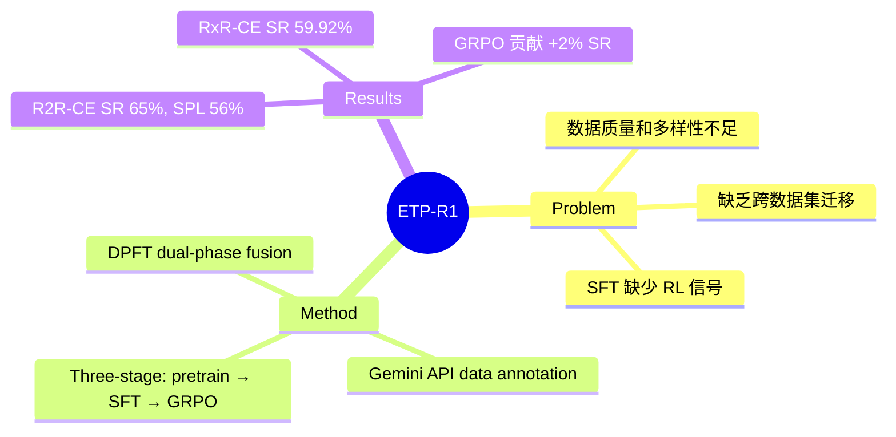

## Summary
ETP-R1 在 ETPNav 的 topological planning 框架上，引入 Gemini API 大规模数据标注、跨数据集联合预训练，以及首次将 closed-loop online reinforcement fine-tuning（GRPO）应用于 graph-based VLN-CE 模型，在 R2R-CE 和 RxR-CE 上均取得 SOTA。

## Problem & Motivation
Graph-based VLN-CE 方法（如 ETPNav、DUET）在导航精度上有优势，但面临三大瓶颈：（1）训练数据质量和多样性不足——传统 speaker model 生成的 augmented instructions 语言单一；（2）不同 VLN 数据集（R2R、RxR）各自训练，未充分利用跨任务迁移；（3）SFT 阶段只做行为克隆，缺乏从导航结果中学习的 reinforcement 信号。ETP-R1 系统地解决了这三个问题。

## Method
- **Training-free instruction annotation**: 使用 Gemini 2.0 Flash API 重新标注 Prevalent 数据集，为每条轨迹生成六种不同风格的指令（composite image = left+front+right views + trajectory segmentation），得到 Prevalent_Gemini_Aug 数据集（1M instances），平均指令长度从 31 词增至 48 词
- **Model architecture**: Text encoder（12-layer RoBERTa）+ Node encoder（ViT-B/32 CLIP for RGB, ResNet-50 for depth）+ DPFT module（Dual-Phase Fusion Transformer，包含 Symmetric Cross-Modal Fusion 和 Text-Guided Graph Refinement 两阶段）+ SAP/MLM task heads
- **Three-stage training**:
  - **Stage 1 - Offline joint pretraining**: 统一五个数据集（Prevalent 1M + Prevalent_Gemini_Aug 1M + RxR-Marky 1M + R2R_train 14K + RxR_train 80K），SAP + MLM 双任务
  - **Stage 2 - Online SFT**: DAgger-based，expert action probability p 递减
  - **Stage 3 - Online RFT (GRPO)**: Group Relative Policy Optimization，group size G=8，clip range epsilon=0.2，KL weight beta=0.04；R2R reward = I(d_final<1.5) + SPL - d_final/6；RxR reward = nDTW + SDTW + gSPL - d_final/6；online split 90% SFT + 10% RFT

## Key Results
- **R2R-CE val-unseen**: NE 3.94m, SR 65%, SPL 56%, OSR 72%（GRPO 相比 DAgger：SR +2%, SPL +2%）
- **R2R-CE test-unseen**: NE 4.19m, SR 64%, SPL 54%（vs. previous SOTA NE 4.78m, SR 58%, SPL 51%）
- **RxR-CE val-unseen**: NE 5.22m, SR 59.92%, SPL 48.97%, nDTW 65.31, SDTW 50.41（vs. HNR SOTA: SR 56.39%, nDTW 63.56）
- **Ablation**: Gemini annotations 提升 SAP accuracy；跨数据集从 R2R+G 扩展到 R2R+P+G 提升 6.55%；RxR 跨任务数据额外贡献 1.16%
- **GRPO ablation**: dropout during sampling 至关重要（去掉损失 2%）；strict on-policy（mu=1）优于 multi-epoch（mu=2 损失 2%）；temperature scaling 无效

## Strengths & Weaknesses
**Strengths**:
- 三阶段训练 pipeline 设计系统：data scaling（Gemini annotation）→ joint pretraining → reinforcement fine-tuning，每一步都有清晰的消融验证
- 首次将 GRPO 应用于 graph-based VLN-CE，证明了 RL fine-tuning 对导航任务的有效性（SR +2%），为 VLN 社区引入了新的训练范式
- Gemini API 标注方法 training-free 且可扩展，生成指令的语言多样性显著优于传统 speaker model
- 跨数据集联合预训练的 insight 有价值：RxR 数据能提升 R2R 性能，反之亦然
- 代码已开源

**Weaknesses**:
- 仍基于 ETPNav 的 waypoint prediction + topological map 框架，对 continuous action space 的处理依赖 low-level controller 的 heuristic
- GRPO 提升幅度有限（SR +2%），且 ablation 显示对 hyperparameters 敏感（dropout、on-policy 等），RL fine-tuning 的稳定性和通用性有待进一步验证
- 依赖 Gemini API 进行数据标注，成本和 API 可用性可能是约束
- 缺少 real robot 实验，仅在 simulator 中评估

## Mind Map

## Connections
- Related papers: [[2304-ETPNav]]（直接前身，ETP-R1 在其基础上引入 data scaling + GRPO）、[[2202-DUET]]（topological map + graph transformer 的经典方法，ETP-R1 沿用了类似架构思路）、[[2512-EfficientVLN]]（同期 VLN-CE SOTA，streaming 路线 vs graph-based 路线的对比）、[[2402-NaVid]]（streaming baseline）、[[2412-NaVILA]]（VLA 路线对比）、[[2305-NavGPT]]（LLM-based navigation reasoning）
- Related ideas: GRPO 在 VLN 中的成功应用表明 RL fine-tuning 可能成为 VLN 训练的标准组件；Gemini API annotation 方法可迁移到其他 embodied AI 数据集构建
- Related projects:

## Notes
- ETP-R1 是 graph-based VLN-CE 路线的最新 SOTA，与 streaming VLA 路线（如 PROSPECT、Efficient-VLN）形成两大技术路线的竞争格局
- GRPO 在 VLN 中的应用与 LLM 领域的 RLHF/DPO 趋势一致，值得关注后续是否有更 advanced 的 RL 方法被引入
- Gemini annotation 的 scaling law 效应值得深入研究：更多数据 → 更好性能的边际收益如何变化
