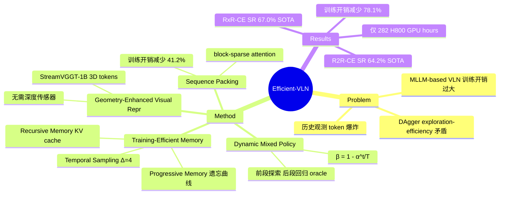

## Summary

针对 MLLM-based VLN 模型训练开销过大的问题，提出 Efficient-VLN，通过 progressive memory、recursive memory 和 dynamic mixed policy（DAgger 改进）三大机制，在仅 282 H800 GPU hours 下达到 R2R-CE 64.2% SR 和 RxR-CE 67.0% SR 的 SOTA 性能，训练开销相比 StreamVLN 减少 78.1%。

## Problem & Motivation

MLLM-based VLN 方法（如 StreamVLN、NavFoM）虽然性能突出，但训练开销极高（1,500–4,032 GPU hours），严重限制了实际研发迭代。作者识别出两个核心瓶颈：（1）处理长时间历史观测产生的海量 token 带来的二次方计算复杂度；（2）DAgger 数据聚合中 exploration 与 efficiency 的矛盾——低 oracle 比例探索充分但轨迹过长，高 oracle 比例效率高但缺乏 error-recovery 数据。

## Method

### Geometry-Enhanced Visual Representation
- 使用 Qwen2.5-VL-3B 作为 MLLM backbone，visual encoder 冻结
- 2D visual tokens 通过 spatial patching 和 2×2 token reduction 获取
- 使用 StreamVGGT-1B 从 RGB 序列提取 3D geometry latent tokens，经 2-layer MLP 对齐后与 2D features element-wise 相加：**f**_t = **v**_t + **g**_t，无需深度传感器

### Training-Efficient Memory Representations
三层机制逐步压缩 token 数量：

1. **Temporal Sampling**：以 stride Δ=4 均匀采样帧，减少相邻帧冗余
2. **Progressive Memory**：模拟人类遗忘曲线，按时间远近施加不同程度的 spatial compression——最近 K 帧使用 2×2 下采样，次近 K 帧 4×4，更早的 8×8，以此类推。总 token 数上界为 KS/3（K=3, S 为单帧 token 数）
3. **Recursive Memory**：引入 learnable sentinel tokens，其 KV cache 作为记忆状态。每步将上一步 **m**_cur 的 KV states 替换到当前步 **m**_pre 位置，实现通过 KV cache 而非 hidden states 的梯度传播

### Dynamic Mixed Policy for DAgger
改进 DAgger 的 oracle 混合策略：β = 1 - α^(t/T)，其中 α 为衰减率，t 为当前步，T 为总路径步数。轨迹前段以 learned policy 为主（充分探索），后段逐渐转向 oracle policy（确保到达目标），在获取 error-recovery 数据的同时避免轨迹过长。

### Training Strategy
- **Stage 1**：在 R2R-CE + RxR-CE 混合数据集上训练基础导航能力
- **Stage 2**：DAgger 增强 + ScaleVLN-150K + ScanQA + SQA3D + LLaVA-Video-178K
- **Sequence Packing**：使用 block-sparse attention masks 将多个连续步拼接，单次 backward pass 处理步数从 8 翻倍到 16，训练开销减少 41.2%

## Key Results

**导航性能（SOTA）**：
- R2R-CE val-unseen：SR 64.2%，显著超过 StreamVLN 的 52.8%
- RxR-CE val-unseen：SR 67.0%，显著超过 StreamVLN 的 48.6%
- Stage 1 即达到 R2R-CE 60.8% SR / RxR-CE 63.5% SR

**训练效率**：
| Method | GPU Hours | Hardware |
|--------|-----------|----------|
| StreamVLN | 1,500 | A100 |
| NaVILA | 576 | A100 |
| NavFoM | 4,032 | H100 |
| **Efficient-VLN** | **282** | **H800** |

**Ablation 亮点**：
- Progressive memory 在长 horizon 任务（RxR-CE）上优势显著
- Dynamic mixed policy 相比 constant β=0.25 减少 56% 探索开销且 SR 更高（60.8% vs 59.5%）
- 3D geometry encoder 带来 3.9–4.8% SR 提升
- Sequence packing 减少 41.2% 训练开销

## Strengths & Weaknesses

**Strengths**：
- 训练效率提升显著（282 vs 1500+ GPU hours），使 MLLM-based VLN 研究更加普惠
- Progressive memory 设计直觉优雅（模拟遗忘曲线），且上界分析清晰（KS/3）
- Dynamic mixed policy 是对 DAgger 的通用性改进，思路可迁移到其他 sequential decision-making 任务
- 无需深度传感器即可融入 3D geometry 信息，降低硬件依赖
- 实验全面，ablation 覆盖各个组件

**Weaknesses**：
- 仅在 Habitat 模拟环境评估，缺乏 real-world 验证
- 作者机构信息未明确披露
- Recursive memory 在长序列上表现不如 progressive memory（RxR-CE 上 54.7% vs 50.6%+），两者的互补关系可以进一步探索
- 3B 参数量的 backbone 在边缘端部署仍有挑战

## Mind Map

## Notes
- Dynamic mixed policy 的思路（前段探索、后段 oracle）可以推广到其他需要 DAgger 的 embodied AI 任务
- Progressive memory 的分层压缩策略与 streaming perception / online VLM 领域的 token 管理问题有共性
- 3D geometry 通过 StreamVGGT 从纯 RGB 提取，是否可以进一步结合 metric map 构建来增强空间理解？
