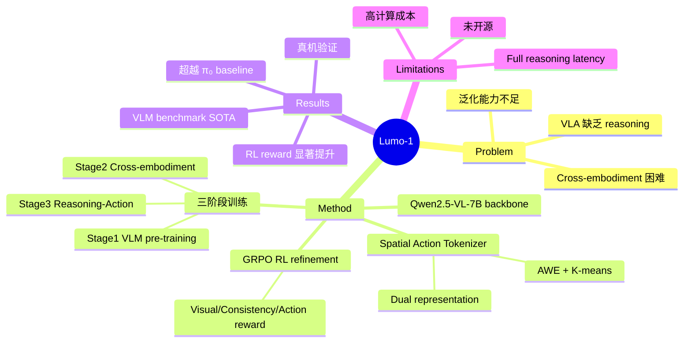

## Summary
Lumo-1 是一个将 embodied reasoning 与 robotic action 统一的 VLA 模型，基于 Qwen2.5-VL-7B 构建。通过三阶段训练 pipeline（VLM continued pre-training → cross-embodiment co-training → target-embodiment reasoning-action training）逐步将 VLM 扩展为具有结构化推理能力的 action model。核心创新在于将 reasoning trace（bounding box、keypoint、trajectory waypoint）与 action prediction 显式关联，并通过 GRPO-based RL 进一步对齐 reasoning 与 action 的一致性。在 Astribot S1 双臂移动操作平台上展示了强泛化能力。

## Problem & Motivation
当前 VLA 模型大多将 observation 直接映射到 control signal，缺乏中间推理过程，导致泛化能力和可解释性不足。具体问题包括：
- **Reasoning 缺失**：action 不是结构化推理的产物，而是端到端的黑箱映射
- **Cross-embodiment 困难**：不同 robot 的 action space 各异，难以统一表示
- **泛化瓶颈**：面对 unseen object、unseen environment、abstract instruction 时性能下降严重
- Lumo-1 的核心 insight：action 应当是 structured reasoning 的产物，而非 observation 的直接映射

## Method
### 整体架构
基于 Qwen2.5-VL-7B 的 multi-modal transformer，联合建模 reasoning trace 和 action prediction：
$$\pi(\mu, a_{t:t+H} | o_t, \ell) = \pi(a_{t:t+H} | o_t, \mu) \times \pi(\mu | o_t, \ell)$$
其中 $\mu$ 为 reasoning trace，先于 action 生成，实现可解释的决策过程。

### Spatial Action Tokenizer
- 使用 delta end-effector space + SO(3) rotation 表示
- AWE (Adaptive Waypoint Extraction) 将轨迹分解为关键 waypoint
- K-means clustering (150 clusters) 构建 motion primitive codebook
- 每个 end-effector delta 最多 5 个 token，8-token 格式覆盖双臂+torso

### Dual Action Representation
- Pre-training 阶段使用 discrete token（保护 language understanding 能力）
- Fine-tuning 阶段切换为 flow-matching continuous expert（提升 action 精度）

### 三阶段训练（共 407B tokens）
1. **Stage 1 - Continued VLM Pre-training**（13.7B tokens）：增强 embodied reasoning 能力——planning、spatial understanding、trajectory prediction，16.3M curated samples
2. **Stage 2 - Cross-Embodiment Co-Training**（200B tokens）：在 Genie-1、ARX、YAM、Agile X、Astribot S1 等多平台 145 个 task 上联合训练，使用 trajectory de-duplication 和 mirroring 等数据增强
3. **Stage 3 - Reasoning-Action Training**（193B tokens）：针对 Astribot S1 的 16.2M frames，使用结构化 reasoning annotation（textual + visual reasoning），包含 full reasoning 和 partial reasoning 两种模式

### RL Refinement (GRPO)
使用 Group Relative Policy Optimization 对齐 reasoning 和 action：
- **Visual Reward**：bounding box IoU、keypoint accuracy、trajectory DTW distance
- **Consistency Reward**：基于 Qwen3-VL-32B 的 VLM 评判 text-spatial alignment
- **Action Reward**：末端位姿误差（位置/旋转/gripper），exponential decay 加权
- **Format Reward**：regex-based 结构合规性检查

## Key Results
### VLM Benchmark
Lumo-1-Stage1 在 BLINK、CV-Bench、EmbSpatial、RefSpatial-Bench、SAT、Where2Place、RoboSpatial 7 个 benchmark 中 6 个超越 Qwen2.5-VL-7B-Instruct，且优于 RoboBrain-7B-2.0 和 Robix-7B。

### Generalizable Pick-and-Place
四类评估设置下均优于 π₀ baseline：
- **Basic**（训练内物体+环境）：基础性能扎实
- **Unseen Environments**：Stage2 将 action accuracy 从 86.98% 提升到 92.95%
- **Unseen Instructions**（概念推理如"高热量饮品""最大的草莓"）：full reasoning 模式显著提升
- **Unseen Objects**（105 个新物体）：强泛化能力

### RL 效果
- Full reasoning reward：79.72 → 83.23 (+3.51)
- Partial reasoning reward：67.42 → 71.59 (+4.17)
- Waypoint reward：96.23 → 99.68 (+3.45)

### 迁移能力
通过少量 fine-tuning 数据即可适应 long-horizon 和 dexterous task。

## Strengths & Weaknesses
**优势**：
- 三阶段训练 pipeline 设计合理，逐步构建 embodied reasoning → action 的能力链
- Structured reasoning trace（bbox + keypoint + trajectory）直接 ground 到物理控制，可解释性强
- Spatial action tokenizer 设计精巧，兼顾 compact 表示和 cross-embodiment 兼容
- GRPO-based RL 的 reward design 覆盖 visual/consistency/action 多维度，有理论深度
- 在 Astribot S1 真机上验证，非纯仿真

**不足**：
- 整体方案高度依赖 Astribot S1 平台和自有数据，可复现性低（无开源代码/数据）
- Full reasoning 模式 latency 较高，实际部署建议用 partial reasoning，reasoning 的实际收益受限
- Reasoning error 在复杂/模糊指令下仍然存在
- RL 训练存在 narrow solution pattern 倾向，需要额外 exploration technique
- 128 H100 GPU 的训练成本极高，不利于社区复现

## Mind Map

## Notes
- 训练规模：407B tokens，128 H100 GPUs，三个阶段分别 7K/100K/70K steps
- Action space 8-token format：[ΔxyzL, ΔSO(3)L, ΔxyzR, ΔSO(3)R, GripperL, ΔxyzT, ΔSO(3)T, GripperR]
- 项目主页：www.astribot.com/research/Lumo1
- Reasoning 分两种模式：full reasoning（完整推理链）和 partial reasoning（仅 subtask，低延迟）
- 值得关注的技术细节：intra-prompt trajectory de-duplication 和 robot trajectory mirroring 两个数据处理 trick
