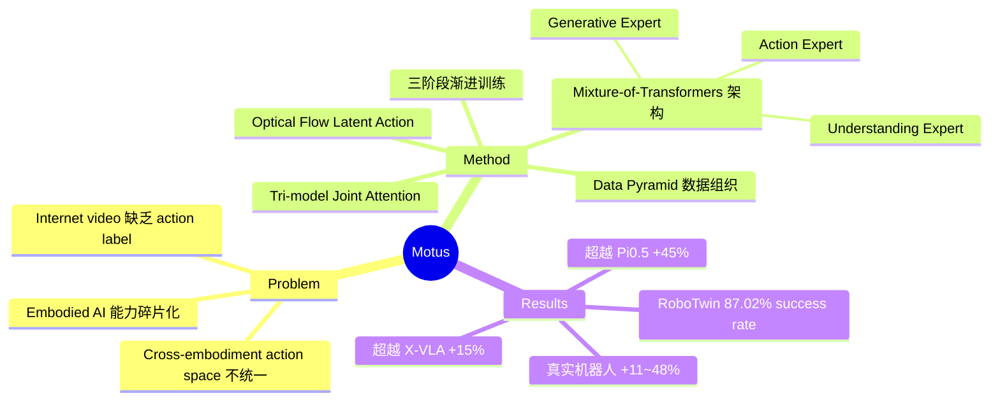

## Summary
Motus 提出了一个基于 Mixture-of-Transformers 架构的统一 latent action world model，通过 optical flow 作为 latent action 表示，将 video generation、vision-language understanding 和 action prediction 整合到单一模型中，在仿真和真实机器人任务上大幅超越现有 VLA 方法。

## Problem & Motivation
当前 embodied AI 系统将关键能力分散在孤立模型中——VLA、world model、inverse dynamics model、video generation model 各自独立训练，缺乏统一的 world knowledge 整合框架。此外，不同 robot embodiment 的 action space 各不相同，难以从缺少 action label 的 internet video 和 human demonstration 中有效迁移知识。Motus 的核心动机是用一个统一架构同时解决 multimodal integration 和 heterogeneous data utilization 两大挑战，实现 cross-embodiment 的通用机器人策略。

## Method
核心架构为 **Mixture-of-Transformers (MoT)**，集成三个 specialized expert：
- **Generative Expert**：基于 Wan 2.2 5B 的 video generation 模块
- **Understanding Expert**：基于 Qwen3-VL-2B 的 vision-language 理解模块
- **Action Expert**：自定义 Transformer 用于 action prediction

三者通过 **Tri-model Joint Attention** 连接——共享 multi-head attention 层实现跨模态融合，同时保留各自的专业功能。

**Latent Action 表示**：使用 optical flow 压缩为 14 维向量，表示 pixel-level 的运动 delta，桥接 visual dynamics 与 control signal。这使得模型可以在无 action label 的视频数据上进行 pretraining。

**三阶段训练**：
1. Stage 1：在 multi-robot trajectory 数据上进行 video generation adaptation
2. Stage 2：在 heterogeneous data 上使用 latent action 进行 unified training
3. Stage 3：针对 target robot 进行 fine-tuning

数据组织采用 **Data Pyramid** 结构，系统性地整合 internet video、human demo、multi-robot trajectory 等多层数据源。

## Key Results
**仿真 (RoboTwin 2.0, 50+ tasks)**：
- Motus: **87.02%** average success rate
- X-VLA: 72.84% (Motus 提升 +15%)
- Pi0.5: 43.84% (Motus 提升 +45%)

**真实机器人 (AC-One & Agilex-Aloha-2)**：
- Fold Towel: baseline 4% → Motus 14.5-39%
- Brew Coffee: baseline 0% → Motus 62%
- 整体提升 +11~48%

**Ablation**：Stage 1 pretraining 单独达到 81.86%，三阶段完整训练达到 87.02%，验证了渐进式训练策略的有效性。

## Strengths & Weaknesses
**优势**：
- 真正的统一架构：成功将五种建模范式整合到一个模型中，无性能退化
- Latent action 设计巧妙：optical flow 优雅地桥接 visual domain 和 control domain，支持大规模无标注预训练
- 实验全面：50+ 仿真任务、两个真实机器人平台、完整 ablation study
- 实验结果显著：在所有 baseline 上均有大幅提升

**不足**：
- 缺乏理论分析：为什么 Tri-model Joint Attention 比其他融合方式更有效，没有给出形式化论证
- 真实世界实验对比不充分：仅与 Pi0.5 对比，缺少与 UWM 等相关工作的直接比较
- 依赖 optical flow：对 DPFlow 的依赖引入额外预处理步骤，对 optical flow 误差的鲁棒性未探讨
- 计算成本不透明：预训练耗费 18,000 GPU hours，但 inference latency 和部署约束未讨论
- Fine-tuning 数据量有限（100-2000 trajectories），scaling 特性不明确

## Mind Map

## Notes
