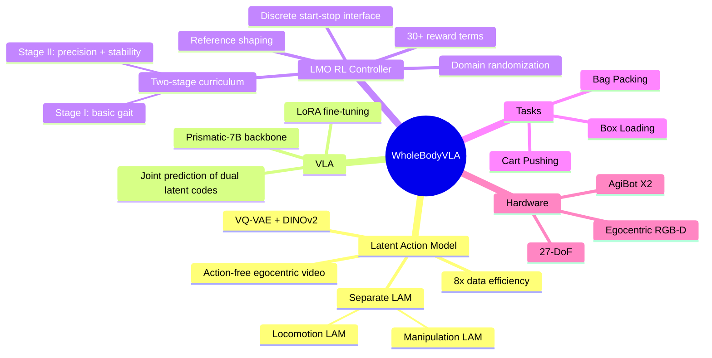

## Summary
WholeBodyVLA 提出了一个面向 humanoid robot 全身 loco-manipulation 的统一 VLA 框架，核心贡献有两个：(1) 通过分离的 locomotion/manipulation Latent Action Model (LAM) 从 action-free egocentric video 学习 latent action，大幅降低 teleoperation 数据需求；(2) 设计了 Loco-Manipulation-Oriented (LMO) RL controller，用离散 start-stop 指令替代传统 velocity-tracking，解决执行层对 manipulation 的不友好问题。在 AgiBot X2 上实现 78.0% 平均成功率，比 modular baseline 高 21.3%。

## Problem & Motivation
现有 humanoid robot 系统将 locomotion 和 manipulation 分开处理，存在两个核心问题：

1. **数据稀缺**：全身 loco-manipulation 的 teleoperation 数据采集成本极高，限制了 VLA 的 scaling
2. **执行层不匹配**：传统 locomotion controller 基于 velocity-tracking 目标训练，缺乏对 episode-level 行为（制动精度、方向保持）的约束，导致 robot 在 locomotion 结束后位姿不稳定，无法可靠执行后续 manipulation

关键 insight：人类通过观察他人学习 loco-manipulation，暗示 action-free egocentric video 可以提供有效监督信号。

## Method
### Unified Latent Action Model (LAM)
基于 VQ-VAE 架构，使用 DINOv2 作为 visual backbone。给定连续帧 $(o_t, o_{t+k})$，encoder 提取 latent code 并量化到 codebook：
$$z_t = E_i(o_t, o_{t+k}), \quad c_t^i = \arg\min_{c \in C^i} \|z_t - c\|_2$$

**关键设计——分离 LAM**：分别训练 manipulation LAM 和 locomotion LAM，而非共享。原因是两类视频的 attention pattern 截然不同：
- Manipulation 视频：相机静止，关注 arm motion
- Locomotion 视频：相机持续运动，关注环境变化
- 混合时同一 pixel 变化可能来自 arm motion（manipulation）或 camera motion（locomotion），产生歧义

Ablation 验证：shared LAM 比 separate LAM 低 12pp（66.0% vs 78.0%）。

### VLA 训练
预训练的 VLA（基于 Prismatic-7B）联合预测两种 latent action：
$$\max \pi_\theta(c_t^{mani}, c_t^{loco} \mid o_t, \ell)$$

Execution decoder 将 latent action 映射到 robot-specific 命令（上身关节角 + 下身离散运动指令）。

### 数据采集
Locomotion 数据用头戴 RealSense D435i 相机的单人即可采集（无需 MoCap/teleoperation），定义 8 个 canonical motion primitive，面向潜在 manipulation target 执行。总计约 300 小时。

### Loco-Manipulation-Oriented (LMO) RL Policy
**离散命令接口**：
$$u_t = [s_x, s_y, s_\psi, h^*] \in \{-1, 0, 1\}^3 \times \mathbb{R}$$
其中 $s_{x,y,\psi}$ 是 start/stop flag，$h^*$ 是 stance height。相比 velocity-tracking，显式的 start-stop 语义使 VLA 能直接控制"走"和"停"。

**Reference Shaping**：ternary intent 通过 exponential smoothing 转化为平滑 velocity reference，防止意图切换时的冲击加速度。

**Two-Stage Curriculum**：
- Stage I：基础步态习得，随机采样目标速度，逐步放松 joint limit
- Stage II：精度与稳定性优化，固定巡航速度，加入方向精度奖励（terminal yaw deviation）、结构化扰动（replay AgiBot-World arm motion）、静止惩罚

奖励函数包含 30+ 项，覆盖 intent execution、posture stabilization、locomotion structure、energy/smoothness、stability 五个类别。

**Domain Randomization**：dynamics（torque injection、mass scale）、contact（friction 0.1–3.0）、controller gains、sensory delays（action lag 2–8 steps）。

### 部署
- VLA：RTX 4090 workstation，~10 Hz
- LMO：NanoPi onboard，50 Hz
- 通信：ZeroMQ over Ethernet

## Key Results
### 主实验（AgiBot X2 真机，25 trials/task）

| Method | Bag Packing | Box Loading | Cart Pushing | Avg |
|--------|-------------|-------------|--------------|-----|
| Modular Design | 22/12 | 9/9 | 22/22 | 64.0% |
| GR00T w/ LMO | 20/10 | 6/4 | 12/11 | 42.0% |
| OpenVLA-OFT w/ LMO | 19/6 | 12/12 | 22/14 | 56.7% |
| **WholeBodyVLA** | **23/13** | **19/17** | **23/22** | **78.0%** |

WholeBodyVLA 比 Modular Design +21.3pp，比 OpenVLA-OFT +24pp，比 GR00T +36pp。

### 数据效率
100% video pretraining + 25 teleoperation trajectories ≈ 0% video pretraining + 200 trajectories，即 **8× 数据效率提升**。

### LAM Ablation

| Variant | Avg | Δ |
|---------|-----|---|
| Full (separate LAM) | 78.0% | — |
| w/o LAM | 39.3% | -38.7pp |
| w/ mani LAM only | 63.3% | -14.7pp |
| w/ shared LAM | 66.0% | -12.0pp |

### LMO Ablation
Velocity-based RL 替代 LMO 后平均从 78.0% 降至 54.0%，91.7% 的性能差距来自 locomotion failure。两阶段 curriculum 中去掉 Stage II 使 squatting CoMS sway 从 0.03→0.07m，lateral error 从 0.55→0.72m。

## Strengths & Weaknesses
### Strengths
1. **问题定义清晰**：准确识别了 loco-manipulation 中 data scarcity 和 execution misalignment 两个核心瓶颈，solution 与 problem 高度对应
2. **Separate LAM 的设计有 insight**：不是简单堆砌，而是基于对 locomotion/manipulation 视频 attention pattern 差异的深入分析，ablation 证实 +12pp
3. **LMO 离散接口设计合理**：start-stop 语义比 continuous velocity 更适合与 discrete token prediction 的 VLA 对接，且 two-stage curriculum 工程设计扎实
4. **数据效率显著**：8× reduction 有实际意义，egocentric video 采集成本远低于 teleoperation
5. **真机验证充分**：3 个 task、25 trials、双盲评估，实验设计规范

### Weaknesses
1. **仅在 AgiBot X2 验证**：单一 embodiment 上的结论难以确认 generalizability，尤其 LMO controller 与机器人硬件强耦合
2. **任务复杂度有限**：3 个 task 均为 pick-place/push 级别，未涉及 dexterous manipulation 或 dynamic 交互（论文自己承认）
3. **Evaluation 主观性**：依赖两位评判者的 success/failure 判断，缺乏客观量化 metric（如 grasp force、position error）
4. **Locomotion 数据的 scalability 存疑**：虽然采集成本低，但 8 个 canonical motion primitive 的定义隐含了 task-specific bias，能否 scale 到 open-ended navigation 不清楚
5. **与 concurrent work 对比不足**：缺乏与 HumanPlus、HITTER 等近期 humanoid 全身控制方法的对比
6. **10 Hz VLA + 50 Hz LMO 的 latency gap**：高层决策频率远低于低层执行，在需要快速反应的场景中可能成为瓶颈，论文未讨论

## Mind Map

## Notes
- 与 [[2512-Motus]] 的 latent action 思路类似（都用 VQ-VAE），但 WholeBodyVLA 的创新在于将 locomotion 和 manipulation 分离编码，解决了 mixed attention 的歧义问题
- Separate LAM 的 insight 可能对其他 multi-modal action learning 场景有启发：当不同 action modality 的 visual signature 有根本差异时，分离编码优于统一编码
- LMO 的离散接口设计本质上是将 continuous control 的复杂性封装在 RL 层，让 VLA 只需做 discrete decision——这是一个 pragmatic 的 engineering choice，但也限制了 locomotion 的表达力
- 论文声称的 "action-free" 并不完全准确——locomotion video 采集仍然需要人类按照 8 个 primitive 执行特定 motion pattern，虽然不需要 action label 但需要 structured demonstration
- 值得追踪后续工作是否能 (1) 扩展到更多 embodiment，(2) 处理 long-horizon task，(3) 加入 memory/mapping 模块
