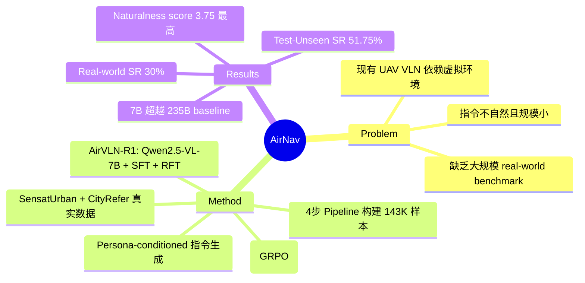

## Summary
AirNav 是首个基于真实城市航拍数据构建的大规模 UAV VLN benchmark，包含 143K 条导航样本和高自然度的多样化指令（naturalness score 3.75，超越所有现有 UAV VLN 数据集），并提出 AirVLN-R1 模型（基于 Qwen2.5-VL-7B，SFT+RFT 两阶段训练），在 benchmark 和真实无人机测试中均取得最佳表现。

## Problem & Motivation
现有 UAV VLN 数据集存在三大限制：（1）依赖虚拟环境（synthetic 或 game-engine based），无法捕捉真实城市场景的复杂 spatial structures 和丰富 texture details；（2）指令缺乏自然度，多为 template-based 生成或仅提供 target description，不包含 landmark reference 和 conditional behaviors 等关键中间线索；（3）规模有限（最大约 32K），不支持大规模模型训练和评估。AirNav 同时解决这三个问题，构建基于 real urban aerial data 的大规模 benchmark。

## Method
### AirNav Benchmark 构建
数据基于 SensatUrban（高密度 3D point cloud，覆盖 Cambridge 和 Birmingham）和 CityRefer（自然语言 object descriptions），环境通过 CityFlight 对齐 OpenStreetMap 形成交互式飞行平台。

**四步构建 Pipeline**：
1. **Start & Target Selection**: 随机采样起点，选择有明确空间边界的地理目标，MLLM 生成 target description，过滤歧义样本
2. **Landmark Planning**: MLLM 识别起终点间的代表性地理 landmark，施加最大距离约束保证 perceptual continuity，语义精炼确保描述准确
3. **Trajectory Synthesis**: 对连续节点对使用 look-ahead strategy 生成 executable action sequence，拼接为完整轨迹
4. **Instruction Generation**: 引入 10 种 user persona（基于年龄、社会角色、表达偏好），结合 MLLM 和 human-authored few-shot examples 生成多样化指令

### 数据集规模与统计
| Split | Desc. | Scene | Easy | Medium | Hard |
|:------|:------|:------|:-----|:-------|:-----|
| Train | 102,968 | 24 | - | - | - |
| Val Seen | 9,072 | 24 | 2,904 | 2,892 | 3,276 |
| Val Unseen | 11,684 | 4 | 2,895 | 3,981 | 4,808 |
| Test Unseen | 19,651 | 6 | 4,871 | 7,428 | 7,352 |

- 总计约 **143K** 导航样本，vocabulary size 20.7K（远超现有数据集）
- 难度分级：Easy (<135m)、Medium (135-235m)、Hard (>=235m)
- 大多数轨迹含 2-6 个 intermediate landmarks，4-5 个最常见
- Instruction length 分布广泛，peak 约 100 words
- **Naturalness score 3.75**（GPT-4o 评估），超过 LANI(3.00)、AVDN(3.47)、AerialVLN(2.59)、OpenFly(3.12)

### Task Formulation
- Partially observable sequential decision-making
- 离散 action space: forward, turning left, turning right, stop
- 每步可输出 variable-length action sequence（最多 8 个动作）
- Success criteria: 终点与目标距离 <20m
- Metrics: NE, SR, OSR, SPL

### AirVLN-R1 Model
基于 **Qwen2.5-VL-7B** 构建，8×A100 GPU 训练：
- **Input**: Instruction + Current State (position, heading) + Historical Action Sequence + Current View Image + Historical View Images
- **Progressive Interval Sampling**: 近期帧密采样、远期帧稀疏采样，控制 visual memory 大小
- **Output**: 最多 8 个 discrete actions 的 variable-length sequence

**两阶段训练（受 DeepSeek-R1 启发）**：
1. **SFT**: Cross-entropy loss，学习 multimodal input → action sequence 的映射
2. **RFT**: 基于 GRPO，多目标 reward function：
   - **Distance-to-Subgoal reward**: 鼓励接近中间节点
   - **Heading Angle Alignment reward**: 鼓励航向对齐（tolerance 60°）
   - **Stop Consistency reward**: 惩罚 early-stop 和 missed-stop
   - **Format reward**: 确保输出格式正确
   - 总 reward: r_all = λ1·r_dis + λ2·r_yaw + r_stop + r_format

## Key Results
### AirNav Benchmark 主实验（Table 2）
| Method | Val-Seen SR | Val-Unseen SR | Test-Unseen SR |
|:-------|:-----------|:-------------|:--------------|
| Seq2Seq | 1.58 | 0.92 | 1.28 |
| CMA | 5.13 | 4.93 | 4.48 |
| Qwen2.5-VL-7B | 1.82 | 1.57 | 1.65 |
| Qwen2.5-VL-32B | 3.02 | 2.64 | 2.84 |
| Qwen3-VL-235B-A22B | 5.50 | 5.18 | 4.94 |
| GPT-4o | 4.53 | 4.13 | 4.29 |
| **AirVLN-R1 (Ours)** | **51.79** | **51.66** | **51.75** |

- AirVLN-R1 在所有 metrics 上大幅领先，test-unseen SR 达到 **51.75%**，SPL **50.57**
- 关键优势：seen→unseen 迁移时性能几乎无衰减（51.79→51.75），展现强泛化能力
- 7B 模型超越 32B 和 235B 模型，证明 task-specific SFT+RFT 的有效性

### Ablation: 训练范式
| Paradigm | Val-Seen SR | Val-Unseen SR | Test-Unseen SR |
|:---------|:-----------|:-------------|:--------------|
| SFT-only | 43.89 | 40.68 | 39.56 |
| RFT-only | 2.33 | 2.07 | 2.31 |
| **SFT+RFT** | **51.79** | **51.66** | **51.75** |

- SFT-only 在 seen 上表现好但 unseen generalization 有限（43.89→39.56）
- RFT-only 无法收敛（sparse reward），SR 仅约 2%
- SFT+RFT 组合最优，RFT 阶段将 unseen SR 从 40.68 提升至 51.66（+27%）

### Real-World 测试
- 室内+室外各 10 个任务，不同路径复杂度
- AirVLN-R1: SR = 6/20 (30%), NE = 67.29（最低）
- 传统方法完全失败，通用 MLLM zero-shot 仅解决极少数任务
- GPT-4o 有一定提升但总体 SR 仍有限

## Strengths & Weaknesses
**Strengths**:
- **真实数据源**: 基于 SensatUrban 真实航拍 3D point cloud，不依赖 synthetic rendering，spatial fidelity 高
- **指令自然度领先**: Persona-conditioned generation + human review 的 pipeline 设计优雅，naturalness score 3.75 显著超越所有前作
- **规模优势**: 143K 样本是现有最大 UAV VLN 数据集（此前最大 CityNav 仅 32K）
- **SFT+RFT 训练范式**: 受 DeepSeek-R1 启发的两阶段训练在 7B 模型上实现超越 235B 模型的效果，值得借鉴
- **Multi-objective reward 设计**: distance + heading + stop consistency + format 四维 reward 覆盖了导航决策的核心要素

**Weaknesses**:
- 仅覆盖 Cambridge 和 Birmingham 两个城市，跨城市/国家的 generalization 待验证
- 离散 action space（forward/turn/stop）无法建模真实 UAV 的 continuous flight dynamics
- Real-world 测试规模有限（仅 20 个 episodes），且 SR 30% 距实用差距较大
- 固定视角和高度分布可能不足以覆盖真实 UAV 的多样飞行条件（遮挡、极端光照、复杂高度）
- Sim-to-real gap 仍然显著，benchmark 上的性能提升不一定直接转化为 real-world gain

## Mind Map

## Connections
- Related papers: [[2402-NaVid]]（indoor VLN 的 video-based approach，AirNav 将 VLN 扩展到 outdoor UAV 场景）、[[2507-VLNPE]]（同关注 VLN 的 physical embodiment gap，VLN-PE 面向地面机器人，AirNav 面向 UAV）、[[2304-ETPNav]]（indoor VLN-CE baseline）、[[2305-NavGPT]]（LLM-based VLN agent）、[[2412-NaVILA]]（VLA for navigation，不同 embodiment）、[[2603-PROSPECT]]（streaming VLN，可扩展至 aerial setting）
- Related ideas: SFT+RFT 两阶段训练范式（源自 DeepSeek-R1）在 embodied navigation 中的成功应用，可推广到其他 VLN/VLA 任务；Persona-conditioned instruction generation 方法论可用于其他数据集构建
- Related projects:

## Notes
- AirNav 与 VLN-PE 形成互补：VLN-PE 关注地面机器人的 physical embodiment gap，AirNav 关注 UAV 的 aerial navigation gap。两者共同指出了 VLN 从 sim-to-real 迁移的核心难题
- SFT+RFT 的 training paradigm 是本文最大的方法论亮点：SFT 提供稳定初始化，RFT 通过 GRPO 在 unseen 环境上获得了 +27% 的 SR 提升。这比单纯增加 SFT 数据或模型规模更有效
- 7B 模型击败 235B 模型的结果再次证明 task-specific fine-tuning 的重要性，与 VLN-PE 中"小模型 in-domain 训练超越大模型 zero-shot"的结论一致
- Naturalness score 的评估方法（10 种 persona + GPT-4o scoring + human calibration）值得参考，可作为其他 VLN 数据集的 instruction quality 评估标准
- 项目主页：https://littlelucifer1.github.io/AirNav/
