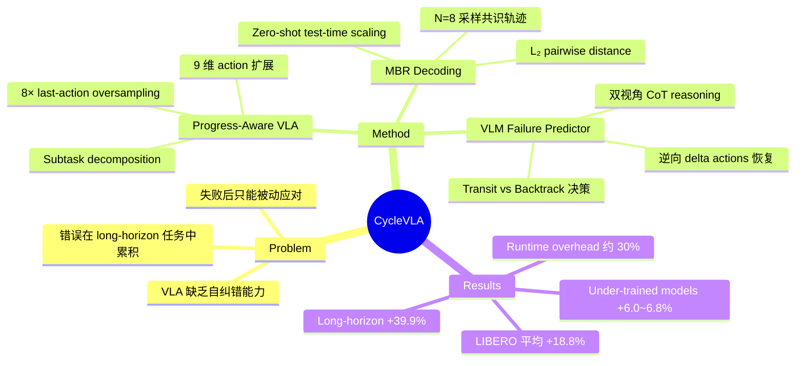

## Summary
提出 CycleVLA，一种为 VLA 模型赋予主动自纠错（proactive self-correction）能力的框架：通过 progress-aware subtask decomposition 识别关键转换点，结合 VLM-based failure predictor 在失败完全发生前触发 subtask backtracking，并利用 Minimum Bayes Risk (MBR) decoding 提升重试成功率。在 LIBERO 上平均提升 +18.8%，long-horizon 任务提升高达 +39.9%。

## Problem & Motivation
现有 VLA 模型在执行长序列 manipulation 任务时缺乏自纠错能力——错误一旦发生只能被动应对，且会在后续 subtask 中累积放大，导致 long-horizon 任务成功率急剧下降。人类执行动作时会持续感知异常并提前调整（如感到杯子滑动时会加紧握力），但当前 VLA 既没有 progress tracking 机制来判断任务进展，也没有在错误萌芽阶段主动回退的能力。这一问题在 under-trained 或 domain shift 场景下尤其严重，因为 policy 本身的错误概率更高。

## Method
CycleVLA 由三个核心组件组成：

1. **Progress-Aware VLA（进度感知的 VLA）**：在标准的 7 维 robot action 上扩展为 9 维，增加 stop signal（binary）和 progress indicator（0-1，离散化为 0.1 bins）。通过 LLM 对 demonstration 进行 subtask decomposition，利用 gripper state transition 和 movement primitives 对齐 subtask 时间戳。训练时对最后动作步进行 8× oversampling，强化终止检测能力。

2. **VLM-Based Failure Predictor（基于 VLM 的失败预测器）**：当 progress indicator 达到 ~90% 时，将第三人称和 wrist-mounted camera 的同步图像输入 off-the-shelf VLM（GPT-5.2），通过 Chain-of-Thought reasoning 融合双视角信息，判断当前 subtask 是"transit"（继续）还是"backtrack"（回退到最早可恢复缺失前置条件的 subtask）。回退时通过逆向执行记录的 delta actions 恢复机器人状态。

3. **Minimum Bayes Risk (MBR) Decoding**：backtracking 后从 stochastic policy 中采样 N=8 条 action sequences，计算 N×N pairwise L₂ distance matrix，选择使 expected risk 最小化的共识轨迹（即最密集区域的 medoid），采用 adaptive r-NN density estimation。这本质上是一种 zero-shot test-time scaling 策略，不需要额外训练。

## Key Results
- **LIBERO benchmark**（基于 OpenVLA）：Spatial 84.7%→97.6%（+12.9%），Object 88.4%→98.1%（+9.7%），Goal 79.2%→91.7%（+12.5%），Long 53.7%→93.6%（+39.9%），平均 76.5%→95.3%（+18.8%）
- **Under-trained models**：在 200K/350K/500K steps 的 checkpoint 上均有 +6.0~6.8% 的一致性提升，表明方法对不同能力水平的 policy 都有效
- **MBR 分析**：N=8 已实现大部分收益，超过 N=16 后边际收益递减；L₂ 和 L₁ 距离优于 cosine similarity 和 correlation
- **Runtime overhead**：整体推理时间增加约 30%，其中 VLA action inference 占 68.6%，action sampling 占 22.2%，VLM failure prediction 仅占 6.0%
- **Ablation**：去掉 MBR 后降至 92.5%；用 LLaMA-3.2-11B 替换 GPT-5.2 后为 92.8%；always-on MBR 可达 96.9% 但耗时翻倍

## Strengths & Weaknesses
**优势**：
- 首次系统性地将 proactive self-correction 引入 VLA，从"事后补救"转向"事前预防"，思路清晰且有实际意义
- Subtask progress tracking 的设计很巧妙——通过 9 维 action 扩展让 VLA 自身学会判断进度，避免了额外模块的引入
- MBR decoding 作为 zero-shot test-time scaling 策略非常实用，无需额外训练即可提升 retry 成功率
- Long-horizon 任务上 +39.9% 的提升极为显著，验证了 error accumulation 问题的严重性和 self-correction 的价值
- Ablation 完整，每个组件的贡献都有实验证据支撑

**不足**：
- 可逆性假设（reversibility assumption）是核心限制——通过逆向执行 delta actions 回退在 contact-rich 或不可逆操作（如倒水、切割）中不成立
- 依赖外部 VLM（GPT-5.2）作为 failure predictor，引入了延迟和 API 依赖，限制了部署灵活性
- 目前仅在 LIBERO simulation 上验证，缺乏真实机器人实验
- Subtask decomposition 依赖 LLM + gripper heuristics，在非 gripper-based manipulation 中可能需要重新设计
- VLM failure predictor 存在 confirmatory bias 倾向（将其作为硬约束时成功率降至 79.7%），可靠性有待提升

## Mind Map

## Notes
- MBR decoding 思路来自 NLP 的 machine translation，作为 test-time scaling for VLA 的探索值得关注
- Progress indicator 的设计可能可以推广到其他 sequential decision making 场景
- VLM failure predictor 的 confirmatory bias 是一个有趣的发现，暗示当前 VLM 在 spatial/physical reasoning 方面仍有不足
