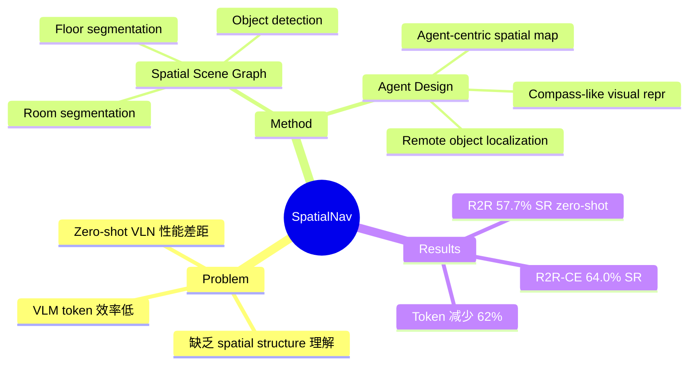

## Summary
SpatialNav 提出利用 Spatial Scene Graph (SSG) 实现 zero-shot VLN，通过 agent-centric spatial mapping、compass-aligned visual representation 和 remote object localization 三大组件，在 R2R val-unseen 达到 57.7% SR，R2R-CE 达到 64.0% SR，大幅超越 zero-shot baselines。

## Problem & Motivation
Zero-shot VLN 方法与 learning-based 方法之间存在显著性能差距，核心原因在于 zero-shot agent 缺乏对环境 spatial structure 的充分理解。现有 zero-shot 方法直接用 VLM 做 sequential decision，但难以捕捉全局空间关系。SpatialNav 的核心 insight 是：允许 agent 在任务执行前充分探索环境并构建 spatial scene graph，从而将 3D spatial structure 和 object semantics 编码为可供 VLM reasoning 的结构化表示。

## Method
**Spatial Scene Graph (SSG) 构建**分四个阶段：
1. **Floor Segmentation**：基于 height-based clustering（DBSCAN）分离不同楼层
2. **Room Segmentation**：geometric heuristics 划分房间，超过 20m² 的区域需人工校验
3. **Room Classification**：使用 GPT-5 分析 pre-exploration 图像进行房间类型标注
4. **Object Detection**：在 Matterport3D training data 上 fine-tuned SpatialLM 检测物体

**SpatialNav Agent** 包含三个关键组件：
- **Agent-centric Spatial Map**：从 SSG 中 query 约 7m 范围内的信息，生成 top-down spatial representation，提供局部空间上下文
- **Compass-like Visual Observation**：将 8 个方向的视图组织为 3×3 grid 的单张图像（compass-style），token 开销仅 ~640（vs. sequential input 的 1700+），减少 62% 且性能接近
- **Remote Object Localization**：从 navigable locations 检索 SSG 中的 object semantics，实现 "future-aware decision making"，使 agent 能感知当前视野之外的物体

## Key Results
**Discrete environments**：
- R2R val-unseen: 57.7% SR, 47.8% SPL（vs. SpatialGPT 47.1% SR, 36.1% SPL，+10.6% SR, +11.7% SPL）
- REVERIE val-unseen: 49.6% SR（接近 supervised DUET+ScaleVLN 的 57.0%）

**Continuous environments**：
- R2R-CE: 64.0% SR（vs. VLN-Zero 42.4%，+21.6%）
- RxR-CE: 32.4% SR（vs. STRIDER 35.0%，略低但为 zero-shot 方法）

**Ablation**：
- Compass-style visual format: 1024×1024 达到 60.3% SR（vs. sequential 62.5%），tokens 减少 62%
- 最优 perception radius = 7.68m，过大或过小均降低性能
- Spatial map alone 40.8% SR → 加 remote objects 在 visual-grounded 条件下提升显著

## Strengths & Weaknesses
**Strengths**：
- Zero-shot 框架在标准 benchmarks 上大幅超越同类方法，R2R-CE 上甚至超越部分 supervised methods
- Compass-style visual representation 设计精巧，以 62% 的 token 节省达到接近 full observation 的性能
- 在 discrete 和 continuous environments 上都有全面评估
- SSG 的 hierarchical 结构（floor → room → object）提供清晰的 spatial reasoning 基础

**Weaknesses**：
- Pre-exploration 假设较强：需要在任务执行前完整探索环境，限制了在 unseen environments 中的 online 应用
- Room segmentation 对 open spaces 仍需人工校正，自动化程度不足
- SSG 构建依赖 fine-tuned SpatialLM，在 domain transfer 时可能需要重新训练
- 未评估 SLAM-based point cloud generation 的 robustness 和 computational overhead

## Mind Map

## Connections
- Related papers: [[2305-NavGPT]]（LLM-based zero-shot VLN 先驱，SpatialNav 在此基础上引入 spatial structure）、[[2309-ConceptGraphs]]（open-vocabulary 3D scene graph，SSG 构建的技术基础）、[[2202-DUET]]（dual-scale graph transformer，SpatialNav 在 REVERIE 上与其对比）、[[2304-ETPNav]]（topological planning for VLN-CE，continuous environment 导航对比）、[[2512-EfficientVLN]]（learning-based VLN SOTA，R2R-CE 64.2% SR 与 SpatialNav 64.0% 接近）、[[2502-VLNav]]（同期 neuro-symbolic VLN 工作，不同路线：online exploration vs. pre-exploration）
- Related ideas: Pre-exploration + scene graph 的范式虽然 assumptions 较强，但在 zero-shot 设定下效果惊人；如何将 SSG 的优势迁移到 online exploration 设定是重要方向
- Related projects:

## Notes
- Qi Wu 组（University of Adelaide）是 VLN 领域的重要力量，NavGPT 也出自该组
- R2R-CE 64.0% SR 作为 zero-shot 方法，已接近 Efficient-VLN (64.2%) 等 supervised SOTA，说明 spatial structure 对 VLN 极其关键
- Compass-style visual representation 的 token 效率优化思路可迁移到其他 VLM-based navigation 系统
