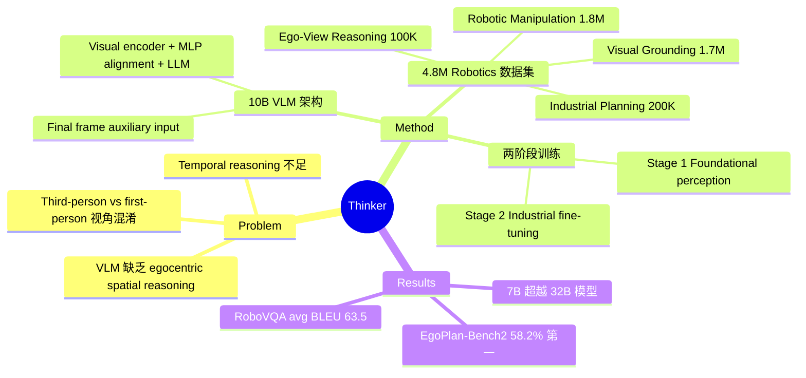

## Summary
提出 Thinker，一个面向 embodied intelligence 的 vision-language foundation model（10B 参数）。核心贡献是构建了 4.8M 实例的 robotics-specific 数据集，覆盖 ego-view reasoning、visual grounding、spatial understanding 和 chain-of-thought planning 四大能力维度，并采用两阶段训练策略（foundational perception → industrial task alignment）。架构上的创新点是将视频最终帧作为 auxiliary input 增强 temporal reasoning。在 RoboVQA 上达到 63.5 avg BLEU（超越 RoboBrain-7B），在 EgoPlan-Bench2 上以 58.2% accuracy 排名第一（超越 RoboBrain2-32B）。

## Problem & Motivation
现有大规模 VLM 虽然在通用视觉理解上表现优异，但直接应用于 robotics 时面临两个关键挑战：（1）**第一人称与第三人称视角混淆**——通用 VLM 主要在 third-person images 上训练，缺乏 ego-centric spatial reasoning 能力；（2）**temporal reasoning 不足**——模型难以从视频序列（特别是视频末尾）中提取关键时序信息来判断当前状态和下一步动作。根本原因在于训练数据中缺乏 grounded in first-person perspective 的时空信息，导致模型无法建立 egocentric coordinate system 下的空间理解和基于过去事件的 temporal reasoning。

## Method
**整体架构**：Thinker 由 text tokenizer、visual encoder、MLP alignment module 和 10B 参数的 language backbone 组成。关键设计是将视频的 final frame 作为 auxiliary input 与完整视频序列一起输入，增强模型对视频末尾状态的理解。

**四大核心能力**：
1. **Task Planning**：理解自然语言指令并结合 state memory 生成动作计划，支持 chain-of-thought reasoning
2. **Spatial Understanding**：基于 egocentric coordinate system（以 camera 为原点）进行空间关系推理
3. **Temporal Understanding**：从过去的视频事件中提取关键信息，判断当前状态
4. **Object Grounding**：bounding box 和 point-level localization，支持 affordance 识别

**训练数据**（共 4.8M 实例）：
- Visual Grounding 1.7M：LVIS-520K + Sharerobot-affordance + Pixmopoint + Robopoint
- Ego-View Reasoning 100K：Egoplan-it-100K（过滤后的 ego-view 视频 QA）
- Robotic Manipulation 1.8M：RoboVQA-800K + Sharerobot-1M
- Industrial Planning 200K：Industroplan（多物体 manipulation 场景）

**两阶段训练**：
- Stage 1：Foundational perception，在混合数据集上训练基础的 visual grounding、spatial understanding 和 planning 能力
- Stage 2：Supervised fine-tuning on Industroplan-200K，对齐 real-world industrial 场景

**训练基础设施**：multi-task heterogeneous training with dynamic sampler（根据 validation feedback 自适应调整采样比例）、task-aware normalization、periodic checkpointing for fault tolerance。

## Key Results
- **RoboVQA benchmark**：Thinker-7B 达到 avg BLEU 63.5（BLEU-1: 72.7, BLEU-2: 65.7, BLEU-3: 59.5, BLEU-4: 56.0），超越 RoboBrain-7B（62.7）
- **EgoPlan-Bench2 benchmark**：overall accuracy 58.2%，在所有 domain 排名第一
  - Daily life 63.78%、Work 54.95%、Recreation 61.20%、Hobbies 52.54%
  - 超越 RoboBrain2-32B（57.23%），注意 Thinker 仅 7B/10B 参数
- 在两个 benchmark 上均超越了包括 GPT-4V、Qwen2.5-VL 在内的通用 VLM

## Strengths & Weaknesses
**优势**：
- 数据工程扎实：4.8M 实例覆盖了 embodied AI 的核心能力维度，数据构建方法论清晰
- 以更小的模型（7B/10B）超越了更大的模型（RoboBrain2-32B），说明 domain-specific 数据的价值
- Final frame auxiliary input 是简单但有效的 temporal reasoning 增强手段
- 两阶段训练策略（通用→领域）合理，有 curriculum learning 的思想
- 覆盖了 task planning、spatial、temporal、grounding 四个维度，能力设计较为全面

**不足**：
- 仅 4 页 IROS 短文，方法细节不足（如 MLP alignment module 的具体设计、visual encoder 的选择等未详述）
- 没有真实机器人闭环实验——仅在 VQA/benchmark 上评估，未验证 planning output 是否能驱动真实 manipulation
- 缺少与同等规模 VLA 模型（如 OpenVLA、π₀）的对比，benchmark 选择偏向 VLM 而非 VLA
- Industroplan-200K 数据集未公开，可复现性存疑
- "即将发布完整技术报告和权重"但目前均未兑现，实际贡献仍需后续验证
- 缺少 ablation study（如 final frame auxiliary input 的单独贡献、各数据集的影响等）

## Mind Map

## Notes
- 这是一篇 IROS 2025 的 4 页短文，信息密度有限，核心价值在于 data curation methodology 和 benchmark 结果
- 作者承诺发布完整技术报告、架构和权重，需要持续跟踪
- 与 RoboBrain 系列是直接竞争关系，都在做 robotics-specific VLM，但 Thinker 以更小模型取胜
- Rating 给 3：有参考价值但非必读——方法细节不足、缺少真实机器人验证、关键资源未公开
