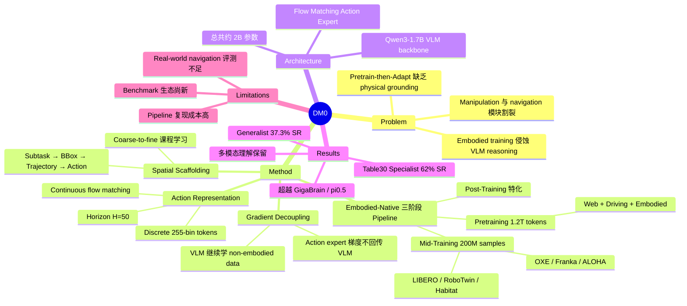

## Summary
DM0 是 Dexmal 提出的 Embodied-Native VLA 模型，摒弃传统的 "Pretrain-then-Adapt" 范式，从训练伊始就将 physical data 作为一等公民，统一 manipulation 和 navigation 任务。仅用 2B 参数在 RoboChallenge Table30 benchmark 上达到 62% success rate，超越了 GigaBrain-0.1（3B, 51.67%）和 pi0.5（3B, 42.67%）等更大模型。

## Problem & Motivation
现有 VLA 模型遵循 "Pretrain-then-Adapt" 范式：先在 internet data 上大规模预训练，再适配到 physical tasks。这导致模型缺乏 **intrinsic physical grounding**——internet 数据集无法捕捉机器人交互中的动态空间特性。此外，联合优化 language 和 control objectives 时会发生 catastrophic forgetting，motor skills 的学习反而侵蚀模型的 general reasoning 能力。DM0 的核心主张是：真正的 generalist robot 需要一个 **Embodied-Native framework**，从训练起点就融合 web text、autonomous driving 和 embodied interaction data，而非事后适配。同时，DM0 希望在单一框架内统一 manipulation 和 navigation，消除现有系统中的模块割裂。

## Method
**整体架构：Qwen3-1.7B VLM backbone + Flow Matching Action Expert（共约 2B 参数）**

**1. 三阶段训练流水线**
- **Stage 1 Pretraining（1.2T tokens, 370K steps）**：在 heterogeneous data（Common Crawl、LAION、教育考试、OCR、GUI、driving scenes、embodied interaction logs）上统一预训练，让模型从一开始就获得 physical priors
- **Stage 2 Mid-Training（200M samples, 64×H20 GPUs）**：将 VLM 接地到 physical control。数据包括 vision-language data（Cambrian、LLaVA OneVision）、embodied reasoning、simulation data（LIBERO、RoboTwin2.0、Habitat navigation）、单臂/双臂 robotics data（Franka、UR5、ARX-5、ALOHA、OXE 等）
- **Stage 3 Post-Training（50M samples）**：针对特定 robot platform 特化

**2. Gradient Decoupling（梯度解耦）**
受 Knowledge Insulation 启发，action expert 的梯度不回传到 VLM，防止 embodied training 侵蚀语义表征。同时 VLM 继续在 non-embodied data 上更新，维持 general capabilities。训练目标为 autoregressive loss（VLM 预测 reasoning text + discrete action tokens）与 flow matching loss（action expert 预测 continuous action sequences）的加权组合。

**3. Embodied Spatial Scaffolding（空间脚手架策略）**
层级式监督框架，逐步约束 solution space：
1. **Subtask Prediction**：将整体任务分解为可解释的子步骤
2. **Goal Bounding Box Prediction**：在 visual input 中定位目标物体/区域
3. **End-Effector Trajectory Prediction**：预测末端执行器在 camera view 中的轨迹
4. **Discrete Action Prediction**：输出控制指令 tokens

这构成了从 high-level semantic reasoning → spatial grounding → low-level control 的自然课程学习。

**4. Action Representation**
- **Discrete tokens**：255-bin 量化，用于 VLM 监督
- **Continuous values**：直接回归目标，用于 action expert
- Prediction horizon：50 步，per-timestep 归一化和量化

## Key Results
**RoboChallenge Table30（Specialist 配置）：**

| 模型 | 参数量 | Overall SR |
|:-----|:------|:----------|
| **DM0** | **2B** | **62.00%** |
| Spirit-v1.5 | 4B | 51.00% |
| GigaBrain-0.1 | 3B | 51.67% |
| pi0.5 | 3B | 42.67% |

- 典型任务：arrange fruits in basket 100%（GigaBrain 60%）、plug network cable 80%（其他接近 0-20%）、stack color blocks 100%
- 以更小参数量（2B vs. 3-4B）实现 SOTA，展示了参数效率

**Generalist 配置：** DM0 达到 37.3% SR / 49.08 score，远超 pi0.5（17.67% / 31.27）和 pi0（9.0% / 20.22），跨任务泛化能力显著

**多模态理解保留：** 在 embodied VQA、lifestyle VQA、Chain-of-Thought subtask decomposition 等评测中保持了良好的 general reasoning 能力，验证了 gradient decoupling 策略的有效性

## Strengths & Weaknesses
**Strengths:**
- Embodied-Native 理念有说服力：从训练起点就融合 physical data，而非事后适配，避免了 domain gap
- Gradient decoupling 有效解决了 embodied training 侵蚀 VLM semantic capacity 的核心矛盾，实验验证了 multimodal understanding 的保留
- Spatial Scaffolding 策略从 subtask → bbox → trajectory → action 构成自然的 coarse-to-fine 课程，理论动机清晰
- 2B 参数量显著小于竞争对手（3-4B），却达到更高性能，parameter efficiency 出色
- 数据工程扎实：1.2T tokens pretraining + 200M mid-training samples，heterogeneous data 覆盖 web/driving/embodied，pipeline 完整
- 同时在 specialist 和 generalist 两种设定下都取得 SOTA

**Weaknesses:**
- 论文作者阵容极为庞大（50+ 人），但 institute 信息不够清晰，难以评估团队实际研究深度
- Table30 benchmark 相对较新，尚未被广泛采用，与 SIMPLER、LIBERO 等社区标准 benchmark 的对比不够充分
- Generalist 配置下 37.3% SR 虽然远超 baseline，但绝对值仍较低，距离实用部署有距离
- 三阶段 pipeline + heterogeneous data 的复杂度很高，复现成本大
- Navigation 能力主要通过 Habitat simulation 数据获取，real-world navigation 的评测证据不足
- Code 和 checkpoint 虽已发布，但社区验证和 fine-tuning 生态尚待建立

## Mind Map

## Notes
- DM0 的核心贡献在于提出 Embodied-Native 范式，区别于 pi0 系列的 Pretrain-then-Adapt。这一理念是否真正优于后者，还需要更多 controlled ablation 验证（目前的对比存在数据量、数据质量等 confounding factors）
- Gradient decoupling 与 pi0 的 Action Expert MoE-style 设计解决的是同一个问题（防止 action training 破坏 VLM），但技术路线不同：pi0 用参数隔离，DM0 用梯度隔离
- Spatial Scaffolding 的 Chain-of-Thought 式设计值得关注——这是将 LLM 的 reasoning 范式引入 low-level control 的有趣尝试
- 2B 参数打败 3-4B 竞争对手，说明 data recipe 和训练策略可能比单纯的 model scaling 更重要
