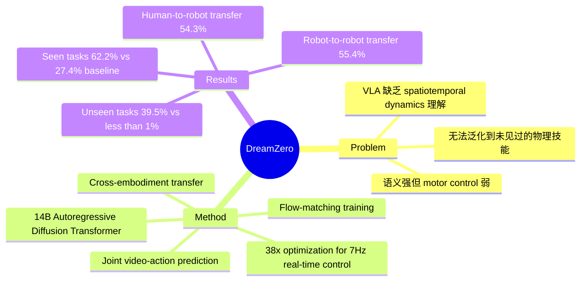

## Summary
DreamZero 提出 World Action Model (WAM)，利用 video diffusion 联合预测未来视频帧和机器人动作，在 zero-shot 泛化到新任务和新环境上比现有 VLA 模型提升超过 2 倍。

## Problem & Motivation
当前 Vision-Language-Action (VLA) 模型虽然语义理解能力强，但在泛化到训练数据中未见过的物理运动和环境时表现很差。例如 VLA 可以执行"把可乐罐移到 Taylor Swift 旁边"，但如果训练数据中没有"解鞋带"这个技能，就无法完成该任务。核心问题在于 VLM 缺乏精确的 spatiotemporal dynamics 理解和 motor control 能力。DreamZero 的 insight 是：video generation model 天然具备对物理世界动态的理解，如果将 video prediction 和 action prediction 联合建模，就能将 world model 的泛化能力迁移到 policy 上。

## Method
DreamZero 的核心架构是一个 14B 参数的 autoregressive diffusion transformer，联合预测未来视频帧和机器人动作：

- **Joint Video-Action Prediction**: 不是分开训练 video model 和 action model，而是端到端联合训练，共享 denoising objective，确保 video 和 action 紧密对齐
- **Autoregressive Design**: 保留原始帧率，支持 KV caching 加速推理；closed-loop control 时用 ground-truth observation 替换预测帧，消除 compounding error
- **Flow-Matching Training**: 使用 teacher forcing 和 chunk-wise video denoising，同一 chunk 内所有帧共享相同 timestep
- **Real-time Optimization Suite**: 多层优化实现实时控制
  - System-level: classifier-free guidance parallelism, DiT caching
  - Implementation: torch compile, CUDA graphs, quantization
  - Model-level: DreamZero-Flash，解耦 video/action noise schedule
  - 最终实现 38x 加速，14B 模型在 2 张 GB200 GPU 上达到 7Hz closed-loop control
- **Cross-Embodiment Transfer**: 利用 video-only 数据（无 action label）从人类或其他机器人迁移技能

## Key Results
- **Seen tasks (AgiBot G1)**: 62.2% average task progress vs. 27.4% for best VLA baseline (2.3x improvement)
- **Unseen tasks**: 39.5% vs. <1% for from-scratch VLAs
- **DROID-Franka benchmark**: 49% task progress vs. 31-33% for VLA baselines
- **Cross-embodiment (robot-to-robot)**: 20 min YAM data 即达 55.4% task progress (42% relative improvement)
- **Cross-embodiment (human-to-robot)**: 12 min egocentric video 即达 54.3% task progress
- **Few-shot adaptation**: 30 min play data 即可适配新机器人 (YAM)，同时保留 zero-shot 泛化能力
- **Data ablation**: 多样化数据 (500 hrs) 50% vs. 重复性 demonstration 33%；14B 模型显著优于 5B (50% vs. 21%)

## Strengths & Weaknesses
**优势**：
- 实证结果显著：在多个 benchmark 上比 SOTA VLA 提升 2-3 倍，架构设计有原则性
- 数据效率高：能从异构、非重复性轨迹中学习，不需要精心策划的重复 demonstration
- Cross-embodiment 能力新颖：支持从人类视频和其他机器人无 action label 迁移
- 工程落地完善：多层优化实现 7Hz 实时控制，开源了模型权重、推理代码和 benchmark

**不足**：
- 计算开销大：7Hz 控制仍需 2 张 GB200 GPU，远高于 VLA 在消费级硬件上 20Hz+ 的表现
- Context window 有限：最大 6.6 秒视觉记忆，可能限制需要长时间推理的 long-horizon 任务
- 高精度操作短板：sub-centimeter 任务（如插钥匙、精细装配）因多样化预训练优先广度而非密度受限
- Scaling laws 缺失：作者承认缺乏 WAM-specific 的 scaling law 研究
- Long-horizon reasoning 不足：本质上是 "System 1" reactive model，复杂多步任务需要外部 planning system
- Human video transfer 初步：仅用 12 min 实验室内 egocentric 数据，能否 scale 到 internet-scale human video 尚未验证

## Mind Map

## Notes
