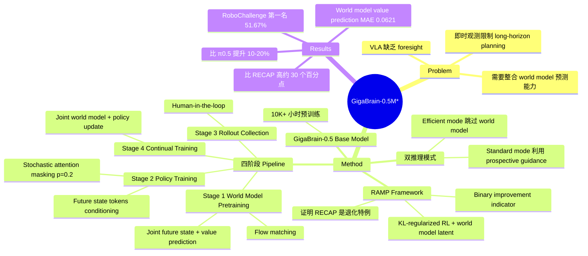

## Summary
GigaBrain-0.5M* 提出 RAMP（Reinforcement leArning via world Model-conditioned Policy），将 world model 的 latent representation 作为条件信号注入 VLA policy 的 RL 训练中，在复杂 manipulation 任务上实现约 30% 的性能提升，其中间版本 GigaBrain-0.1 在 RoboChallenge benchmark 上以 51.67% 的 average success rate 排名第一。

## Problem & Motivation
当前 VLA 模型虽然在语义理解和环境感知上表现出色，但本质上依赖即时观测来决策，缺乏对未来状态的"预见能力"（foresight），在 long-horizon planning 场景下受到根本性限制。作者认为，在大规模 video 数据上预训练的 foundation world model 具有优越的预测能力，可以为 VLA 提供 prospective guidance。核心问题是如何有效地将 world model 的预测整合到 VLA 的 RL 训练中。

## Method
GigaBrain-0.5M* 的方法分为两大部分：基础模型 GigaBrain-0.5 和 RAMP 强化学习框架。

### 基础模型 GigaBrain-0.5
- 在 10,000+ 小时的 robotic manipulation 数据上预训练
- 覆盖多种机器人平台和操作任务

### RAMP 理论基础
RAMP 对 KL-regularized RL 进行了重新推导，引入 world model 的 latent representation 作为额外条件：
- 最优 policy 形式：$\hat{\pi}(a|S) \propto \pi_{ref}(a|S) \exp(A^{\pi_{ref}}(S,a)/\beta)$
- 引入 binary improvement indicator，推导出训练目标：$L(\theta) = E_D[-\log \pi_\theta(a|o,z,l) - \alpha \log \pi_\theta(a|I,o,z_t,l)]$
- 关键理论贡献：证明了 π*₀.₆ 的 RECAP 算法是 RAMP 的退化特例——即忽略 future latent states 信息后的 marginal distribution

### 四阶段训练 Pipeline

**Stage 1: World Model Pretraining**
- 在 4K 小时真实机器人数据上，使用 flow matching 训练 world model
- 联合预测未来 visual states 和 value estimates
- Value signals 作为 latent frames 与 visual representations 拼接

**Stage 2: Policy Training with World Model Conditioning**
- 从 GigaBrain-0.5 预训练 checkpoint 出发 fine-tune
- 接收 world model 输出的 future state tokens 和 value estimates 作为额外输入
- 引入 stochastic attention masking（p=0.2）防止 policy 过度依赖 synthetic signals

**Stage 3: Human-in-the-Loop Rollout Collection**
- 部署 policy 进行自主执行，辅以 expert intervention
- 自动去除 intervention 边界处的时间不连续性

**Stage 4: Continual Training**
- 在收集的 rollout 数据上继续训练 policy
- 同时联合训练 world model，防止 advantage collapse

### 推理模式
- **Efficient mode**：跳过 world model，最大化推理频率
- **Standard mode**：利用 world model 的 prospective guidance，适用于复杂规划场景

## Key Results

### World Model Value Prediction
| 方法 | 推理时间 (s) | MAE | Kendall's τ |
|:-----|:------------|:----|:-----------|
| VLM-based | 0.32 | 0.0683 | 0.7972 |
| WM-based (value only) | 0.11 | 0.0838 | 0.7288 |
| WM-based (state+value) | 0.25 | 0.0621 | 0.8018 |

联合预测 future state 和 value 的方案在精度（最低 MAE 0.0621）和排序一致性（最高 τ 0.8018）上均最优。

### 内部评估（8 个任务）
- Juice Preparation: 100% success rate
- Box Packing: 比 π0.5 提升 10%
- Espresso Preparation: 比 π0.5 提升 20%
- Dexterous manipulation（Paper Towel, Laundry, Collection）: 80%+ success rate，5-15% 提升

### RoboChallenge Benchmark
GigaBrain-0.1（中间版本）在 2026 年 2 月 9 日的 leaderboard 上排名第一，average success rate 51.67%，比 π0.5（42.67%）高出 9 个百分点。

### RL Baseline 对比
RAMP 在所有困难任务上大幅超越替代方案：
- Box Packing: 比 RECAP baseline 高约 30 个百分点
- Espresso Preparation: 比 RECAP 高约 30 个百分点
- Laundry Folding: 接近完美的 success rate

### Multi-Task Generalization
World model conditioning 在 step 20000 时，Box Packing 等任务的 success rate 比 baseline 高约 30%。

## Strengths & Weaknesses
**优势**：
- RAMP 有严格的理论推导，证明 RECAP 是其退化特例，理论贡献清晰
- World model conditioning 的设计（future state tokens + value estimates）自然且有效，为 VLA 引入了 foresight 能力
- Stochastic attention masking 是一个简单但有效的正则化手段，防止 policy 过度依赖 world model predictions
- 双推理模式（efficient/standard）在工程上很实用，允许根据任务复杂度动态切换
- 大规模预训练（10,000+ 小时）提供了强大的 base model

**不足**：
- 作者/机构信息中未明确列出 affiliations，论文透明度有待提升
- World model 训练使用 4K 小时数据，与 base model 的 10K+ 小时有差距，world model 的 coverage 可能有限
- Human-in-the-loop rollout collection 仍需人工介入，非完全自主的 RL 训练
- 内部评估任务数量有限（8 个），缺乏如 LIBERO 等标准化 benchmark 的全面验证
- RoboChallenge 排名使用的是中间版本 GigaBrain-0.1 而非最终的 GigaBrain-0.5M*，最终版本的 benchmark 表现未报告
- 与 π*₀.₆ 的对比主要在理论层面（RECAP 是退化特例），缺少与 RECAP 在相同硬件、相同任务上的直接实验对比

## Mind Map

## Notes
