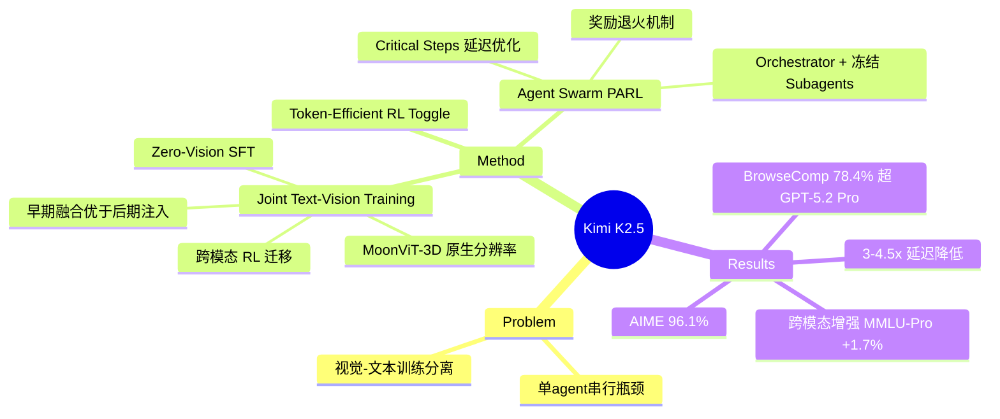

## Summary

Kimi K2.5 是一个开源多模态 agentic 模型，通过 joint text-vision 训练（含 zero-vision SFT 和跨模态 RL）实现文本与视觉的双向增强，并提出 Agent Swarm 并行 agent 编排框架实现 3-4.5× 延迟降低和显著性能提升。

## Problem & Motivation

当前多模态大模型面临两个核心瓶颈：(1) 视觉与文本能力的训练通常是分离的，视觉能力作为后期"注入"导致模态之间无法深度协同；(2) 单 agent 架构在复杂任务上受限于串行执行，延迟高、无法高效分解并行子任务。Kimi K2.5 旨在同时解决这两个问题——让视觉与文本在训练全阶段互相增强，并构建可学习的并行 agent 编排系统。

## Method

### 基础模型

基于 Kimi K2 构建：1.04T 总参数，32B 激活参数，384 experts（每 token 激活 8 个，48% 稀疏度），在 15T 高质量文本 token 上用 MuonClip optimizer 预训练。

### Joint Text-Vision 训练

- **MoonViT-3D 视觉编码器**：采用原生分辨率处理（NaViT patch packing）。视频处理时每 4 帧一组共享 MoonViT，patch 级时序平均实现 4× 时序压缩，图像和视频编码器完全共享权重。
- **Native Multimodal Pre-Training**：核心发现——早期融合 + 低视觉比例（10% vision tokens）优于后期注入 + 高视觉比例（50%）。全程保持恒定的 vision-text token mixing。
- **Decoupled Encoder Process (DEP)**：解决 pipeline parallelism 中的负载不均衡问题，在所有 GPU 上均衡视觉前向，丢弃中间激活值后重算，实现相对纯文本 baseline 90% 的多模态训练效率。

### 三阶段预训练 (~15T tokens)

1. **ViT Training (1T tokens)**：从 SigLIP 继续训练图文对
2. **Joint Pre-training (15T tokens)**：视觉与文本联合训练，4K 序列长度
3. **Long-context Mid-training**：通过 YaRN 插值将上下文扩展至 262K tokens

### Zero-Vision SFT

关键发现：纯文本 SFT 可以激活视觉推理能力。图像操作通过 IPython 代理执行，实现像素级操作和物体定位等多样视觉行为，无需专门的视觉训练数据。

### 跨模态 RL 迁移

视觉 RL 显著提升文本性能：MMLU-Pro 84.7%→86.4%，GPQA-Diamond 84.3%→86.4%，LongBench v2 56.7%→58.9%。证明了双向跨模态增强的有效性。

### Token-Efficient RL (Toggle)

交替执行 budget-limited 和标准 scaling 两个阶段：Phase 0 在准确率超过阈值 λ 时强制 token 预算限制；Phase 1 允许完整 token 使用。在 K2 Thinking 上实现 25-30% token 减少，性能影响可忽略。

### Agent Swarm (PARL)

- **架构**：Parallel-Agent Reinforcement Learning，可训练 orchestrator + 冻结的 subagents（来自中间策略检查点）。解耦设计避免端到端联合优化的 credit assignment 模糊和训练不稳定问题。
- **奖励设计**：`r = rperf + λ₁·rparallel + λ₂·rfinish`，其中 rparallel 防止退化为串行，rfinish 防止虚假并行。λ₁ 和 λ₂ 在训练中退火至零。
- **Critical Steps 指标**：`∑(Smain(t) + max Ssub,i(t))`，直接激励有效并行化和延迟降低。
- **Context 管理**：主动 context sharding 而非被动截断，维护任务级连贯性同时保持 subagent 上下文有界。

## Key Results

**推理与通用能力**：
- AIME 2025: 96.1%（接近 GPT-5.2 满分）
- HMMT 2025: 95.4%
- GPQA-Diamond: 87.6%
- MMLU-Pro: 87.1%
- HLE-Full (with tools): 50.2%

**编程**：
- SWE-Bench Verified: 76.8%
- LiveCodeBench v6: 85.0%
- SWE-Bench Multilingual: 73.0%
- Terminal Bench 2.0: 50.8%

**Agentic 任务**：
- BrowseComp: 78.4% (Agent Swarm，超过 GPT-5.2 Pro 77.9%)
- WideSearch: 79.0% (Agent Swarm)
- DeepSearchQA: 77.1%

**视觉**：
- MMMU-Pro: 78.5%
- MathVista (mini): 90.1%
- VideoMMMU: 86.6%
- OCRBench: 92.3%

**Computer Use**：
- OSWorld-Verified: 63.3%
- WebArena: 58.9%

**Agent Swarm 加速**：WideSearch 上 3×-4.5× 延迟降低；BrowseComp +17.8% 绝对提升。

## Strengths & Weaknesses

**Strengths**：
- **跨模态双向增强是核心 insight**：zero-vision SFT 和 visual RL 提升文本性能的发现非常有价值，说明模态间存在深层互补而非简单叠加
- **Agent Swarm 的 PARL 设计精巧**：orchestrator 与 subagent 解耦训练解决了多 agent RL 的核心难题（credit assignment），奖励退火机制优雅
- **工程深度**：DEP 解决多模态 pipeline parallelism 负载均衡，Toggle 实现 token 效率优化，都是落地所需的关键工程
- **全面 SOTA**：在推理、编程、视觉、agentic 多个维度同时达到顶尖水平，BrowseComp 超过 GPT-5.2 Pro

**Weaknesses**：
- **Agent Swarm 的适用边界不够清晰**：论文承认依赖任务可分解性，但未给出量化判断标准——什么类型的任务适合并行化？
- **551 作者的 industry report**：资源规模难以复现，15T tokens + 1T 参数 MoE 的训练成本极高
- **Ablation 有限**：跨模态迁移的机制解释较浅，为什么 visual RL 能提升 MMLU-Pro？因果路径不够清晰
- **Computer Use 结果中等**：OSWorld 63.3% 和 WebArena 58.9% 仍有很大提升空间，作为主打 "agentic intelligence" 的模型，GUI agent 能力尚未拉开差距

## Mind Map

## Notes

- **与我们研究的关联**：Agent Swarm 的 PARL 框架对 computer-use agent 的多步任务编排有直接参考价值。orchestrator 作为可学习的 meta-policy 而非硬编码规则，是值得探索的方向。
- **关键疑问**：zero-vision SFT 的 IPython proxy 机制具体是什么？文本指令如何映射到像素级操作？这个桥接机制的 generalization 边界在哪里？
- **Agent Swarm vs. 传统 tool-use**：PARL 本质上是让 LLM 学会"管理其他 LLM"，与 hierarchical RL 的 option framework 有精神上的联系，但用 frozen subagent 回避了联合训练的难题——是否会限制 subagent 的适应性？
