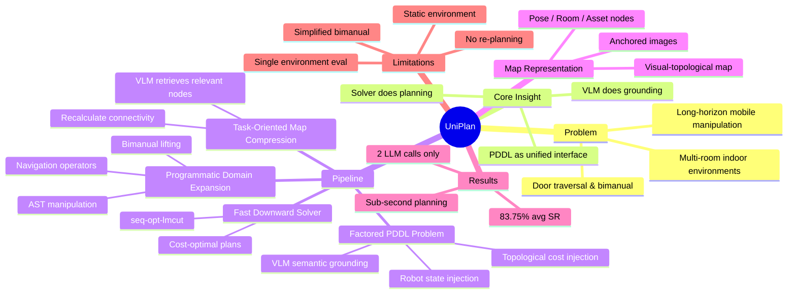

## Summary

UniPlan 将 VLM visual grounding 与 symbolic PDDL planning 结合，用于大规模室内环境的 long-horizon mobile manipulation task planning。系统通过 task-oriented map compression 从 visual-topological map 中提取任务相关节点，利用 VLM 进行 object state grounding 并注入 PDDL problem，最后用 off-the-shelf solver（Fast Downward）生成 cost-optimal plan，在 50 个真实任务上达到 ~84% 成功率，大幅超越 LLM-as-Planner、SayPlan、DELTA 等 baseline。

## Problem & Motivation

现有 long-horizon mobile manipulation 的 task planning 方法存在根本性局限：（1）**Language-only planners** 将视觉观测转为文本描述会造成不可逆的信息损失，尤其是 spatial 和 object state 信息；（2）**VLM-only planners** 没有地图，仅在少量 online image 上操作，无法 scale 到多房间、有门约束的复杂场景；（3）现有 PDDL-based 方法（如 DELTA）依赖 LLM 生成 domain，容易出错且效率低。UniPlan 的核心 insight 是：**VLM 应该只负责 visual semantic grounding（它擅长的），而 planning 应该交给 symbolic solver（它擅长的）**，两者通过 unified PDDL formulation 连接。

## Method

### 四阶段 Pipeline

**Stage 1: Task-Oriented Map Compression**
- 输入：自然语言指令 + visual-topological map（43 pose nodes, 18 room nodes, 31 asset nodes）
- VLM 检索任务相关节点，重新计算压缩图上的 connectivity 和 traversal cost
- 目的：减少 PDDL problem 规模，避免 symbolic planner 的 combinatorial explosion

**Stage 2: Factored PDDL Problem Formation**
- 将 planning problem 解耦为三个独立 factor：
  - **Robot states**：程序化注入（位置、arm configuration），不经过 VLM
  - **Object entities & states**：VLM 从 anchor image 中 grounding，生成 PDDL predicates
  - **Environment structure**：从压缩地图编码 topology 和 cost
- 关键设计：**禁止 VLM 生成 robot-specific predicates**，避免 hallucination

**Stage 3: Programmatic Domain Expansion**
- 基于 UniDomain（81 operators, 79 predicates）的 tabletop domain
- 通过 AST manipulation 自动扩展为 mobile manipulation domain：
  - **Semantic Anchors**：标准化 gripper 建模为 `(hand_free ?r)` 和 `(holding ?r ?o)`
  - **Navigation Expansion**：添加 `(rob_at_node ?r ?n)`、`(obj_at_node ?o ?n)` predicates，所有 manipulation operator 加 location precondition
  - **Door Expansion**：`move_robot` 和 `open_door` operators
  - **Bimanual Expansion**：gripper predicates lift 到 hand-specific 版本
  - **Cost Modeling**：`(travel_cost ?n1 ?n2)` numeric functions 支持 cost-optimal planning

**Stage 4: Unified PDDL Planning**
- Fast Downward solver（seq-opt-lmcut engine）生成 cost-optimal plan
- VLM 使用 GPT-5.2（temperature=0.0）

### Visual-Topological Map

三种节点类型：
- **Pose nodes**：navigation waypoints
- **Room nodes**：doorway 处的空间区域转换点
- **Asset nodes**：家具，附带 anchored high-resolution images

假设地图由 offline 方法预先构建。

## Key Results

### Main Results（50 tasks, 4 settings, 真实室内环境）

| Setting | UniPlan SR | Best Baseline SR | LLM Calls |
|---------|-----------|-----------------|-----------|
| Single-Arm No Door | **83.5%** | 41.0% (SayPlan) | 2 vs 9.1 |
| Single-Arm With Door | **84.0%** | 33.0% (SayPlan) | 2 vs 9.8 |
| Dual-Arm No Door | **82.0%** | 49.5% (SayPlan) | 2 vs 8.8 |
| Dual-Arm With Door | **85.5%** | 42.5% (SayPlan) | 2 vs 9.1 |

- 平均 SR **83.75%**，比最强 baseline 高出 ~40pp
- **仅需 2 次 LLM 调用**（map compression + semantic grounding），baseline 需 4-9 次
- Planning time < 0.7s vs baseline 60-75s（iterative refinement）
- RPQG（plan quality gain）比 baseline 提升 2-16%

### Ablation

| 变体 | SR 变化 | 洞察 |
|------|---------|------|
| w/o Vision | 83.75% → 72.5% | 视觉信息关键，纯文本描述造成信息瓶颈 |
| w/o Domain Expansion | SR 不变但 RPQG 下降 8-23% | Expansion 对 plan optimality 而非 feasibility 重要 |
| w/o Robot State Injection | 83.75% → 52.25% | 让 VLM 推理 robot state 导致灾难性失败 |
| w/o Map Compression | 82% → 73%, T_plan 0.42s → 48.17s | Compression 对 tractability 至关重要 |

### Failure Analysis（16.25% failure rate）

- PDDL Grounding Errors: 7.49%
- Perception Errors: 3.69%
- Retrieval Errors: 3.06%
- Instruction Misunderstanding: 2.03%

## Strengths & Weaknesses

### Strengths

1. **清晰的职责分离**：VLM 只做 grounding，solver 做 planning，各司其职。这是正确的 system design 思路，避免了让 LLM 端到端生成 plan 的 brittleness
2. **Programmatic domain expansion via AST** 是优雅的工程方案，避免了 LLM 生成 PDDL domain 的不可靠性，且具有可扩展性
3. **效率极高**：2 次 LLM 调用 + < 1s solver time，实际部署友好
4. **Ablation 设计合理**，每个组件的贡献都有清晰量化，failure analysis 也做了细分

### Weaknesses

1. **Full observability 假设过强**：假设 offline map 完全准确且环境静态，这在真实家庭场景中不现实。物体会移动、被遮挡、新增或移除
2. **Bimanual 建模过于简化**：双臂被建模为逻辑独立，无法表达需要双手协作的动作（如抬重物）。这削弱了 "bimanual expansion" 的实际价值
3. **PDDL domain 依赖 UniDomain**：81 operators + 79 predicates 的 domain 需要人工设计，scalability 到新任务类型（如 tool use、deformable object manipulation）存疑
4. **评估规模有限**：50 个任务、单一环境，generalization 证据不足。且使用 task-environment emulator 而非真实机器人执行，physical feasibility 未验证
5. **No re-planning**：open-loop planning，无法处理执行失败。7.49% 的 PDDL grounding error 在有 re-planning 的情况下可能可以修复

## Mind Map

## Notes

- 与 SayPlan 的核心区别：SayPlan 用 scene graph + iterative LLM refinement，UniPlan 用 visual-topological map + one-shot PDDL formulation。UniPlan 的 efficiency 优势来自避免了 iterative refinement loop
- **Factored problem construction 是最关键的设计决策**：将 robot state、object state、environment structure 解耦，让每个 factor 由最合适的模块处理。w/o Injection ablation 证明让 VLM 处理 robot state 会导致灾难性失败（SR 降至 52%）
- Domain expansion via AST 的思路有启发性——能否类似地将 tabletop manipulation 的 skill library 通过 programmatic transformation 扩展到 mobile setting？
- 主要 failure mode 是 PDDL grounding error（7.49%），说明 VLM → PDDL predicate 的转换仍是瓶颈。这与其他 VLM + symbolic planning 工作的观察一致
- 使用 GPT-5.2 且 reasoning effort 设为 "none"——暗示 grounding 任务不需要 deep reasoning，simple pattern matching 就够了
- **Open question**：这种 fully symbolic planning + VLM grounding 的 paradigm 能否 scale 到 partially observable、dynamic 环境？可能需要与 belief-space planning 或 online re-planning 结合
