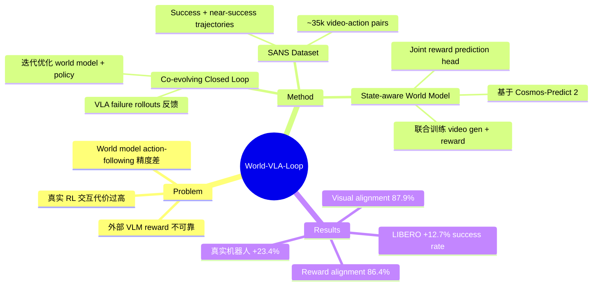

## Summary
提出 World-VLA-Loop 框架，通过 video world model 与 VLA policy 的闭环迭代学习，解决机器人 RL 训练中真实环境交互成本过高、现有 world model action-following 精度不足的问题，在 LIBERO 上提升 +12.7%，真实机器人上提升 +23.4% success rate。

## Problem & Motivation
VLA 模型用 RL 进行 post-training 时面临两个核心瓶颈：（1）真实环境 RL 代价极高，需要数千次物理 rollout 并持续人工监督；（2）现有 video world model 的 action-following precision 很差，经常在错误动作下也"幻觉"出成功结果，导致 reward signal 不可靠。已有方法依赖外部 VLM 或 heuristic proxy reward，精度不足以支撑稳定的 RL 训练。因此需要一种能在虚拟环境中可靠训练 VLA policy 的方案。

## Method
核心架构分三层：

1. **SANS Dataset**：收集 success 和 near-success trajectories（~35k video-action pairs from ManiSkill + 小规模真实数据）。Near-success 样本迫使 world model 关注 spatial dynamics 的细粒度差异，是提升 action-following 精度的关键。

2. **State-aware Video World Model**：基于 Cosmos-Predict 2 构建，两项关键创新：
   - Joint reward prediction head：将 diffusion latents 映射为 scalar reward
   - 联合训练目标：video generation loss + reward prediction loss（含 noise-level weighting）
   - 这确保 reward 与实际 visual outcome 内在对齐，而非依赖外部 VLM

3. **Co-evolving Closed Loop**：迭代闭环优化：
   - World model 为 VLA policy 提供 RL post-training 环境
   - VLA policy 的 failure rollouts 反馈回 SANS dataset
   - 增强后的 world model 提供更好的 action-outcome alignment
   - 如此迭代，world model 和 policy 共同进化

## Key Results
- **World Model 质量**：average visual alignment 87.9%，reward alignment 86.4%；SSIM 0.91，PSNR 28.09，LPIPS 0.045
- **LIBERO benchmarks**：平均 success rate 提升 +12.7%
- **真实机器人**：success rate 从 13.3% 提升到 36.7%（+23.4%），迭代优化后再提升 +13.3%
- **Ablation**：去掉 reward prediction head 后 visual alignment 下降约 30%；去掉 near-success data 后效果显著下降；外部 VLM（Qwen3-VL）reward alignment 仅 50-55%，远低于集成方案的 75-95%

## Strengths & Weaknesses
**优势**：
- 解决了机器人 RL 的真实痛点——将昂贵的物理交互转移到 learned world model 中
- Reward prediction 与 video generation 联合训练的设计很优雅，避免了外部 VLM reward 的不对齐问题
- 闭环迭代机制有理论直觉也有实验验证，world model 和 policy 确实共同提升
- 真实机器人实验验证了 sim-to-real 的可行性
- Ablation 充分，每个设计选择都有实验支撑

**不足**：
- 仅限 short-horizon tasks（~20s），autoregressive video model 超过 200 frames 后存在 quality drift
- 计算成本高：NVIDIA H100 上每 24 帧需 7 秒
- 真实机器人实验仅涉及单一任务，泛化性验证不足
- Near-success trajectory 的收集在所有 domain 上未必容易 scale
- 明确排除了 LIBERO-100（long-horizon benchmark），长时序场景的适用性存疑

## Mind Map

## Connections
- Related papers:
- Related ideas:
- Related projects:

## Notes
