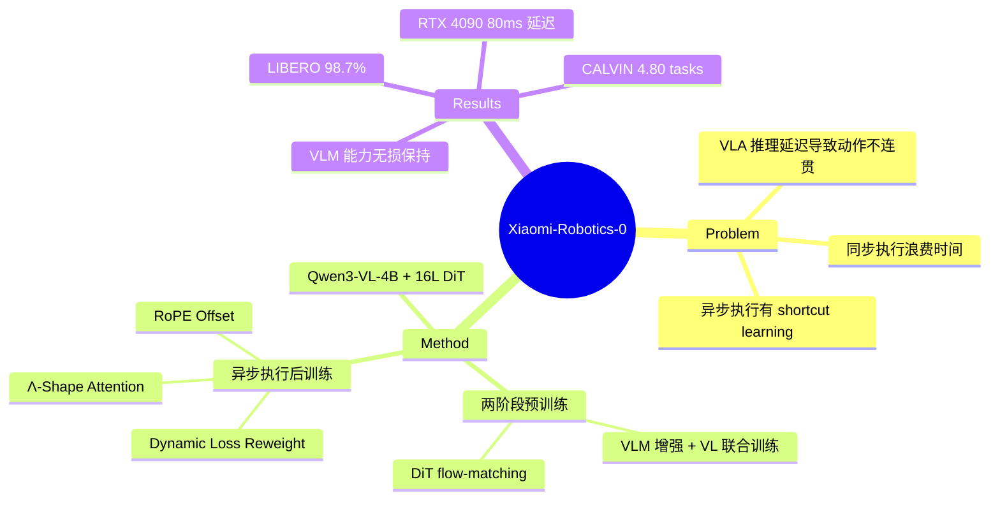

## Summary
提出 Xiaomi-Robotics-0，一个 4.7B 参数的 VLA 模型，通过 VLM + Diffusion Transformer 混合架构和异步推理优化，在 LIBERO / CALVIN / SimplerEnv 仿真 benchmark 上达到 SOTA，并在消费级 GPU（RTX 4090）上实现 80ms 延迟的实时平滑执行。

## Problem & Motivation
VLA 模型展示了强大的跨任务泛化能力，但数十亿参数带来的推理延迟是部署的核心瓶颈：同步执行模式下机器人在等待推理时停顿，导致动作不连贯、陷入 OOD 状态。现有方法要么牺牲模型容量换速度，要么在异步执行时因 action prefix 的 shortcut learning 降低性能。本文的目标是在不降低性能的前提下，让大规模 VLA 模型在消费级硬件上实时流畅执行。

## Method
### 整体架构
Mixture-of-Transformers 设计，总参数 4.7B：
- **VLM backbone**: Qwen3-VL-4B-Instruct，处理视觉观测和语言指令
- **Diffusion Transformer (DiT)**: 16 层，通过 flow-matching 生成 action chunks

### 预训练（两阶段）
**Stage 1 — VLM 增强**：
- 机器人轨迹数据与 vision-language 数据联合训练（1:6 采样比）
- 采用 Choice Policies 范式：预测 N 个 action chunk 候选并打分，winner-takes-all 监督（仅 L1 距离最小的候选接收梯度）
- 关键发现：不加 VL 数据的训练会导致 VLM 能力完全丧失（catastrophic forgetting）

**Stage 2 — DiT 训练**：
- 冻结 VLM，从头训练 DiT（200M timesteps）
- Flow-matching loss，β 分布采样偏好高噪声 timestep
- 使用 attention sink tokens 稳定注意力分布

### 训练数据
- 机器人轨迹：~200M timesteps，来自 DROID、MolmoAct 及自有数据（338h Lego 拆解 + 400h 毛巾折叠）
- Vision-language：80M+ 样本，覆盖 visual grounding、VQA、captioning、embodied reasoning

### 异步执行后训练（核心创新）
解决异步推理中 action prefix 带来的 shortcut learning 问题，三项技术：
1. **RoPE Positional Index Offsetting**：区分 noisy action tokens 与 clean action prefix 的位置编码
2. **Λ-Shape Attention Mask**：限制后续 timestep 的 action tokens attend to action prefix，强制其关注视觉/语言信号，同时允许通过早期 tokens 实现平滑过渡
3. **Dynamic Loss Re-weighting**：对 online-predicted 与 ground-truth 动作之间 L1 误差较大的样本加权，提升鲁棒性

### 部署
- 异步执行：机器人在推理时继续执行剩余 chunk actions
- RTX 4090 上 80ms 推理延迟，30Hz 传感器同步

## Key Results
### 仿真 Benchmark（全部 SOTA）
| Benchmark | 指标 | 成绩 |
|:--|:--|:--|
| LIBERO（4 splits 平均） | Success Rate | **98.7%** |
| CALVIN ABCD→D | Avg Tasks | **4.80** |
| CALVIN ABC→D | Avg Tasks | **4.75** |
| SimplerEnv Google Robot VM | Success Rate | **85.5%** |
| SimplerEnv Google Robot VA | Success Rate | **74.7%** |
| SimplerEnv WidowX | Success Rate | **79.2%** |

### 真实机器人
- **Lego 拆解**：吞吐量最高，异步执行相比 Training RTC 有明显优势
- **毛巾折叠**：1.2 pieces/min（vs 竞品 1.0），30 分钟连续测试中避免了 Training RTC 的重复失败循环

### VLM 能力保持
在 10 个 VL benchmark 上（MMBench、SEED-Bench、POPE 等）保持接近原始 Qwen3-VL 的水平（78.6-84.4%），POPE 上甚至超越 baseline（88.5%）。

## Strengths & Weaknesses
**亮点**：
- 异步执行的工程方案非常实用：Λ-Shape Attention Mask 和 RoPE Offsetting 优雅地解决了 shortcut learning 问题，这是 VLA 部署中的真实痛点
- 全面的 benchmark 覆盖（仿真+真机+VL 保持），实验说服力强
- 开源模型和代码，对社区贡献大
- VLM 能力保持的联合训练方案（1:6 采样比）是重要的实践经验

**局限**：
- 真机实验仅限两个任务（Lego 拆解、毛巾折叠），泛化到更多任务类型尚未验证
- 4.7B 参数 + RTX 4090 的硬件要求仍然较高，离嵌入式部署有距离
- 异步执行方案与 action chunk 长度和推理延迟的关系（Δtc ≥ Δtinf）限制了灵活性
- 未探索 action representation 的优化空间（如 spatial/geometric tokenization）

## Action Space
**7-DoF 连续动作空间**，每步 action vector 为 7 维：

| 维度 | 含义 | 备注 |
|:--|:--|:--|
| 0-2 | End-effector delta position (x, y, z) | 3D 平移 |
| 3-5 | End-effector delta rotation | LIBERO: axis-angle；SimplerEnv: euler (roll, pitch, yaw)，执行时转 axis-angle |
| 6 | Gripper command | CALVIN 中二值化为 {-1, 1} |

**Action chunk size**（每次推理生成的未来步数）：
- LIBERO / CALVIN: T = 10
- SimplerEnv: T = 4
- 真机实验: T = 30（30Hz 控制，对应 1 秒）

**State representation**: 7 维 proprioceptive state（EEF pos 3 + rotation 3 + gripper 1），padding 至 32 维输入 DiT。

**生成方式**：DiT 通过 flow-matching 生成连续 action chunk，输出 shape 为 `(B, T, D+1)`，其中额外一维为概率/置信度，取前 7 维作为动作。

## Mind Map

## Notes
- Λ-Shape Attention Mask 的设计思路值得借鉴：通过控制 attention pattern 来防止 policy 走捷径。这种 attention engineering 的方法可能对其他异步/流式 VLA 场景也有启发。
- 1:6 的 robot:VL 采样比是防止 catastrophic forgetting 的关键数据配方，如果未来做 VLA 训练可以作为 baseline 参考。
- 与 [[Ideas/SpatialToken-VLA]] 的关联：本文的 action expert tokens 设计（DiT 部分）可以视为一种 modality-specific token 的实践，和 SpatialToken 将 scene graph 编码为 spatial tokens 的思路在架构层面有共通之处——都是给 VLM 加入非文本 modality 的 learnable tokens。
