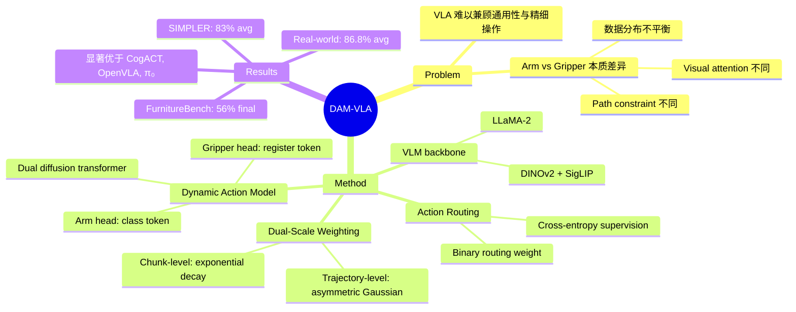

## Summary
DAM-VLA 提出了一种基于 dynamic action model 的 VLA 框架，通过将 arm movement 和 gripper manipulation 解耦为两个专用 diffusion action head，配合 action routing mechanism 和 dual-scale weighting 机制，在 SIMPLER benchmark、FurnitureBench 和真实机器人实验中显著优于 OpenVLA、CogACT、π₀ 等 baseline。

## Problem & Motivation
当前 VLA 系统难以同时兼顾通用任务适应性和精细操作精度。作者指出 arm movement 与 gripper manipulation 存在三个关键差异：（1）path constraint 不同——arm 轨迹相对自由，gripper 需要精确姿态；（2）visual attention 不同——arm 需要全局场景理解，gripper 需要局部细粒度关注；（3）数据分布不平衡——dataset 中 arm movement episode 远多于 gripper manipulation，但后者对任务成功至关重要。现有方法用统一的 action head 处理两者，无法针对性优化。

## Method
DAM-VLA 的架构包含三个核心组件：

**1. Vision-Language Model backbone**
- 采用 DINOv2 + SigLIP 双视觉编码器提取 visual feature（class token 用于全局注意力，register token 用于局部注意力）
- LLaMA-2 作为 language backbone，融合视觉和语言信息
- 从不同 transformer layer 输出 cognition latent（f^cog）和 reasoning latent（f^rea）

**2. Action Routing Mechanism**
- 利用 VLM 的 reasoning latent 预测 routing weight w
- w < 0.5 执行 arm movement model；w >= 0.5 执行 gripper manipulation model
- 通过 cross-entropy loss 对 ground-truth label 进行监督

**3. Dynamic Action Model（双头 Diffusion Transformer）**
- Arm movement head：接收 class token（全局注意力），适合路径规划
- Gripper manipulation head：接收 register token（局部注意力），适合精细操作
- 两个 head 均以 cognition latent 为 condition

**Dual-Scale Action Weighting**：
- Trajectory-level weight（w^t）：基于 gripper state transition 的非对称 Gaussian 分布（σ_l=6, σ_r=2），在操作关键帧附近加权
- Action-chunk-level weight（w^a）：指数衰减（γ=0.8），反映时间不确定性
- 综合权重：w^move = (1-w^t) * w^a，w^mani = w^t * w^a

训练 loss：L = 1.0 * L_move + 1.0 * L_mani + 0.0001 * L_class

## Key Results
**SIMPLER Benchmark**：
- Google Robot VM setting：DAM-VLA 83% 平均成功率（CogACT 72%，OpenVLA 37%，π₀ 70%）
- Google Robot VA setting：81%（CogACT 62%），展示环境变化下的鲁棒性
- WidowX Robot VM：71%（π₀ 57%，CogACT 52%）

**FurnitureBench（long-horizon contact-rich）**：
- One-Leg 组装任务最终成功率 56%（CogACT 42%），尤其在 screw leg 步骤优势明显（62% vs 56%）

**Real-World（Franka robot，80 trials）**：
- In-Distribution：91.4%（CogACT 65.7%）
- Out-of-Distribution：82.2%（CogACT 60.0%）
- 平均 86.8% vs 62.9%

**Ablation**：full model 平均 78%，移除 visual tokens + dual-scale weighting 降至 73%，仅用 baseline 为 58%，验证了各组件的贡献。

## Strengths & Weaknesses
**Strengths**：
- 将 arm movement 和 gripper manipulation 的本质差异显式建模，motivation 清晰且有说服力
- Action routing mechanism 避免了 CoT reasoning 的计算开销，同时实现了动态切换
- Dual-scale weighting 机制优雅地解决了 manipulation 数据稀疏的问题
- 实验覆盖全面：simulated benchmark + long-horizon assembly + real-world，结果一致性强

**Weaknesses**：
- 作者 affiliation 未在论文中明确列出，peer review 状态不明
- Action routing 是二元切换（arm vs gripper），实际操作中两者的边界可能并非如此清晰
- FurnitureBench 仅测试了 One-Leg 任务，long-horizon 的泛化性有待更多验证
- 未讨论与 flow matching 方法（如 π₀）结合的可能性，dual-head diffusion 是否优于 dual-head flow matching 未知
- Real-world 实验仅限 pick-and-place，未覆盖更复杂的灵巧操作

## Mind Map

## Notes
- DAM-VLA 的核心 insight——arm movement 和 gripper manipulation 需要不同的 action model——值得关注，这可能启发更细粒度的 action decomposition 研究
- Dual-scale weighting 的设计（trajectory-level + chunk-level）是一个通用的技巧，可能适用于其他需要处理稀疏关键动作的场景
- 论文中 CogACT 作为主要 baseline 反复出现，需要了解 CogACT 的方法细节以更好理解 DAM-VLA 的改进点
